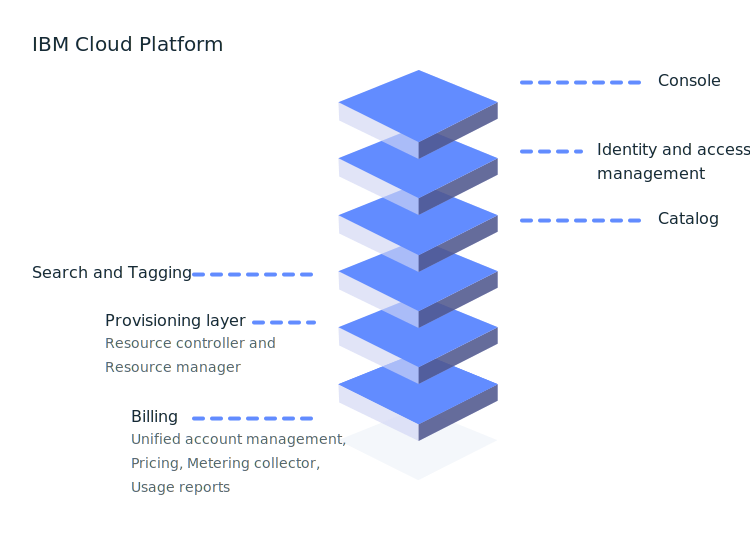

---

copyright:
  years: 2016, 2019
lastupdated: "2019-05-31"

keywords: console, platform overview, overview

subcollection: overview

---

{:shortdesc: .shortdesc}
{:new_window: target="_blank"}

# What is the {{site.data.keyword.Bluemix_notm}} platform?
{: #whatis-platform}

IBM's cloud platform combines platform as a service (PaaS) with infrastructure as a service (IaaS) to provide an integrated experience. The platform scales and supports both small development teams and organizations, and large enterprise businesses. Globally deployed across data centers around the world, the solution you build on {{site.data.keyword.cloud}} spins up fast and performs reliably in a tested and supported environment you can trust.
{: .shortdesc}

As the following diagram illustrates, the {{site.data.keyword.Bluemix_notm}} platform is composed of multiple components that work together to provide a consistent and dependable cloud experience. 

  * A robust console that serves as the front end for creating, viewing, managing your cloud resources
  * An identity and access management component that securely authenticates users for both platform services and controls access to resources consistently across {{site.data.keyword.Bluemix_notm}}
  * A catalog that consists of hundreds of {{site.data.keyword.Bluemix_notm}} offerings
  * A search and tagging mechanism for filtering and identifying your resources
  * An account and billing management system that provides exact usage for pricing plans and secure credit card fraud protection
  
  

Whether you have [existing code](/docs/apps/tutorials?topic=creating-apps-tutorial-byoc#tutorial-byoc) that you want to modernize and bring to the cloud or you're developing a [brand new application](/docs/apps/tutorials?topic=creating-apps-tutorial-starterkit), your developers can tap into the rapidly growing ecosystem of available services and runtime frameworks in {{site.data.keyword.Bluemix_notm}}.

## Setting up your account
{: #set-up-account}

If you're just trying out {{site.data.keyword.Bluemix_notm}}, you can go straight to the catalog and start checking out the offerings that you'd like to explore and add to your Lite account. However, if you're ready to get started with an environment for a group of developers or entire organization and get apps running in production, consider setting up the basics in your account:

* User access groups for organizing users and service IDs into one entity to make assigning access a streamlined process.
* Resource groups for organizing your resources to make assigning access to a set of resources quick and easy.
* Access policies for your access groups or individual developers who need IAM access policies or Cloud Foundry org and space roles.

For more information, see the [best practices for setting up your account](/docs/account?topic=account-account_setup) and [best practices for assigning access](/docs/iam?topic=iam-account_setup). 

## Pricing and billing
{: #pricing-billing}

Regardless of your account type, you can explore {{site.data.keyword.Bluemix_notm}} by using Lite plans for the services that provide free quota. When you're choosing a service from the catalog and you select a tile, if there are different types of available plans you can see details about pricing information. If you choose a service plan with a paid plan, you can estimate your costs by using the cost estimator tool. For more information, see [Estimating your costs](/docs/billing-usage?topic=billing-usage-cost).

{{site.data.keyword.Bluemix_notm}} billing provides multiple services that ensure the {{site.data.keyword.Bluemix_notm}} platform can securely manage pricing, accounts, usage, and more.

### Account management
{: #account-mgmt}

Account management maintains the billing relationship with the customer. Each account is a billing entity that represents a customer. This service controls account lifecycle, subscription, user relationship, and organization.

### Pricing
{: #pricing}

The pricing platform service helps you to define, manage, and retrieve pricing information for resources in the {{site.data.keyword.Bluemix_notm}} catalog.

### Usage metering
{: #metering}

With usage metering, service providers can submit metrics that are collected for resource instances that are provisioned by {{site.data.keyword.Bluemix_notm}} users. Third-party service providers that deliver an integrated billing service are required to submit usage for all active service instances every hour. 

### Usage reports
{: #usage}

Usage reports return the summary for the account for the specified month. Account billing managers are authorized to access the reports.

## {{site.data.keyword.Bluemix_notm}} catalog
{: #catalog}

The {{site.data.keyword.Bluemix_notm}} catalog stores the offering definitions (description, features, images, URLs, and so on) of the resources that are available in the {{site.data.keyword.Bluemix_notm}} console. Offerings are managed across geographies as the system of record. The catalog supports command-line interfaces (CLIs) and a RESTful API where users can retrieve information about existing offerings and create, manage, and delete their resources. For more information, see [Managing the catalog](/docs/overview?topic=overview-manage-catalog).

## Creating resources
{: #provisioning-layer}

The resource controller is the next-generation {{site.data.keyword.Bluemix_notm}} platform provisioning layer that manages the lifecycle of {{site.data.keyword.Bluemix_notm}} resources in your account. Resources are provisioned globally in an account scope. The resource controller supports both synchronous and asynchronous provisioning of resources. Examples of resources include databases, accounts, processors, memory, and storage limits. 

In general, resources that are tracked by the provisioning layer are intended to associate usage metrics and billing, but that isn’t always the case. In some cases, the resource might be associated with the provisioning layer to ensure that the resource lifecycle can be managed along with the account lifecycle. The resource controller uses {{site.data.keyword.Bluemix_notm}} Identity and Access Management (IAM) for authentication and authorization of actions that are taken against the provisioning layer.

### Resource lifecycle management
{: #lifecycle}

The resource controller provides common APIs to control the lifecycle of resources from creating an instance to creating access credentials to removing access to deleting an instance.

## Managing your resources
{: #resource-manager}

A collection of resources is managed by [resource groups](/docs/overview?topic=overview-whatis-rgs). A resource group is associated with your account. All {{site.data.keyword.Bluemix_notm}} resources must be assigned to a resource group. When you create an account, a default resource group is created for you. All {{site.data.keyword.Bluemix_notm}} IAM-enabled resources must be provisioned within a resource group. If you have a Lite account, you can have only one resource group. If you have a Pay-As-You-Go or Subscription account, you can create more than one resource group. If an account is suspended, the corresponding resource group is suspended as well, and all resources within the resource group are suspended. 

## Searching and tagging resources
{: #search-and-tag}

The search service is a global and shared resource properties repository that is integrated within the {{site.data.keyword.Bluemix_notm}} platform. It is used for storing and searching a cloud resource's attributes, and it categorizes and classifies resources. Resources are uniquely identified by a [Cloud Resource Name (CRN)](/docs/overview?topic=overview-crn) identifier. The properties of a resource include tags and system properties. Both properties are defined within an {{site.data.keyword.Bluemix_notm}} billing account, and span across many regions.

This service also manages tags that are associated with a resource. You can create, delete, search, attach, or detach tags with the Tagging API. Tags are uniquely identified by a CRN identifier. Tags have a name, which must be unique within a billing account. You can create tags in key:value pairs or label format.

## Monitoring your resources
{: #resources_observability}

Observability offers a single location where you can monitor and observe your applications and services in {{site.data.keyword.Bluemix_notm}}. 

With the {{site.data.keyword.la_full}} service, you can add log management capabilities to your {{site.data.keyword.Bluemix_notm}} architecture and you can manage system and application logs. It offers advanced features to monitor and troubleshoot, define alerts, and design custom dashboards. {{site.data.keyword.la_full_notm}} is operated by LogDNA in partnership with {{site.data.keyword.IBM_notm}}. For more information, see [Getting started with {{site.data.keyword.la_full_notm}}](/docs/services/Log-Analysis-with-LogDNA?topic=LogDNA-getting-started).

The {{site.data.keyword.mon_full_notm}} service, allows you to gain operational visibility into the performance and health of your applications, services, and platforms. It offers a full stack telemetry with advanced features to monitor and troubleshoot, define alerts, and design custom dashboards. {{site.data.keyword.mon_full_notm}} is operated by Sysdig in partnership with {{site.data.keyword.IBM_notm}}. For more information, see [Getting started with IBM Cloud Monitoring with Sysdig service](/docs/services/Monitoring-with-Sysdig?topic=Sysdig-getting-started#getting-started)

## Monitoring your account 
{: #account_observability}

Use the {{site.data.keyword.at_full}} service to monitor the activity of your {{site.data.keyword.Bluemix_notm}} account, investigate abnormal activity and critical actions, and comply with regulatory audit requirements. In addition, you can be alerted on actions as they happen. The events that are collected comply with the Cloud Auditing Data Federation (CADF) standard. For more information, see [Getting started with {{site.data.keyword.at_full_notm}}](/docs/services/Activity-Tracker-with-LogDNA?topic=logdnaat-getting-started).
