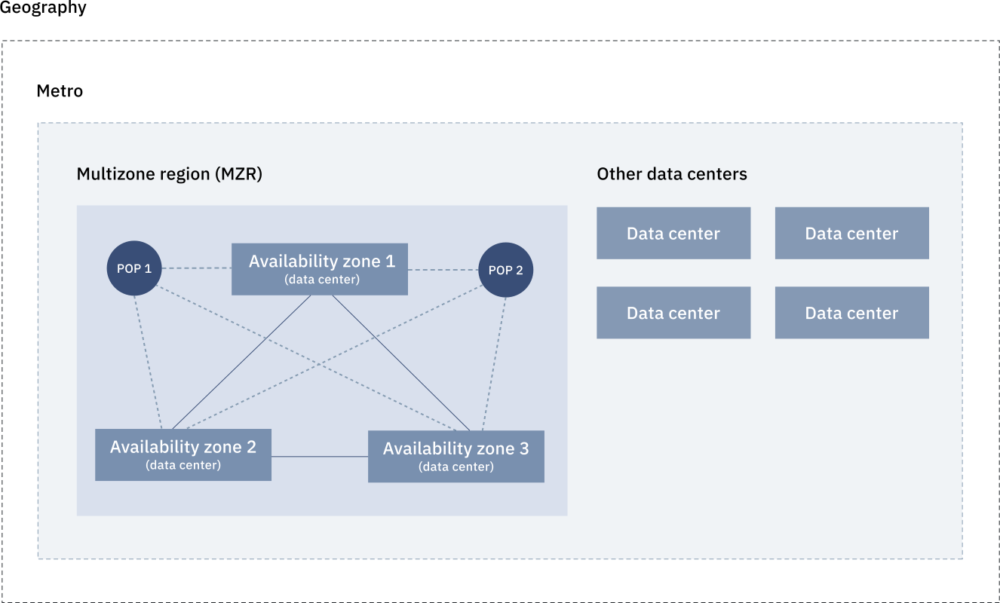

---

copyright:
  years: 2019, 2020
lastupdated: "2020-03-24"

keywords: data center, data centers, data center locations, specific data center, individual data centers, regions, locations, network, ibm cloud regions, multizone regions, MZRs, latency, HA, high availability, endpoints, cloud regions, cloud data centers, multizone, resources, geography, global load balancing, geo, load balancing, availability zones, zones, north america, south america, europe, asia, DC, failover

subcollection: overview

---

{:shortdesc: .shortdesc}
{:tip: .tip}
{:note: .note}
{:term: .term}
{:new_window: target="_blank"}

# Locations for resource deployment
{: #locations}

{{site.data.keyword.cloud}} has a resilient global network of locations consisting of regions, zones, and data centers to host your highly available cloud workload. You can create resources in different locations but with the same billing and usage view, and deploy your apps to the location that is nearest to your customers to achieve low application latency.
{: shortdesc}

With global load balancing, the {{site.data.keyword.cloud_notm}} console displays information about the next closest location if your nearest geographical location is unavailable. The console is highly available and continues to run even if your resources are unavailable.

You can view all resources and locations from the Resource list page in the console. If you want to view and work with resources in a specific location, expand the **Location** filter, and select a location from the list. By expanding a specific location, you can select to filter by individual data centers, regions, or zones.

For example, if you have resources that are deployed in the London 2 (eu-gb-2) zone, you can set filters to display only those resources in your resource list. Expand the **London** metro option, and the **London (eu-gb)** region option. Within that region, you can select from the list of available zones. If you have a resource that is deployed in a specific data center, you can identify the data center by the specific metro location and alphanumeric code, for example, London 02 (lon02).

You might also want to display your resources that are located globally. The **Global** option means that only one logical, globally accessible instance of the service, independent of any region or zone, is published to customer applications. These types of resources are accessible from a global endpoint.

As illustrated in the following graphic, a data center is a physical building that represents an availability zone that is located within a multizone region (MZR). An MZR is organized by its metro location. For example, London can encompass more than one grouping of data centers within an MZR. The graphic shows three availability zones in one MZR that work together in the instance that one of the data centers becomes unavailable. Availability zones are connected directly to each or through low latency links.

{: caption="Figure 1. Location hiearchy" caption-side="bottom"}

## Multizone regions
{: #mzr-table}

A [multizone region (MZR)](#x9774820){: term} is comprised of 3 or more zones that are independent from each other to ensure that single failure events affect only a single zone. MZRs provide low latency (< 2 milliseconds latency) and high bandwidth (> 1000 Gbps) connectivity across zones.

The advantage of an MZR is that it provides consistent cloud services across the different zones, better resiliency, availability, higher interconnect speed between data centers for cloud platforms, and infrastructure services such as {{site.data.keyword.cos_full}}, and {{site.data.keyword.Bluemix_notm}} load balancers. These features can be critical to your applications. Deploying the application in an MZR rather than a single zone can increase the availability from 99.9% to 99.999% when deployed over three zones.

The following table lists the {{site.data.keyword.cloud_notm}} MZRs and the region, zone, and data center codes for each one.

| Location | Region | Zone | Data Center |
|-----------|----------|------|----|
| Brazil | br-sao | br-sao-1 br-sao-2 br-sao-3 | SAO01 SAO04 SAO05 |
| Dallas | us-south | us-south-1 us-south-2 us-south-3 | DAL10 DAL12 DAL13 |
| Washington DC | us-east | us-east-1 us-east-2 us-east-3 | WDC04 WDC06 WDC07 |
{: caption="Table 1. MZRs in North and South America" caption-side="top"}
{: #americas-mzr}
{: tab-title="Americas"}
{: tab-group="mzr"}
{: class="simple-tab-table"}
{: summary="Use the buttons before the table to change the context of the table. The column headers identify the data centers located in the specific geographical area."}

| Location      | Region   | Zone | Data Center |
|-----------|----------|------|----|
| Frankfurt     | eu-de    |eu-de-1 eu-de-2 eu-de-3 | FRA02 FRA04 FRA05 |
| London        | eu-gb    |eu-gb-1 eu-gb-2 eu-gb-3 | LON04 LON05 LON06|
{: caption="Table 1. MZRs in Europe" caption-side="top"}
{: #europe-mzr}
{: tab-title="Europe"}
{: tab-group="mzr"}
{: class="simple-tab-table"}
{: summary="Use the buttons before the table to change the context of the table. The column headers identify the data centers located in the specific geographical area."}

| Location      | Region   | Zone | Data Center |
|-----------|----------|------|----|
| Osaka | jp-osa | jp-osa-1 jp-osa-2 jp-osa-3 | OSA21 OSA22 OSA23 |
| Sydney        | au-syd   |au-syd-1 au-syd-2 au-syd-3 | SYD01 SYD04 SYD05|
| Tokyo         | jp-tok   |jp-tok-1 jp-tok-2 jp-tok-3 | TOK02 TOK04 TOK05|
{: caption="Table 1. Multizone regions in Asia Pacific" caption-side="top"}
{: #asiapacific-mzr}
{: tab-title="Asia Pacific"}
{: tab-group="mzr"}
{: class="simple-tab-table"}
{: summary="Use the buttons before the table to change the context of the table. The column headers identify the data centers located in the specific geographical area."}

## Single-zone regions
{: #szr-table}

The following table lists the [single-zone regions (SZR)](#x9774825){: term} in {{site.data.keyword.cloud_notm}} and the region, zone, and data center codes for each one.

| Location      | Region   | Zone | Data Center |
|-----------|----------|------|----|
| Seoul     | kr-seo | kr-seo-1 | SEO01 SEO02 |
| Chennai | in-che-1  |in-che-1  | CHE01 |
{: caption="Table 2. SZRs for creating resources" caption-side="top"}

## Data centers
{: #data-centers}

In addition to selecting a region for your resource, you can select from a list of the {{site.data.keyword.Bluemix_notm}} [data centers](#x2439906){: term}. Data centers host the power, cooling, compute, network, and storage resources used for services and apps. They don't provide isolation from multizones in a location. 

The following graphic illustrates the available {{site.data.keyword.Bluemix_notm}} data centers.

{: caption="Figure 2. Data center locations" caption-side="bottom"}

Data centers are based on POD architecture where each data center can have more than one POD, depending on on-demand buildout. Each POD consists of racks, servers, networks, and storage, along with backup power generators. Placing the application servers across PODs further improves the availability.

See the following table for the specific code for each data center.

| Data Center      | Code  |
|------------------|-------|
| Dallas 01        | DAL01 |
| Dallas 05        | DAL05 |
| Dallas 06        | DAL06 |
| Dallas 07        | DAL07 |
| Dallas 09        | DAL09 |
| Dallas 10        | DAL10 |
| Dallas 12        | DAL12 |
| Dallas 13        | DAL13 |
| Houston 01       | HOU01 |
| Mexico 01        | MEX01 |
| Montreal 01      | MON01 |
| Raleigh 01       | RAL01 |
| San Jose 01      | SJC01 |
| San Jose 03      | SJC03 |
| San Jose 04      | SJC04 |
| Sao Paulo 01     | SAO01 |
| Seattle 01       | SEA01 |
| Toronto 01       | TOR01 |
| Washington DC 01 | WDC01 |
| Washington DC 04 | WDC04 |
| Washington DC 06 | WDC06 |
| Washington DC 07 | WDC07 |
{: caption="Table 3. Data centers in North and South America" caption-side="top"}
{: #americas}
{: tab-title="Americas"}
{: tab-group="dcs"}
{: class="simple-tab-table"}
{: summary="Use the buttons before the table to change the context of the table. The column headers identify the data centers located in the specific geographical area."}

| Data Center  | Code  |
|--------------|-------|
|Amsterdam 01 | AMS01|
|Amsterdam 02 | AMS02|
|Amsterdam 03 | AMS03|
|Frankfurt 01 | FRA01|
|Frankfurt 02 | FRA02|
|Frankfurt 03 | FRA03|
|Frankfurt 04 | FRA04|
|Frankfurt 05 | FRA05|
|London 01 | LON01|
|London 02 | LON02|
|London 03 | LON03|
|London 04 | LON04|
|London 05 | LON05|
|London 06 | LON06|
|Milan 01 | MIL01|
|Milan 02 | MIL02|
|Oslo 01 | OSL01|
|Oslo 02 | OSL02|
|Paris 01 | PAR01|
|Paris 02 | PAR02|
|Paris 03 | PAR03|
|Paris 04 | PAR04|
|Paris 05 | PAR05|
|Paris 06 | PAR06|
{: caption="Table 3. Data centers in Europe" caption-side="top"}
{: #europe}
{: tab-title="Europe"}
{: tab-group="dcs"}
{: class="simple-tab-table"}
{: summary="Use the buttons before the table to change the context of the table. The column headers identify the data centers located in the specific geographical area."}

| Data Center  | Code  |
|--------------|-------|
|Chennai 01 | CHE01|
|Hong Kong 01 | HKG01|
|Hong Kong 02 | HKG02|
|Melbourne 01 | MEL01|
|Melbourne 02 | MEL02|
|Osaka 01 | OSA01|
|Osaka 21 | OSA1|
|Osaka 22 | OSA22|
|Osaka 23 | OSA23|
|Perth 01 | PER01|
|Seoul 01 | SEO01|
|Seoul 02 | SEO02|
|Singapore 01 | SNG01|
|Singapore 02 | SNG02|
|Sydney 01 | SYD01|
|Sydney 02 | SYD02|
|Sydney 03 | SYD03|
|Sydney 04 | SYD04|
|Sydney 05 | SYD05|
|Tokyo 01 | TOK01|
|Tokyo 02 | TOK02|
|Tokyo 03 | TOK03|
|Tokyo 04 | TOK04|
|Tokyo 05 | TOK05|
{: caption="Table 4. Data centers in Asia Pacific" caption-side="top"}
{: #asiapacific}
{: tab-title="Asia Pacific"}
{: tab-group="dcs"}
{: class="simple-tab-table"}
{: summary="Use the buttons before the table to change the context of the table. The column headers identify the data centers located in the specific geographical area."}

The data centers table includes certain data centers that are set to close in 2020, and support for existing workloads is still available until the closing date. For the list of data centers that are closing, see [Withdrawal of support for some data centers](/docs/get-support?topic=get-support-dc-migrate).
{: note}
