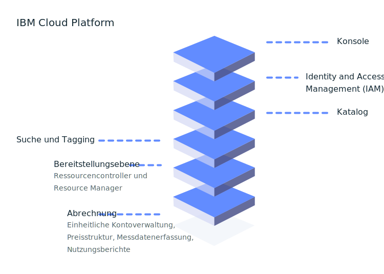

---

copyright:
  years: 2016, 2019
lastupdated: "2019-05-31"

keywords: console, platform overview, overview

subcollection: overview

---

{:shortdesc: .shortdesc}
{:new_window: target="_blank"}

# Was ist die {{site.data.keyword.Bluemix_notm}}-Plattform?
{: #whatis-platform}

Die Cloud-Plattform von IBM stellt durch die Kombination von 'Platform as a Service' (PaaS) mit 'Infrastructure as a Service' (IaaS) eine integrierte Erfahrung bereit. Die Plattform passt sich an die Dimensionierung an und unterstützt sowohl kleine Entwicklungsteams und Organisationen als auch große Unternehmen. Mit der globalen Bereitstellung in Rechenzentren auf der ganzen Welt gewinnt die von Ihnen auf {{site.data.keyword.cloud}} aufgebaute Lösung rasch an Dynamik und funktioniert zuverlässig in einer getesteten und unterstützten Umgebung, der Sie vertrauen können.
{: .shortdesc}

Wie das folgende Diagramm veranschaulicht, besteht die {{site.data.keyword.Bluemix_notm}}-Plattform aus mehreren Komponenten, durch deren Interaktion eine konsistente und zuverlässige Cloudschnittstelle bereitgestellt wird.  

  * Eine robuste Konsole, die als Front-End für das Erstellen, Anzeigen und Verwalten Ihrer Cloud-Ressourcen dient
  * Eine Komponente für Identitäts- und Zugriffsmanagement, die Benutzer für beide Plattformservices sicher authentifiziert und den Zugriff auf Ressourcen in der Gesamtheit von {{site.data.keyword.Bluemix_notm}} einheitlich steuert
  * Ein Katalog, der Hunderte von {{site.data.keyword.Bluemix_notm}}-Angeboten umfasst
  * Ein Such- und Taggingmechanismus zum Filtern und Identifizieren Ihrer Ressourcen
  * Ein Konto- und Abrechnungsverwaltungssystem, das die genaue Verwendung von Preisstrukturplänen (Preistarifen) zur Verfügung stellt und Schutz vor Kreditkartenbetrug bietet
  
  

Unabhängig davon, ob Sie über [vorhandenen Code](/docs/apps/tutorials?topic=creating-apps-tutorial-byoc#tutorial-byoc) verfügen, den Sie modernisieren und in die Cloud integrieren möchten, oder ob Sie eine [völlig neue Anwendung](/docs/apps/tutorials?topic=creating-apps-tutorial-starterkit) entwickeln, können sich Ihre Entwickler können das rasch wachsende Ökosystem verfügbarer Services und Laufzeitframeworks in {{site.data.keyword.Bluemix_notm}} zunutze machen.

## Konto einrichten
{: #set-up-account}

Wenn Sie {{site.data.keyword.Bluemix_notm}} einfach nur ausprobieren, können Sie direkt den Katalog aufsuchen und sich mit denjenigen Angeboten näher befassen, die Sie erkunden und zu Ihrem Lite-Konto hinzufügen wollen. Wenn Sie jedoch bereit sind, mit einer Umgebung für eine Gruppe von Entwicklern oder für eine ganze Organisation loszulegen und Apps bis zur Reife für ihre Ausführung im Produktionsbetrieb zu bringen, sollten Sie in Ihrem Konto die wichtigsten Basisdaten einrichten:

* Benutzerzugriffsgruppen zum Organisieren von Benutzern und Service-IDs in einer einzigen Entität, damit die Zuweisung des Zugriffs in einem optimierten Prozess erfolgen kann.
* Ressourcengruppen zum Organisieren Ihrer Ressourcen, um die Zuweisung von Zugriff auf eine Gruppe von Ressourcen möglichst schnell und einfach zu gestalten.
* Zugriffsrichtlinien für Ihre Zugriffsgruppen oder für einzelne Entwickler, die IAM-Zugriffsrichtlinien oder die Cloud Foundry-Rollen 'org' und 'space' benötigen.

Weitere Informationen können Sie unter [Bewährte Verfahren für das Einrichten Ihres Kontos](/docs/account?topic=account-account_setup) und [Bewährte Verfahren für die Zuweisung von Zugriff](/docs/iam?topic=iam-account_setup) nachlesen. 

## Preisstruktur und Abrechnung
{: #pricing-billing}

Unabhängig von Ihrem Kontotyp können Sie {{site.data.keyword.Bluemix_notm}} unter Verwendung von Lite-Plänen für diejenigen Services erkunden, die kostenfreie Kontingente bereitstellen. Wenn Sie sich für einen Service aus dem Katalog entscheiden und eine Kachel auswählen, werden Details der Preisinformationen angezeigt, sofern verschiedene Typen von Plänen angeboten werden. Wenn Sie über einen gebührenpflichtigen Plan verfügen und einen Serviceplan auswählen, können Sie die voraussichtlich anfallenden Kosten mit der Kostenschätzungsfunktion schätzen lassen. Weitere Informationen enthält [Kosten schätzen](/docs/billing-usage?topic=billing-usage-cost).

Die Abrechnung mit {{site.data.keyword.Bluemix_notm}} stellt mehrere Services bereit, mit denen sichergestellt wird, dass die {{site.data.keyword.Bluemix_notm}}-Plattform Preisstrukturen, Konten, Nutzung und vieles mehr sicher verwalten kann.

### Kontoverwaltung
{: #account-mgmt}

Die Kontoverwaltung sorgt für die Pflege der Rechnungsbeziehung mit dem Kunden. Jedes Konto ist eine Abrechnungseinheit, die einen Kunden darstellt. Dieser Service steuert den Lebenszyklus des Kontos, das Abonnement, die Benutzerbeziehung und die Organisation.

### Preisstruktur
{: #pricing}

Der Plattformservice für die Preisstruktur unterstützt Sie dabei, Preisinformationen für Ressourcen im {{site.data.keyword.Bluemix_notm}}-Katalog zu definieren, zu verwalten und abzurufen.

### Nutzungsmessung
{: #metering}

Bei der Nutzungsüberwachung können Service-Provider Metriken einreichen, die für Ressourceninstanzen erfasst werden, die von {{site.data.keyword.Bluemix_notm}}-Benutzern bereitgestellt werden. Drittanbieter, die einen integrierten Abrechnungsservice #bereitstellen, sind dazu verpflichtet, die Nutzung für alle aktiven Serviceinstanzen stündlich einzureichen. 

### Nutzungsberichte
{: #usage}

Nutzungsberichte liefern eine Zusammenfassung für das Konto für den angegebenen Monat. Die Abrechnungsmanager für das Konto sind berechtigt, auf die Berichte zuzugreifen.

## {{site.data.keyword.Bluemix_notm}}-Katalog
{: #catalog}

Der {{site.data.keyword.Bluemix_notm}}-Katalog dient zur Speicherung der Angebotsdefinitionen (Beschreibung, Funktionen, Bilder, URLs usw.) der Ressourcen, die in der {{site.data.keyword.Bluemix_notm}}-Konsole verfügbar sind. Angebote werden standort- bzw. länderübergreifend als System of Record (SOR, Kerndatensystem) verwaltet. Der Katalog unterstützt Befehlszeilenschnittstellen (CLIs) und eine RESTful-API, in der Benutzer Informationen zu vorhandenen Angeboten abrufen und ihre Ressourcen erstellen, verwalten und löschen können. Weitere Informationen finden Sie in [Katalog verwalten](/docs/overview?topic=overview-manage-catalog).

## Ressourcen erstellen
{: #provisioning-layer}

Der Ressourcencontroller ist die {{site.data.keyword.Bluemix_notm}}-Plattformbereitstellungsebene der nächsten Generation, die den Lebenszyklus von {{site.data.keyword.Bluemix_notm}}-Ressourcen in Ihrem Konto verwaltet. Ressourcen werden global im Gültigkeitsbereich eines Kontos bereitgestellt. Der Ressourcencontroller unterstützt sowohl die synchrone als auch die asynchrone Bereitstellung von Ressourcen. Beispiele für Ressourcen sind unter anderem Datenbanken und Konten, Prozessoren, Speicher und Speichergrenzwerte. 

Im Allgemeinen dienen Ressourcen, die in der Bereitstellungsebene überwacht werden, der Zuordnung von Nutzungsmetriken und Abrechnungen, dies ist jedoch nicht zwingend erforderlich. In einigen Fällen kann die Ressource der Bereitstellungsebene zugeordnet werden, um sicherzustellen, dass der Lebenszyklus der Ressource zusammen mit dem Lebenszyklus des Kontos verwaltet werden kann. Der Ressourcencontroller verwendet {{site.data.keyword.Bluemix_notm}} Identity and Access Management (IAM) für die Authentifizierung und Autorisierung von Aktionen, die für die Bereitstellungsebene ausgeführt werden.

### Verwaltung des Lebenszyklus von Ressourcen
{: #lifecycle}

Der Ressourcencontroller stellt gemeinsame APIs zur Verfügung, mit dem der Lebenszyklus von Ressourcen ab dem Erstellen einer Instanz über das Erstellen von Zugriffsberechtigungsnachweisen und das Entfernen des Zugriffs bis zum Löschen einer Instanz gesteuert werden kann.

## Ressourcen verwalten
{: #resource-manager}

Eine Sammlung von Ressourcen wird von [Ressourcengruppen](/docs/overview?topic=overview-whatis-rgs) verwaltet. Ihrem Konto ist eine Ressourcengruppe zugeordnet. Alle {{site.data.keyword.Bluemix_notm}}-Ressourcen müssen einer Ressourcengruppe zugewiesen sein. Wenn Sie ein Konto erstellen, wird eine Standardressourcengruppe für Sie erstellt. Alle Ressourcen, die für {{site.data.keyword.Bluemix_notm}} IAM aktiviert sind, müssen innerhalb einer Ressourcengruppe bereitgestellt werden. Bei einem Lite-Konto können Sie lediglich eine Ressourcengruppe haben. Wenn Sie über ein Konto mit nutzungsabhängiger Zahlung oder ein Abonnementkonto verfügen, können Sie mehr als nur eine Ressourcengruppe erstellen. Wenn ein Account ausgesetzt wird, so wird die entsprechende Ressourcengruppe ebenfalls ausgesetzt und alle Ressourcen in dieser Ressourcengruppe werden auch ausgesetzt. 

## Ressourcen durchsuchen und mit Tags versehen
{: #search-and-tag}

Der Suchservice ist ein globales und gemeinsam genutztes Repository von Ressourceneigenschaften, das in die {{site.data.keyword.Bluemix_notm}}-Plattform integriert ist. Es wird zum Speichern und Durchsuchen der Attribute einer Cloudressource verwendet und sorgt für die Kategorisierung sowie die Klassifizierung von Ressourcen. Ressourcen werden durch einen [Cloudressourcennamen (Cloud Resource Name, CRN)](/docs/overview?topic=overview-crn) eindeutig gekennzeichnet. Zu den Eigenschaften einer Ressource gehören Tags und Systemeigenschaften. Beide Eigenschaften werden in einem {{site.data.keyword.Bluemix_notm}}-Abrechnungskonto definiert und erstrecken sich über zahlreiche Regionen.

Dieser Service verwaltet auch Tags, die einer Ressource zugeordnet sind. Tags können mit der Anwendungsprogrammierschnittstelle (API) für Tagging erstellt, gelöscht, gesucht, angehängt und abgehängt werden. Tags werden durch eine CRN-Kennung eindeutig gekennzeichnet. Tags besitzen einen Namen, der innerhalb eines Abrechnungskontos eindeutig sein muss. Sie können Tags als 'schlüssel:wert'-Paar oder in Bezeichnungsformat erstellen.

## Ressourcen überwachen
{: #resources_observability}

Die Beobachtbarkeit ermöglicht es, Anwendungen und Services in {{site.data.keyword.Bluemix_notm}} von einer zentralen Position aus zu überwachen und zu beobachten.  

Mit dem {{site.data.keyword.la_full}}-Service können Sie Protokollverwaltungsfunktionen zur {{site.data.keyword.Bluemix_notm}}-Architektur hinzufügen und System- und Anwendungsprotokolle verwalten. Es stehen erweiterte Features für die Überwachung und Fehlerbehebung, die Definition von Alerts und das Entwerfen von angepassten Dashboards zur Verfügung. {{site.data.keyword.la_full_notm}} wird von LogDNA in einer Partnerschaft mit {{site.data.keyword.IBM_notm}} ausgeführt. Weitere Informationen finden Sie in [Einführung in {{site.data.keyword.la_full_notm}}](/docs/services/Log-Analysis-with-LogDNA?topic=LogDNA-getting-started). 

Der {{site.data.keyword.mon_full_notm}}-Service ermöglicht operationale Einblicke in die Leistung und den Allgemeinzustand von Anwendungen, Services und Plattformen. Er bietet eine umfassende Telemetrie mit erweiterten Features zur Übewachung und Fehlerbehebung, zur Definition von Alerts und zum Entwerfen angepasster Dashboards. {{site.data.keyword.mon_full_notm}} wird von Sysdig in einer Partnerschaft mit {{site.data.keyword.IBM_notm}} ausgeführt. Weitere Informationen finden Sie in [Einführung in den IBM Cloud Monitoring with Sysdig-Service](/docs/services/Monitoring-with-Sysdig?topic=Sysdig-getting-started#getting-started). 

## Konto überwachen 
{: #account_observability}

Verwenden Sie den {{site.data.keyword.at_full}}-Service, um die Aktivitäten im {{site.data.keyword.Bluemix_notm}}-Konto zu überwachen, abnormale Aktivitäten und kritische Aktionen zu untersuchen und die Einhaltung gesetzlicher Auditvorschriften sicherzustellen. Darüber hinaus können Sie festlegen, dass Sie Alerts erhalten, falls bestimmte Aktionen stattfinden. Die Erfassung von Ereignissen entspricht dem CADF-Standard (Cloud Auditing Data Federation). Weitere Informationen finden Sie in [Einführung in {{site.data.keyword.at_full_notm}}](/docs/services/Activity-Tracker-with-LogDNA?topic=logdnaat-getting-started). 
