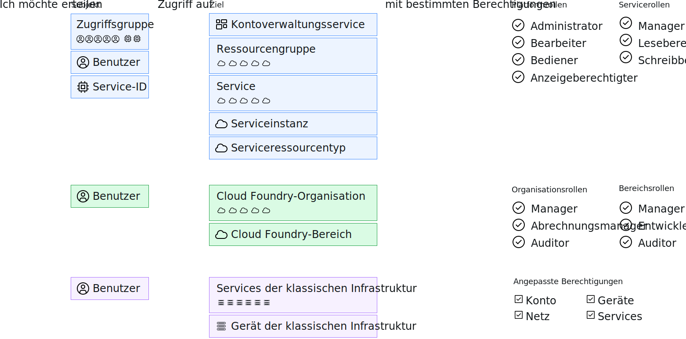

---

copyright:

  years: 2017, 2019

lastupdated: "2018-04-02"

keywords: users level of access, user control, access control, permissions

subcollection: overview

---

{:shortdesc: .shortdesc}
{:codeblock: .codeblock}
{:screen: .screen}
{:new_window: target="_blank"}

# Zugriff in {{site.data.keyword.Bluemix_notm}} verwalten
{: #cloudaccess}

Über das Zugriffsmanagement können Sie steuern, welche Benutzer Ressourcen in Ihrem Konto anzeigen, erstellen, verwenden und verwalten können. Um Zugriff zu erteilen, können Sie Rollen zuordnen, die den Benutzern auf verschiedenen Ebenen Zugriff für die Ausführung von Plattformverwaltungstasks und Zugriff auf Kontoressourcen ermöglichen.
{: shortdesc}

Die Art und Weise, wie der Zugriff in {{site.data.keyword.Bluemix}} verwaltet wird, hängt vom Typ der Ressource ab, für die Sie den Zugriff zuordnen möchten. {{site.data.keyword.Bluemix_notm}} Identity and Access Management (IAM) ist das Zugriffsmanagementsystem, das für die konsistente Verwaltung von Ressourcen verwendet wird, die in einer Ressourcengruppe auf der gesamten {{site.data.keyword.Bluemix_notm}}-Plattform organisiert sind. Klassische Infrastruktur- und Cloud Foundry-Ressourcen werden nicht mit Cloud IAM verwaltet. Diese Ressourcentypen verfügen über eigene Zugriffsmanagementsysteme. 

Wenn Sie eine Kombination verschiedener Ressourcentypen haben, verwalten Sie jeden Typ separat: 

* Rufen Sie bei IAM-Ressourcen **Verwalten** &gt; **Zugriff (IAM)** auf. Wählen Sie dann **Benutzer**, **Zugriffsgruppen** oder **Service-IDs** aus, um loszulegen.
* Sie weisen Zugriff auf Ihre [klassischen Infrastrukturressourcen](/docs/iam?topic=iam-infrapermission) zu, indem Sie in **Verwalten** > **Access (IAM)** auf der Registerkarte für die klassische Infrastruktur entsprechende Berechtigungen festlegen. 
* Wenn Sie Zugriff auf [Cloud Foundry-Ressourcen](/docs/iam?topic=iam-cfaccess) zuweisen möchten, ordnen Sie Benutzer zu Organisationen zu und legen Sie die Cloud Foundry-Zugriffsrollen "org" und "space" in **Verwalten** > **Zugriff (IAM)** auf der Cloud Foundry-Registerkarte für den Benutzer zu.

Während jeder Zugriffstyp separat verwaltet wird, bestehen alle Zugriffsrichtlinien aus einem Subjekt, dem Sie Zugriff zuweisen möchten, einem Ziel für die Richtlinie, auf den sich der Zugriff des Subjekts erstreckt, und schließlich einer IAM-Rolle, die Cloud Foundry-Rolle oder eine Berechtigung für die klassische Infrastruktur, um die Zugriffsebene des Subjekts auf das Ziel zu bestimmen.

Das Subjekt einer IAM-Richtlinie kann eine Benutzergruppe, Benutzer- oder Service-ID sein. Das Ziel kann ein Kontoverwaltungsservice, eine Ressourcengruppe, ein Service im Konto, eine bestimmte Serviceinstanz oder ein Ressourcentyp innerhalb eines Services sein. Plattform- und Servicerollen können ausgewählt werden, um die Zugriffsebene für das Subjekt festzulegen. Für den Cloud Foundry-Zugriff erhält ein Benutzer Zugriff auf eine Cloud Foundry-Organisation und einen Bereich, indem jede ausgewählt und eine "org"- und "space"-Rolle zugewiesen wird. Bei der klassischen Infrastruktur wird ein Benutzer ausgewählt, und der Zugriff kann auf einen Service oder auf ein Gerät mit bestimmten zugewiesenen Berechtigungen beschränkt werden. 

## Berechtigungen für die Verwaltung des Zugriffs
{: #perms-manageaccess}

Als Kontoeigner können Sie den Zugriff auf alle Ressourcen in Ihrem Konto verwalten. Sie können die Task zum Verwalten des Zugriffs auf Plattformressourcen auch delegieren, indem Sie einem Benutzer in Ihrem Konto die Administratorrolle für alle Services, nur einen bestimmten Service oder für die Ressourcengruppe zuordnen, die der Benutzer verwalten soll.

Wenn Sie über Cloud Foundry-Services in Ihrem Konto verfügen, können Sie einem anderen Benutzer die Rolle 'Organisationsmanager' oder 'Bereichsmanager' zuordnen, damit er Benutzer hinzufügen und Cloud Foundry-Rollen für den Zugriff auf Instanzen in der Organisation oder dem Bereich zuweisen kann, die/den sie verwalten.

## Einführung
{: #cloudaccess-getstarted}

Wechseln Sie zu **Verwalten** &gt; **Access (IAM)** und wählen Sie dann **Benutzer** aus, um mit der Verwaltung des Zugriffs für Benutzer in Ihrem Konto zu beginnen. Wählen Sie zunächst einen Benutzer aus der Liste aus. Sie sehen nur die Zugriffsmanagementoptionen, für die Sie eine Berechtigung haben. Wenn Sie z. B. nicht der Kontoeigner und kein Organisations- oder Bereichsmanager sind, wird die Option zum Verwalten des Cloud Foundry-Zugriffs nicht angezeigt.

Sie können Apps und Services auch Zugriffsrollen zuordnen, indem Sie Service-IDs verwenden. Rufen Sie dazu die Seite **Service-IDs** auf. Weitere Informationen zum schnellen Einstieg in {{site.data.keyword.Bluemix_notm}} IAM enthält das [Lernprogramm 'Einführung'](/docs/iam?topic=iam-getstarted).
