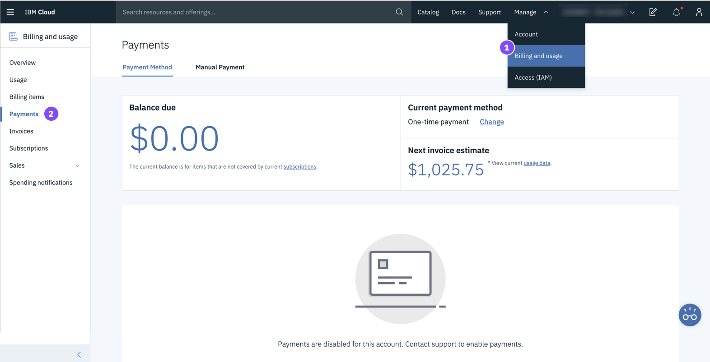
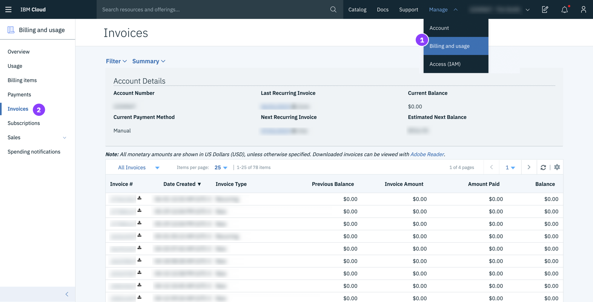

---

copyright:
  years: 2015, 2019
lastupdated: "2019-06-25"

keywords: ui, components, using the console, SoftLayer, classic infrastructure

subcollection: overview

---

{:shortdesc: .shortdesc}
{:tip: .tip}
{:note: .note}
{:new_window: target="_blank"}

# In der {{site.data.keyword.cloud_notm}}-Konsole navigieren 
{: #ui}

Die {{site.data.keyword.cloud}}-Konsole ist eine Benutzerschnittstelle, mit der Sie alle Ihre {{site.data.keyword.cloud_notm}}-Ressourcen verwalten können. Wenn Sie auf die [-Konsole](https://cloud.ibm.com){: new_window}   zugreifen, können Sie ein kostenfreies Konto erstellen, sich anmelden, auf die Dokumentation und den Katalog zugreifen, Preisinformationen anzeigen, Unterstützung anfordern oder den Status von {{site.data.keyword.cloud_notm}}-Komponenten überprüfen. Nachdem Sie sich angemeldet haben, enthält die Menüleiste ein Menüsymbol  und weitere Links.
{: shortdesc}

## Verwendung der Konsole
{: #consoleoptions}

Wenn Sie sich bei {{site.data.keyword.cloud_notm}} anmelden, wird Ihr Dashboard angezeigt, in dem die Widgets aufgeführt sind, die den Status Ihres Kontos zusammenfassen. Wenn Sie Widgets hinzufügen oder entfernen möchten, lesen Sie die Informationen im Abschnitt [Dashboard anpassen](/docs/overview?topic=overview-custom-dashboard).

  * Verwenden Sie den Link **Katalog**, um neue Ressourcen zu erstellen.
  * Verwenden Sie den Link **Docs**, um auf die Produktdokumentation zuzugreifen. 
  * Verwenden Sie den Link **Support**, um auf das Support Center zuzugreifen.  
  * Über das Menü **Verwalten** können Sie auf Ihre Konto-, Abrechnungs- und Nutzungsoptionen sowie auf die Optionen für Identity and Access Management (IAM) zugreifen.
  * Klicken Sie auf das Symbol für den Kostenschätzer , um den Kostenschätzer zu öffnen.
  * Klicken Sie auf das Benachrichtigungssymbol , um auf Ankündigungen und geplante sowie ungeplante Ereignisse zuzugreifen.

## Nach Ressourcen suchen
{: #search}

Sie können von jeder beliebigen Position in der {{site.data.keyword.cloud_notm}}-Konsole nach Name oder nach Tag nach Ressourcen suchen, die Sie in der Ressourcenliste erwarten. Geben Sie den Namen einer Ressource oder einen Tag in das Suchfeld in der Menüleiste der Konsole ein.

Weitere Informationen enthält [Nach Ressourcen suchen](/docs/resources?topic=resources-searching-for-resources). 

## Ressourcen in der Ressourcenliste verwalten
{: #dashboardview}

Rufen Sie das Menüsymbol  &gt; **Ressourcenliste** auf, um auf Ihre Liste von Kontoressourcen zuzugreifen. Sie können die Ressourcenliste Dashboard verwenden, um {{site.data.keyword.cloud_notm}}-Ressourcen und Cloud Foundry-Serviceinstanzen anzuzeigen und mit ihnen zu arbeiten. In [Was ist eine Ressource?](/docs/resources?topic=resources-resource) finden Sie weitere Informationen zu den verschiedenen Ressourcentypen.

### Ressourcen anzeigen
Über die Ressourcenliste können Sie alle Ressourcen Ihres Kontos für alle Regionen anzeigen. Damit die Elemente angezeigt werden, die für Sie wichtig sind, filtern Sie Ihre Liste mit den Filtern für die einzelnen Spaltenüberschriften. Wenn Sie Ressourcen an einem bestimmten Standort anzeigen und mit diesen arbeiten möchten, erweitern Sie den Filter **Standort** und wählen Sie einen Standort aus der Liste aus.

### Mit Ressourcen arbeiten
Über die Ressourcenliste können Sie auf unterschiedliche Arten mit Ihren Ressourcen arbeiten:

  * Jede Ressource wird in einer eigenen Zeile angezeigt, an deren Ende sich ein Symbol 'Aktionen'  befindet. Klicken Sie auf das Symbol 'Aktionen' , um eine Ressource zu starten, zu stoppen, umzubenennen oder zu löschen.
  * Wenn Sie Berechtigungsnachweise oder Verbindungen für eine Ressource konfigurieren möchten, klicken Sie auf den Namen der Ressource, um zur Seite mit den Ressourcendetails zu navigieren. Wählen Sie dann **Serviceberechtigungsnachweise** oder **Verbindungen** aus. Weitere Informationen finden Sie unter [Berechtigungsnachweis hinzufügen](/docs/resources?topic=resources-service_credentials) und [Verbindungen verwalten](/docs/resources?topic=resources-connect_app).

## Im Katalog arbeiten
{: #catalogcreate}

Wenn Sie eine Ressource erstellen möchten, klicken Sie in Ihrer Ressourcenliste auf **Erstellen**. Sie werden dann zu dem Katalog geleitet. Wenn Sie eine Kachel im Katalog auswählen, sehen Sie, wo die Ressource verfügbar ist. Nicht jede im Katalog aufgelistete Ressource ist in jeder Region verfügbar.

Nachdem Sie auf die Kachel für die Ressource geklickt haben, die Sie erstellen möchten, können Sie die Position auswählen, an der die Bereitstellung erfolgen soll.

  * Bei Cloud Foundry-Ressourcen können Sie eine bestimmte Region auswählen und dann die Organisation und den Bereich für die Serviceinstanz auswählen, die zugeordnet werden soll.
  * Für Ressourcen, die von {{site.data.keyword.cloud_notm}} Identity and Access Management (IAM) verwaltet werden, wählen Sie eine Position aus, an der die Bereitstellung durchgeführt werden soll. Anschließend wählen Sie eine Ressourcengruppe aus, der die Serviceinstanz zugeordnet werden soll.

## Wechsel zur {{site.data.keyword.cloud_notm}}-Erfahrung
{: #redirect-cloud}

Im Rahmen der Migration von SoftLayer zu {{site.data.keyword.cloud_notm}} machen Sie sich mit der {{site.data.keyword.cloud_notm}}-Konsole vertraut, über die die Plattform- und Infrastrukturressourcen verwaltet werden. Es wird derzeit daran gearbeitet, alle SoftLayer- und {{site.data.keyword.cloud_notm}}-Konten zu verknüpfen. Daher kann es sein, dass für Ihr Konto noch kein Zugriff besteht. Sobald ein Zugriff besteht, können Sie die neue Erfahrung in Anspruch nehmen. 

Das frühere SoftLayer wird jetzt als "klassische {{site.data.keyword.cloud_notm}}-Infrastruktur" bezeichnet.
{: note}

### Infrastrukturelemente lokalisieren
{: #sl-links}

Klicken Sie auf **Menüsymbol**  > **Klassische Infrastruktur**, um Ihre Geräte, Speicherung, Ihr Netz, Ihre Sicherheit und Services schnell zu lokalisieren. 

Sie können auch Ihre Geräte und Speicherelemente in der Ressourcenliste anzeigen, indem Sie auf **Menüsymbol**  > **Ressourcenliste** klicken.
{: tip}

### Benutzer, Zugriff und API-Schlüssel verwalten
{: #billing-items}

Sie können Benutzer in Ihrem Konto, den Zugriff auf die klassische Infrastruktur für Ihre Benutzer sowie die API-Schlüssel über den Abschnitt "Zugriff (IAM)" der Konsole verwalten. 

* Um neue Benutzer einzuladen, Benutzer zu entfernen oder die Anmeldeeinstellungen eines bestimmten Benutzers, die IP-Einschränkungen, das VPN-Kennwort und vieles mehr zu verwalten, wechseln Sie zu **Verwalten** > **Zugriff (IAM)** und wählen Sie **Benutzer** aus.
* Zum Starten der Verwaltung des Zugriffs für einen Benutzer auf die klassische Infrastruktur wechseln Sie zu **Verwalten** > **Zugriff (IAM)** und wählen Sie **Benutzer** aus. Weitere Einzelheiten hierzu finden Sie in [Zugriff auf die klassische Infrastruktur verwalten](/docs/iam?topic=iam-mngclassicinfra).
* Zum Erstellen und Verwalten von {{site.data.keyword.cloud_notm}}-API-Schlüsseln oder des API-Schlüssels für die klassische Infrastruktur wechseln Sie zu **Verwalten** > **Zugriff (IAM)** und wählen Sie **API-Schlüssel** aus. Weitere Informationen finden Sie in [Informationen zu API-Schlüsseln](/docs/iam?topic=iam-manapikey).

### Bestellung aufgeben
{: #place-order}

Verwenden Sie den Katalog, um eine Bestellung aufzugeben. Den Katalog können Sie auf einem der folgenden Wege aufrufen:

  * Klicken Sie in der Menüleiste auf **Katalog**.
  * Klicken Sie auf **Menüsymbol**  > **Ressourcenliste**. Klicken Sie anschließend auf **Ressource erstellen**.

### Zahlung vornehmen
{: #payments}

Sie können eine Zahlung über den Abschnitt "Abrechnung und Nutzung" der Konsole vornehmen. Wechseln Sie zu **Verwalten** > **Abrechnung und Nutzung** und wählen Sie **Zahlungen** aus. 

### Auf eigene Rechnungen zugreifen
{: #invoices}

Über den Abschnitt "Abrechnung und Nutzung" der Konsole können Sie auf Ihre Rechnungen zugreifen. Wechseln Sie zu **Verwalten** > **Abrechnung und Nutzung** und wählen Sie **Rechnungen** aus.

### Auf Verkaufsartikel zugreifen
{: #sales}

Ihre Angebote für Geräte und Upgrades, Ihre Bestellungen, Stornierungen und Lieferungen können Sie im Abschnitt "Abrechnung und Nutzung" der Konsole einsehen. Wechseln Sie zu **Verwalten** > **Abrechnung und Nutzung** und wählen Sie **Vertrieb** aus. 

### Auf eigene Supportfälle zugreifen
{: #support-mng}

Für den Zugriff auf Ihre aktuellen Supportfälle klicken Sie auf **Support** > **Fälle verwalten**. Sie können auch auf Ihre archivierten Fälle zugreifen, indem Sie auf **Archivierte Fälle anzeigen** klicken.

### Feedback senden
{: #feedback-profile}

Sie können eine positive Rückmeldung, einen Vorschlag oder anderweitiges Feedback einreichen. Für den Kontakt mit unseren Ansprechpartnern wählen Sie aus den folgenden Methoden:

  * Klicken Sie auf die Schaltfläche **Feedback** am Rand der Konsolenseite. 
  * Klicken Sie auf **Avatarsymbol**  > **Feedback**. 

### E-Mail-Vorgaben festlegen
{: #email-prefsl}

Sie können Ihre Vorgaben festlegen, um E-Mails mit Plattform- und Infrastrukturbenachrichtigungen zu erhalten. Klicken Sie auf **Avatarsymbol**  > **Profil und Einstellungen** und wählen Sie **Benachrichtigungen** aus.

### VPN-Zugriffspunkt auswählen
{: #vpn-access}

Sie können sich an der {{site.data.keyword.cloud_notm}}-Konsole anmelden, indem Sie einen VPN-Zugriffspunkt verwenden. Wechseln Sie zu [VPN-Zugriff](https://www.ibm.com/cloud-computing/bluemix/vpn-access) und wählen Sie einen Zugriffspunkt aus den Listen aus.

