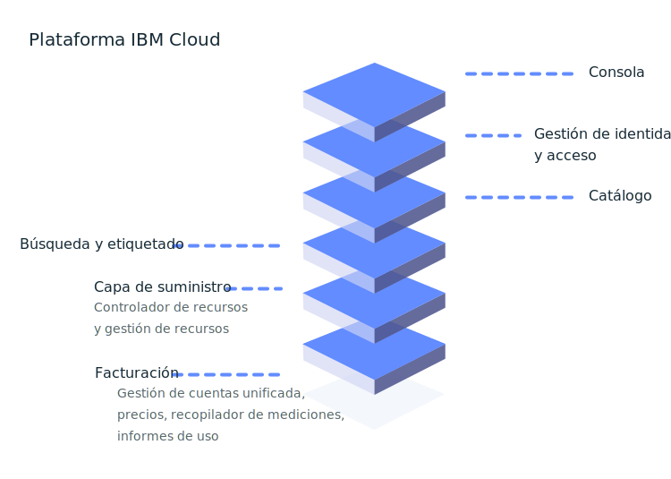

---

copyright:
  years: 2016, 2019
lastupdated: "2019-07-25"

keywords: console, platform overview, overview

subcollection: overview

---

{:shortdesc: .shortdesc}
{:new_window: target="_blank"}

# ¿Qué es la plataforma {{site.data.keyword.Bluemix_notm}}?
{: #whatis-platform}

La plataforma en la nube de IBM combina una plataforma como servicio (PaaS) con la infraestructura como servicio (IaaS) para proporcionar una experiencia integrada. La plataforma escala y ofrece soporte a organizaciones y equipos de desarrollo pequeños y también a grandes empresas. Implementada globalmente en centros de datos de todo el mundo, la solución que crea en {{site.data.keyword.cloud}} se activa rápidamente y se desempeña de manera fiable en un entorno probado y soportado en el que pueda confiar.
{: .shortdesc}

Tal como se muestra en el siguiente diagrama, la plataforma {{site.data.keyword.Bluemix_notm}} consta de varios componentes que trabajan conjuntamente para proporcionar una experiencia en la nube coherente y fiable. 

  * Una consola robusta que sirve como frontal para crear, ver y gestionar los recursos en la nube
  * Un componente de gestión de identidad y acceso que autentica usuarios de forma segura en los servicios de plataforma y controla el acceso a recursos de forma coherente en {{site.data.keyword.Bluemix_notm}}
  * Un catálogo que consta de cientos de ofertas de {{site.data.keyword.Bluemix_notm}}
  * Un mecanismo de búsqueda y etiquetado para filtrar e identificar los recursos
  * Un sistema de gestión de cuentas y facturación que proporciona una utilización exacta de los planes de precios y protección de fraude con tarjeta de crédito
  

En el caso de que disponga de [código existente](/docs/apps/tutorials?topic=creating-apps-tutorial-byoc#tutorial-byoc) que desee modernizar y traer a la nube o de estar desarrollando una [nueva aplicación](/docs/apps/tutorials?topic=creating-apps-tutorial-starterkit), sus desarrolladores pueden tocar en el ecosistema de rápido crecimiento de los servicios e infraestructuras de tiempo de ejecución disponibles en {{site.data.keyword.Bluemix_notm}}.

## Configuración de la cuenta
{: #set-up-account}

Si es un desarrollador y sólo está probando {{site.data.keyword.Bluemix_notm}}, puede ir directamente al catálogo y empezar a ver las ofertas que desea explorar y añadir a su cuenta Lite. Cuando esté listo para empezar a utilizar un entorno y obtener apps ejecutándose en producción, considere la posibilidad de configurar los conceptos básicos de su cuenta:

* Grupos de acceso para organizar los usuarios y los ID de servicio en una entidad para simplificar el proceso de asignación de acceso.
* Grupos de recursos para organizar los recursos y hacer que la asignación de acceso a un grupo de recursos sea rápida y sencilla.
* Políticas de acceso para los grupos de acceso o desarrolladores individuales que necesiten políticas de acceso de IAM o roles de espacio y organizaciones de Cloud Foundry.

Para obtener más información, consulte [prácticas recomendadas para la configuración de su cuenta](/docs/account?topic=account-account_setup) y [prácticas recomendadas para la asignación de acceso](/docs/iam?topic=iam-account_setup). 

Como responsable de finanzas de la empresa, podría estar interesado en simplificar la forma en que gestiona la facturación y el uso en varios equipos y departamentos. Con una cuenta de Suscripción, puede crear una empresa de {{site.data.keyword.Bluemix_notm}}, que ofrece gestión de cuentas centralizada, facturación consolidada e informes de uso de arriba abajo. Una empresa consta de una cuenta de empresa, grupos de cuentas y cuentas individuales. 

* La cuenta de empresa es la cuenta padre de todas las demás cuentas de la empresa. La facturación para toda la empresa se gestiona en el nivel de la cuenta de empresa.
* Los grupos de cuentas ofrecen un modo de organizar cuentas relacionadas. Además, obtiene una vista unificada de los costes de uso de recursos en todas las cuentas que se incluyen en un grupo de cuentas.
* De forma similar a las cuentas autónomas, las cuentas de una empresa contienen recursos y grupos de recursos, organizaciones y espacios de Cloud Foundry y permisos de acceso independientes.

Para obtener más información, consulte las [Prácticas recomendadas para configurar una empresa](/docs/account?topic=account-enterprise-best-practices).
## Precios y facturación
{: #pricing-billing}

Independientemente del tipo de cuenta, puede explorar {{site.data.keyword.Bluemix_notm}} utilizando planes Lite en los servicios que proporcionan cuotas fijas. Cuando elija el servicio de un catálogo y seleccione un mosaico, si hay distintos tipos de planes disponibles, podrá ver los detalles sobre la información de precios. Si elige un plan de servicio con un plan de pago, podrá calcular los costes utilizando la herramienta de estimación de costes. Para obtener más información, consulte [Estimación de los costes](/docs/billing-usage?topic=billing-usage-cost).

La facturación de {{site.data.keyword.Bluemix_notm}} proporciona varios servicios que garantizan que la plataforma de {{site.data.keyword.Bluemix_notm}} puede gestionar de forma segura los precios, las cuentas, el uso, etc.

### Gestión de cuentas
{: #account-mgmt}

La gestión de cuentas mantiene la relación de facturación con el cliente. Cada cuenta es una entidad de facturación que representa a un cliente. Este servicio controla el ciclo de vida, la suscripción, la relación de usuario y la organización de la cuenta.

### Tarifas
{: #pricing}

El servicio de plataforma de precios le ayuda a definir, gestionar y recuperar información de precios para los recursos del catálogo de {{site.data.keyword.Bluemix_notm}}.

### Medición del uso
{: #metering}

Con la calibración de uso, los proveedores de servicios pueden enviar métricas recopiladas para instancias de recursos suministradas por usuarios de {{site.data.keyword.Bluemix_notm}}. Los proveedores de servicios de terceros que distribuyen un servicio de facturación integrado deben enviar datos de uso a todas las instancias de servicio activas cada hora. 

### Informes de uso
{: #usage}

Los informes de uso devuelven el resumen de la cuenta para el mes especificado. Los gestores de facturación de la cuenta están autorizados para acceder a los informes.

## Catálogo de {{site.data.keyword.Bluemix_notm}}
{: #catalog}

El catálogo de {{site.data.keyword.Bluemix_notm}} almacena las definiciones de la oferta (descripción, características, imágenes, URL, etc.) de los recursos que están disponibles en la consola de {{site.data.keyword.Bluemix_notm}}. Las ofertas se gestionan en zonas geográficas como sistema de registros. El catálogo ofrece soporte a las interfaces de línea de mandatos (CLI) y la API RESTful en las que el usuario puede recuperar información sobre las ofertas existentes y crear, gestionar y suprimir sus recursos. Para obtener más información, consulte [Gestión del catálogo](/docs/overview?topic=overview-manage-catalog).

## Creación de recursos
{: #provisioning-layer}

El controlador de recursos es la capa de suministro de la plataforma {{site.data.keyword.Bluemix_notm}} de última generación que gestiona el ciclo de vida de los recursos de {{site.data.keyword.Bluemix_notm}} en la cuenta. Los recursos se suministran globalmente en un ámbito de la cuenta. El controlador de recursos ofrece soporte al suministro síncrono y asíncrono de recursos. Los ejemplos de recursos incluyen límites almacenamiento, bases de datos, cuentas, procesadores y memoria. 

En general, los recursos de los que la capa de suministro realiza un seguimiento están pensados para asociar métricas de uso y métodos de facturación, pero no siempre es así. En algunos casos, el recurso puede estar asociado con la capa de suministro para garantizar que el ciclo de vida del recurso se puede gestionar junto con el ciclo de vida de la cuenta. El controlador de recursos utiliza {{site.data.keyword.Bluemix_notm}} Identity and Access Management (IAM) para la autenticación y autorización de acciones que se emprenden sobre la capa de suministro.

### Gestión del ciclo de vida de un recurso
{: #lifecycle}

El controlador de recursos proporciona API comunes para controlar el ciclo de vida de los recursos desde la creación de una instancia, pasando por la creación de credenciales de acceso, hasta la supresión de una instancia.

## Gestión de los recursos
{: #resource-manager}

Los [grupos de recursos](/docs/overview?topic=overview-whatis-rgs) gestionan las colecciones de recursos. Los grupos de recursos se asocian con la cuenta. Todos los recursos de {{site.data.keyword.Bluemix_notm}} se deben asignar a un grupo de recursos. Cuando crea una cuenta, se crea también un grupo de recursos predeterminado. Todos los recursos de {{site.data.keyword.Bluemix_notm}} habilitados para IAM deben suministrarse dentro de un grupo de recursos. Si tiene una cuenta Lite, solo puede tener un grupo de recursos. Si tiene una cuenta de Pago según uso o de Suscripción, puede crear más de un grupo de recursos. Si una cuenta está suspendida, el grupo de recursos correspondiente se suspende y todos los recursos del mismo también se suspenden. 

## Búsqueda y etiquetado de recursos
{: #search-and-tag}

El servicio de búsqueda es un repositorio de propiedades de recursos compartidos y globales integrado en la plataforma {{site.data.keyword.Bluemix_notm}}. Se utiliza para almacenar y buscar atributos de un recurso de nube, y categoriza y clasifica recursos. Los recursos se identifican de forma exclusiva mediante un identificador de [Nombre de recursos de nube (CRN)](/docs/overview?topic=overview-crn). Las propiedades de un recurso incluyen etiquetas y propiedades del sistema. Ambas propiedades se definen en una cuenta de facturación de {{site.data.keyword.Bluemix_notm}} y abarcan varias regiones.

Este servicio también gestiona las etiquetas que están asociadas a un recurso. Puede crear, suprimir, buscar, adjuntar y desconectar etiquetas con la API de etiquetas. Las etiquetas se identifican de forma exclusiva mediante un CRN. Las etiquetas tienen un nombre, que debe ser exclusivo de una cuenta de facturación. Puede crear etiquetas en pares key:value o en formato de etiqueta.

## Supervisión de los recursos
{: #resources_observability}

La observabilidad ofrece una única ubicación desde la que puede supervisar y observar sus aplicaciones y servicios en {{site.data.keyword.Bluemix_notm}}. 

Con el servicio {{site.data.keyword.la_full}}, puede añadir prestaciones de gestión de registros a su arquitectura {{site.data.keyword.Bluemix_notm}} y puede gestionar los registros del sistema y de la aplicación. Ofrece funciones avanzadas para supervisar y solucionar problemas, definir alertas y diseñar paneles de control personalizados. {{site.data.keyword.la_full_notm}} recibe soporte de LogDNA junto con {{site.data.keyword.IBM_notm}}. Para obtener más información, consulte [Guía de iniciación a {{site.data.keyword.la_full_notm}}](/docs/services/Log-Analysis-with-LogDNA?topic=LogDNA-getting-started).

El servicio {{site.data.keyword.mon_full_notm}} le ofrece visibilidad operativa sobre el rendimiento y el estado de sus aplicaciones, servicios y plataformas. Ofrece telemetría con funciones avanzadas para supervisar y solucionar problemas, definir alertas y diseñar paneles de control personalizados. {{site.data.keyword.mon_full_notm}} recibe soporte de Sysdig junto con {{site.data.keyword.IBM_notm}}. Para obtener más información, consulte [Iniciación a IBM Cloud Monitoring con el servicio Sysdig](/docs/services/Monitoring-with-Sysdig?topic=Sysdig-getting-started#getting-started).

## Supervisión de la cuenta 
{: #account_observability}

Utilice el servicio {{site.data.keyword.at_full}} para supervisar la actividad de la cuenta de {{site.data.keyword.Bluemix_notm}}, investigar cualquier actividad anómala y acciones críticas y cumplir con los requisitos de auditoría normativa. Además, puede recibir alertas sobre acciones a medida que se producen. Los sucesos que se recopilan cumplen con la normativa de Cloud Auditing Data Federation (CADF). Para obtener más información, consulte [Guía de iniciación a {{site.data.keyword.at_full_notm}}](/docs/services/Activity-Tracker-with-LogDNA?topic=logdnaat-getting-started).
