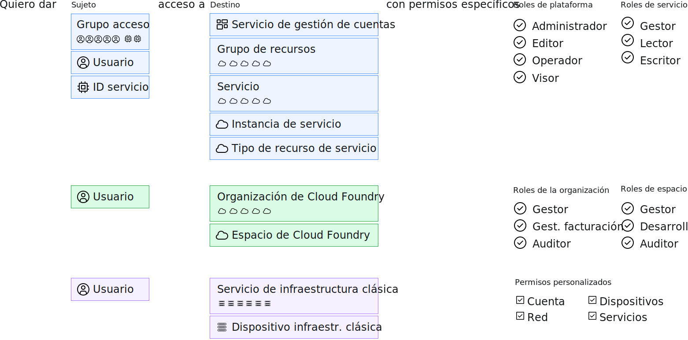

---

copyright:

  years: 2017, 2019

lastupdated: "2018-04-02"

keywords: users level of access, user control, access control, permissions

subcollection: overview

---

{:shortdesc: .shortdesc}
{:codeblock: .codeblock}
{:screen: .screen}
{:new_window: target="_blank"}

# Gestión de acceso en {{site.data.keyword.Bluemix_notm}}
{: #cloudaccess}

La gestión de acceso le permite controlar qué usuarios ven, crean, utilizan y gestionan recursos en su cuenta. Para otorgar acceso, puede asignar roles que permitan a los usuarios niveles de acceso para completar tareas de gestión de plataforma y acceder a recursos de cuenta.
{: shortdesc}

La forma en que gestiona el acceso en {{site.data.keyword.Bluemix}} depende del tipo de recurso al que desea asignar acceso. {{site.data.keyword.Bluemix_notm}} Identity and Access Management (IAM) es el sistema de gestión de acceso que se utiliza para gestionar recursos de forma coherente organizado en un grupo de recursos en la plataforma de {{site.data.keyword.Bluemix_notm}}. La infraestructura clásica y los recursos de Cloud Foundry no se gestionan utilizando Cloud IAM. Estos tipos de recursos tienen sus propios sistemas de gestión de acceso. 

Si tiene una combinación de tipos de recursos, gestiona cada tipo de forma separada:

* Para los recursos de IAM, vaya a **Gestionar** &gt; **Acceso (IAM)** y, a continuación, seleccione **Usuarios**, **Grupos de acceso** o **ID de servicio** para empezar.
* Para asignar el acceso a los [recursos de la infraestructura clásica](/docs/iam?topic=iam-infrapermission), establezca los permisos en **Gestionar** > **Acceso (IAM)** en el separador Infraestructura clásica del usuario al que desea asignar el acceso. 
* Para asignar acceso a los [Recursos de Cloud Foundry](/docs/iam?topic=iam-cfaccess), asigne usuarios a organizaciones y establezca Cloud Foundry y los roles de acceso del espacio en **Gestionar** > **Acceso (IAM)** en el separador de Cloud Foundry para el usuario.

Mientras que cada tipo de acceso se gestiona por separado, todas las políticas de acceso se componen de un sujeto al cual desea asignarle acceso, un destino para que la política delimite el ámbito al cual tiene acceso el sujeto y, finalmente, un rol de IAM, un rol de Cloud Foundry o un permiso de infraestructura clásica para determinar el nivel de acceso que el sujeto tiene en el destino.

Para las políticas de IAM, el sujeto puede ser un grupo de acceso, un usuario o un ID de servicio. Y, el destino puede ser un servicio de gestión de cuentas, un grupo de recursos, un servicio en la cuenta, una instancia de servicio específica o un tipo de recurso dentro de un servicio. Los roles de plataforma y servicio se pueden seleccionar para delimitar el nivel de acceso del sujeto. Para el acceso de Cloud Foundry, a un usuario se le otorga acceso a una organización y espacio de Cloud Foundry seleccionando cada uno y asignando un rol de organización y un rol de espacio. Para la infraestructura clásica, se selecciona un usuario y, a continuación, se puede delimitar el acceso a un servicio o dispositivo con los permisos específicos asignados.

## Permisos para gestionar el acceso
{: #perms-manageaccess}

Como propietario de una cuenta, puede gestionar el acceso a todos los recursos de su cuenta. También puede delegar la tarea de gestionar el acceso a los recursos de plataforma asignando el rol de administrador a un usuario en su cuenta para todos los servicios, solo un servicio en concreto o el grupo de recursos que desea que gestione el usuario.

Si tiene servicios de Cloud Foundry en su cuenta, puede asignar a otro usuario el rol de gestor de espacio u organización para que pueda añadir usuarios y asignar roles de Cloud Foundry para acceder a las instancias en el espacio u organización que gestionan.

## Guía de inicio
{: #cloudaccess-getstarted}

Vaya a **Gestionar** &gt; **Acceso (IAM)** y seleccione **Usuarios** para empezar a gestionar el acceso de los usuarios de la cuenta. Seleccione un usuario de la lista para empezar. Solo ve las opciones de gestión de acceso que tiene permisos para gestionar. Por ejemplo, si no es el propietario de la cuenta y no es un gestor de organización o espacio, no ve la opción de gestionar el acceso de Cloud Foundry.

También puede asignar roles de acceso a apps y servicios utilizando los ID de servicio. Vaya a la página **ID de servicio** para empezar. Para obtener más información sobre cómo empezar a trabajar rápidamente con {{site.data.keyword.Bluemix_notm}} IAM, consulte la [Guía de aprendizaje de iniciación](/docs/iam?topic=iam-getstarted).
