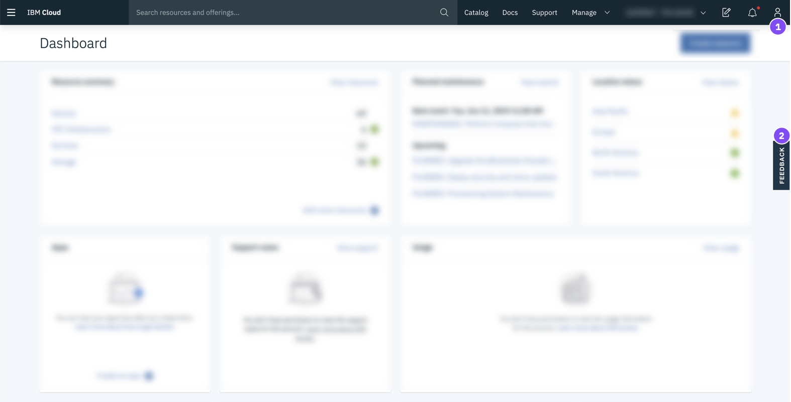

---

copyright:
  years: 2015, 2019
lastupdated: "2019-06-25"

keywords: ui, components, using the console, SoftLayer, classic infrastructure

subcollection: overview

---

{:shortdesc: .shortdesc}
{:tip: .tip}
{:note: .note}
{:new_window: target="_blank"}

# Navegación en la consola de {{site.data.keyword.cloud_notm}} 
{: #ui}

La consola de {{site.data.keyword.cloud}} es una interfaz de usuario que le ayuda a gestionar todos sus recursos de {{site.data.keyword.cloud_notm}}. Cuando accede a la [consola](https://cloud.ibm.com){: new_window} , puede crear una cuenta gratuita, iniciar sesión, acceder a documentación, acceder al catálogo, ver la información de precios o comprobar el estado de los componentes de {{site.data.keyword.cloud_notm}}. Tras iniciar una sesión, la barra de menús contiene un icono Menú  y más enlaces.
{: shortdesc}

## Utilización de la consola
{: #consoleoptions}

Al iniciar sesión en {{site.data.keyword.cloud_notm}}, aparece el panel de control, que muestra widgets que resumen el estado de la cuenta. Si tiene interés en añadir o eliminar widgets, consulte
[Personalización del panel de control](/docs/overview?topic=overview-custom-dashboard).

  * Utilice el enlace de **Catálogo** para crear nuevos recursos.
  * Utilice el enlace **Documentos** para acceder a la documentación del producto.  
  * Utilice el enlace **Soporte** para acceder al centro de soporte.  
  * Desde el menú **Gestionar**, puede acceder a las opciones de su cuenta, de facturación y uso y de Gestión de identidad y acceso.
  * Pulse el icono Estimador de costes  para abrir el estimador de costes.
  * Pulse en el icono Notificaciones  para acceder a los anuncios y a los sucesos planificados y no planificados.

## Búsqueda de recursos
{: #search}

Puede buscar recursos por nombre o etiqueta desde cualquier lugar en la consola de {{site.data.keyword.cloud_notm}} para obtener los recursos que espera encontrar en la lista de recursos. Escriba el nombre del recurso o la etiqueta en el campo de búsqueda de la barra de menús de la consola.

Para obtener más información, consulte [Búsqueda de recursos](/docs/resources?topic=resources-searching-for-resources). 

## Gestión de recursos en la lista de recursos
{: #dashboardview}

Vaya al icono Menú  &gt; **Lista de recursos** para acceder a la lista de recursos de cuenta. Puede utilizar la lista de recursos para ver y trabajar con los recursos de {{site.data.keyword.cloud_notm}} y con las instancias de servicio de Cloud Foundry. Consulte [¿Qué es un recurso?](/docs/resources?topic=resources-resource) para obtener más información sobre los diferentes tipos de recurso.

### Visualización de recursos
Puede ver todos los recursos de la cuenta en todas las regiones desde la lista de recursos. Para ver los elementos que son importantes para usted, filtre la lista con los filtros correspondientes a cada cabecera de columna. Por ejemplo, si desea visualizar y trabajar con recursos en una ubicación específica, expanda el filtro **Ubicación** y seleccione una ubicación de la lista.

### Cómo trabajar con los recursos
Puede trabajar con los recursos de varias formas desde la lista de recursos:

  * Cada recurso se visualiza en su propia fila y se incluye un icono de Acciones  al final de la fila. Pulse el icono Acciones  para iniciar, detener, renombrar o suprimir un recurso.
  * Para configurar credenciales o conexiones para un recurso, pulse el nombre del recurso para navegar a la página de detalles del recurso. Luego, pulse **Credenciales de servicio** o **Conexiones**. Para obtener más información, consulte [Adición de una credencial](/docs/resources?topic=resources-service_credentials) y [Gestión de conexiones](/docs/resources?topic=resources-connect_app).

## Cómo trabajar en el catálogo
{: #catalogcreate}

Para crear un nuevo recurso, pulse **Crear** de la lista de recursos. Se le dirigirá al catálogo. Al seleccionar un mosaico del catálogo, puede ver dónde está disponible el recurso. No todos los recursos listados en el catálogo están disponibles en todas las regiones.

Después de pulsar en el mosaico del recurso que desea crear, puede seleccionar la ubicación donde quiere desplegarlo.

  * Para los recursos de Cloud Foundry, puede seleccionar una región específica y luego seleccionar la organización o espacio al que asignar la instancia de servicio.
  * Para los recursos gestionados por {{site.data.keyword.cloud_notm}} Identity and Access Management (IAM), seleccione la ubicación en la que desplegarlos. A continuación, seleccione un grupo de recursos al que asignar la instancia de servicio.

## Transición a la experiencia de {{site.data.keyword.cloud_notm}}
{: #redirect-cloud}

Como parte de la migración de SoftLayer a {{site.data.keyword.cloud_notm}}, familiarícese con la consola de
{{site.data.keyword.cloud_notm}}, que utilizará para gestionar los recursos tanto de la plataforma como de la infraestructura. Actualmente estamos en proceso de enlazar las cuentas de SoftLayer y de {{site.data.keyword.cloud_notm}}. Por lo tanto, es posible que su cuenta aún no tenga acceso. Tan pronto como tenga acceso, podrá comprobar la nueva experiencia. 

La anteriormente denominada SoftLayer, ahora se denomina infraestructura clásica de {{site.data.keyword.cloud_notm}}.
{: note}

### Localización de los elementos de infraestructura
{: #sl-links}

Pulse el **Icono Menú**  > **Infraestructura clásica** para localizar rápidamente sus dispositivos, almacenamiento, red, seguridad y servicios. 

También puede ver los dispositivos y elementos de almacenamiento en la lista de recursos pulsando sobre el
**Icono Menú**  > **Lista de recursos**.
{: tip}

### Gestión de usuarios, el acceso y las claves de API
{: #billing-items}

Puede gestionar los usuarios de su cuenta, el acceso a la infraestructura clásica de sus usuarios y las claves de API desde la sección Acceso (IAM) de la consola.  

* Para invitar a nuevos usuarios, eliminar usuarios o gestionar los valores de inicio de sesión, restricciones de IP, contraseña de VPN, etc. de un usuario específico, vaya a **Gestionar** > **Acceso (IAM)** y seleccione **Usuarios**.
* Para empezar a gestionar el acceso a la infraestructura clásica de un usuario, vaya a
**Gestionar** > **Acceso (IAM)** y seleccione **Usuarios**. Para obtener más detalles, consulte [Gestión de acceso de la infraestructura clásica](/docs/iam?topic=iam-mngclassicinfra).
* Para crear y gestionar claves de API de {{site.data.keyword.cloud_notm}} o una clave de API de la infraestructura clásica, vaya a
**Gestionar** > **Acceso (IAM)** y seleccione **Claves de API**. Para obtener más información, consulte [Comprensión de claves de API](/docs/iam?topic=iam-manapikey).

### Realización de un pedido
{: #place-order}

Utilice el catálogo para realizar un pedido. Puede navegar hasta el catálogo de una de las maneras siguientes:

  * Pulse **Catálogo** en la barra de menús.
  * Pulse en el **icono de Menú**  > **Lista de recursos**. A continuación, pulse **Crear recurso**.

### Efectuar un pago
{: #payments}

Puede realizar un pago desde la sección Facturación y uso de la consola. Vaya a **Gestionar** > **Facturación y uso** y seleccione **Pagos**. 

### Acceso a las facturas
{: #invoices}

Puede acceder a sus facturas desde la sección Facturación y uso de la consola. Vaya a **Gestionar** > **Facturación y uso** y seleccione **Facturas**.

### Acceso a los elementos de ventas
{: #sales}

Los presupuestos de dispositivos y las actualizaciones, pedidos, cancelaciones y envíos están en la sección Facturación y uso de la consola. Vaya a **Gestionar** > **Facturación y uso** y seleccione **Ventas**. 

### Acceso a los casos de soporte
{: #support-mng}

Para acceder a sus casos de soporte actuales, pulse **Soporte** > **Gestionar casos**. También puede acceder a sus casos archivados pulsando **Ver casos archivados**.

### Enviar comentarios
{: #feedback-profile}

Puede enviar una crítica positiva, una sugerencia o cualquier otro tipo de comentario. Para mantenerse en contacto con nosotros, elija uno de los métodos siguientes:

  * Pulse el botón **Comentarios** que se encuentra en el borde de la página de la consola. 
  * Pulse el **Icono de avatar**  > **Comentarios**. 

### Configuración de las preferencias de correo electrónico
{: #email-prefsl}

Puede establecer sus preferencias para recibir correos electrónicos acerca de notificaciones sobre la plataforma y la infraestructura. Pulse el
**Icono Avatar**  > **Perfil y valores**, y seleccione
**Notificaciones**.

### Selección del punto de acceso a VPN
{: #vpn-access}

Puede iniciar sesión en la consola de {{site.data.keyword.cloud_notm}} utilizando un punto de acceso a VPN. Vaya a
[Acceso a VPN](https://www.ibm.com/cloud-computing/bluemix/vpn-access) y seleccione un punto de acceso de la lista. 

