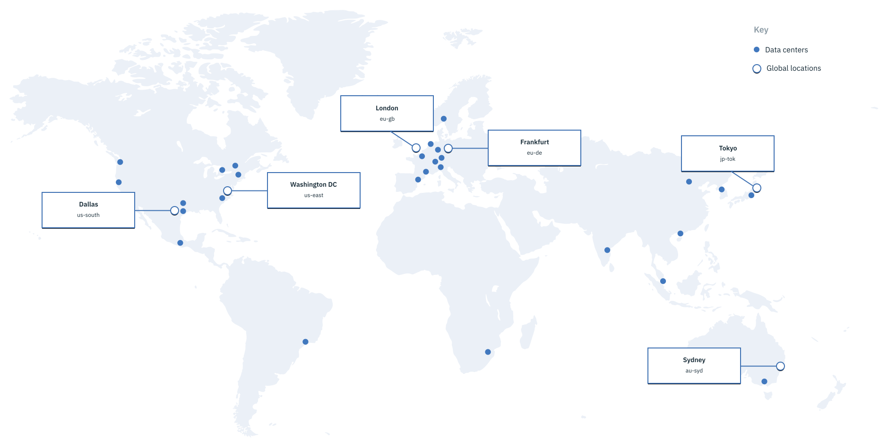

---

copyright:
  years: 2018, 2019
lastupdated: "2019-03-14"

keywords: HA, failover, DR

subcollection: overview

---

{:shortdesc: .shortdesc}
{:codeblock: .codeblock}
{:screen: .screen}
{:new_window: target="_blank"}
{:pre: .pre}
{:table: .aria-labeledby="caption"}
{:note: .deprecated}


# ¿Cómo puedo asegurar un tiempo de inactividad cero?
{: #zero-downtime}

Su estrategia global es importante. Puede seleccionar un centro de datos o ubicación específicos para desplegar los datos en la parte correcta del mundo para sus clientes. 
{:shortdesc}

Los servicios de la plataforma {{site.data.keyword.Bluemix}} son autogestionados. Lo que significa, que las ubicaciones en las que despliega la app pueden dispersar cargas de trabajar entre los centros de datos. Y puede garantizar que se ha establecido un diseño de migración tras error, lo que significa que su app siempre está funcionando para sus clientes. Para los recursos de infraestructura, puede seleccionar centros de datos individuales en los que se despliegan los recursos. 

Todos los recursos de {{site.data.keyword.Bluemix_notm}} están alojados en ubicaciones de centros de datos de todo el mundo. La alta disponibilidad y la recuperación tras desastre no son universales en todos los servicios, por lo que el tipo de alta disponibilidad y de recuperación tras desastre disponibles dependen del servicio que utilice.  

## Recuperación tras desastre
{: #disaster-recovery}

La recuperación tras desastre consiste en sobrevivir a un error catastrófico o pérdida de disponibilidad en una sola ubicación. Para garantizar que se establece la recuperación tras desastre, es necesario desplegar varios entornos de {{site.data.keyword.Bluemix_notm}} en varias ubicaciones para evitar puntos únicos de error. Estos entornos pueden ser una combinación de plataformas públicas, dedicadas o locales.  

### Plan de recuperación tras desastre 
{: #dr-plan}

{{site.data.keyword.Bluemix_notm}} sigue los requisitos de la planificación para un desastre y cada aplicación tiene un plan para que se recupere o reinicie tras un desastre. La recuperación se realiza a partir de copias de seguridad electrónicas en un centro de recuperación o en servicios de cálculo alternativos que restauran el cálculo. Antes de cualquier posible desastre, el plan de recuperación tras desastre incluye los requisitos de alojamiento y sistemas para las prestaciones de hardware, software, conectividad de red y copia de seguridad externa.

La lista siguiente incluye los requisitos del plan de recuperación tras desastre:

- Para el equilibrio de carga, existe un documento que sirve para explicar cómo permanece disponible el servicio de cálculo. 
- Cuando se produce una migración tras error multisitio, el plan de recuperación tras desastre debe explicar qué es lo que hace cada cosa para que se haya producido la migración tras error y garantizar el reinicio. 
- El plan de recuperación tras desastre debe definir cómo funciona la solución y cuál es la pérdida de datos. 
- Debe confirmar cómo se obtiene el tiempo de inactividad máximo tolerable y almacenarse en la base de datos del plan de recuperación tras desastre.  
- El plan de recuperación tras desastre especifica los controles de seguridad para la ejecución en la modalidad de desastre, en caso de que sean distintos de los que se ejecutan en la producción. 

### Gestión del plan de recuperación tras desastre 
{: #dr-plan-mgmt}

Los requisitos que {{site.data.keyword.Bluemix}} sigue son: 

- El plan de recuperación tras desastre debe actualizarse después de que se produzca cualquier cambio importante en la infraestructura, tras release de aplicación principal y después de que se realice cualquier prueba. 
- Debe aprobarse anualmente. 

## Ubicaciones para el despliegue de recursos 
{: #ov_intro_reg}

Puede crear apps e instancias de servicios en distintas ubicaciones con la misma infraestructura de {{site.data.keyword.cloud_notm}} para la gestión de aplicaciones y la misma vista de detalles de uso para la facturación. Tiene la posibilidad de desplegar sus apps en la ubicación más cercana a sus clientes para conseguir una latencia de aplicación baja. 

Para solventar problemas de seguridad, también puede seleccionar la ubicación en la que desea conservar los datos de aplicación. Cuando crea apps en más de una ubicación, si una ubicación deja de estar disponible. las apps que están en las otras ubicaciones seguirán funcionando. Su concesión de recursos es la misma para cada ubicación que utilice. Para obtener más información acerca de los recursos de la plataforma y las ubicaciones en las que están disponibles, consulte [Disponibilidad de servicios](/docs/resources?topic=resources-services_region).

El equilibrio de carga global de la consola de {{site.data.keyword.cloud_notm}} garantiza que si la ubicación geográfica más próxima no está disponible, la consola muestra la información de la siguiente ubicación más próxima. De esta forma, siempre podrá acceder a la consola sin realizar acción alguna para acceder a los recursos que necesita.

Puede ver todos los recursos en todas las ubicaciones de forma predeterminada desde la vista de la lista de recursos de la consola. Si desea ver y trabajar con recursos en una ubicación específica, expanda el menú **UBICACIÓN** y seleccione una ubicación de la lista. 

## Centros de datos
{: #data_center}

Si despliega recursos de la infraestructura, tendrá más opciones para elegir dónde están ubicados los datos. Puede seleccionar una ubicación o puede seleccionar en la lista de centros de datos de {{site.data.keyword.Bluemix_notm}}. Un *centro de datos* es una ubicación física que aloja los recursos de alimentación, refrigeración, cálculo, red y almacenamiento utilizados en los servicios y apps. Los centros de datos no proporcionan aislamiento de errores locales similares a las varias zonas de una ubicación. Para obtener más información, consulte [Ubicaciones globales para su empresa global ](https://www.ibm.com/cloud/data-centers/){: new_window}.

{{site.data.keyword.Bluemix_notm}} ofrece centros de datos en diversas ubicaciones de todo el mundo. Cuando despliegue recursos de su infraestructura, puede seleccionar en una lista de los centros de datos de {{site.data.keyword.Bluemix_notm}}. 




### América del Norte
{: #na}

| Centro de datos | Código  |
|------------------|-------|
| Dallas 01        | dal01 |
| Dallas 05        | dal05 |
| Dallas 06        | dal06 |
| Dallas 07        | dal07 |
| Dallas 09        | dal09 |
| Dallas 10        | dal10 |
| Dallas 12        | dal12 |
| Dallas 13        | dal13 |
| Washington DC 01 | wdc01 |
| Washington DC 04 | wdc04 |
| Washington DC 06 | wdc06 |
| Washington DC 07 | wdc07 |
| San José 01      | sjc01 |
| San José 03      | sjc03 |
| San José 04      | sjc04 |
| Seattle 01       | sea01 |
| Houston 01       | hou01 |
| Montreal 01      | mon01 |
| Toronto 01       | tor01 |
| México 01        | mex01 |
{: caption="Tabla 2. Centros de datos en América del Norte" caption-side="top"}

### América del Sur
{: #sa}

| Centro de datos | Código    |
|------------------|---------|
| Sao Paulo 01     | sao01   |
{: caption="Tabla 3. Centros de datos en América del Sur" caption-side="top"}

### Europa
{: #eu}

| Centro de datos | Código  |
|------------------|-------|
| Londres 02        | lon02 |
| Londres 04        | lon04 |
| Londres 05        | lon05 |
| Londres 06        | lon06 |
| Frankfurt 02     | fra02 |
| Frankfurt 04     | fra04 |
| Frankfurt 05     | fra05 |
| Milán 01         | mil01 |
| Amsterdam 01     | ams01 |
| Amsterdam 03     | ams03 |
| París 01         | par01 |
| Oslo 01          | osl01 |
{: caption="Tabla 4. Centros de datos en Europa" caption-side="top"}

### Asia Pacífico
{: #ap}

| Centro de datos | Código  |
|------------------|-------|
| Tokio 01         | tok02 | 
| Tokio 04         | tok04 |
| Tokio 05         | tok05 |
| Seúl 01         | seo01 |
| Hong Kong 02     | hkg02 |
| Singapur 01     | sng01 |
| Sídney 01        | syd01 |
| Sídney 04        | syd04 |
| Sídney 05        | syd05 |
| Melbourne 01     | mel01 |
{: caption="Tabla 5. Centros de datos en Asia Pacífico" caption-side="top"}


## Acuerdos de nivel de servicio (SLA)
{: #SLAs} 

{{site.data.keyword.Bluemix_notm}} proporciona un nivel de servicio de disponibilidad del 99,5% para varias instancias de un servicio de plataforma en un entorno dedicado o local.

Para enviar una reclamación para el tiempo de inactividad, póngase en contacto con el [Soporte de {{site.data.keyword.Bluemix_notm}}](https://console.cloud.ibm.com/unifiedsupport/supportcenter){: new_window} .

{{site.data.keyword.Bluemix_notm}} proporciona SLA a los servicios de {{site.data.keyword.Bluemix_notm}} que pueden hacer que usted sea elegible para los créditos de su cuenta. Los SLA son la única forma de resolver la incapacidad de {{site.data.keyword.Bluemix_notm}} de cumplir con el nivel de servicio especificado. {{site.data.keyword.Bluemix_notm}} proporciona un nivel de servicio de disponibilidad del 99,5% para varias instancias de un servicio de plataforma en un entorno dedicado o local.

Para obtener más información sobre los entornos dedicados, consulte [IBM Cloud dedicado](/docs/hybrid?topic=dedicated-dedicated) y, para los entornos locales, consulte [Bluemix Local](/docs/hybrid?topic=local-local). 

La descripción completa del servicio de {{site.data.keyword.Bluemix_notm}} está disponible en [Términos de los servicios de Cloud](http://www-03.ibm.com/software/sla/sladb.nsf/sla/bm){: new_window} .

### SLA de disponibilidad del tiempo de inactividad 
{: #avail-downtime}

Es elegible para un crédito en su cuenta si experimenta un tiempo de inactividad inferior a la disponibilidad del 99,5%. La disponibilidad del tiempo de inactividad es el tiempo total en minutos durante el que no se puede conectar a ninguna instancia de servicio. El tiempo total de inactividad en minutos empieza cuando envía un informe para un suceso de parada y termina cuando al menos una de las instancias afectadas está disponible y se puede utilizar.

{{site.data.keyword.Bluemix_notm}} proporciona un SLA de disponibilidad del 99,95% para: 
- Los servicios en la nube del entorno público que se configuran para la alta disponibilidad, tal y como se describe en los detalles del catálogo de cada servicio. 
- Los servicios en la nube de varios entornos locales o dedicados en centros de datos separados geográficamente. 

| Tipo	 | Descripción	 | Detalles de soporte|
|-------------------------------------------------------------------------------|--------------------|----------------|
| Entorno público de alta disponibilidad o Varios entornos locales/dedicados | Otros entornos | Crédito         |
| <99,95%                                                                       |<99,5%              |10%             |
| <99,90%                                                                       |<99,0%              |25%             |
{: caption="Tabla 6. Nivel de servicio de disponibilidad mensual" caption-side="top"}

El porcentaje de disponibilidad se calcula como el número total de minutos en un mes contratado menos el número total del tiempo de inactividad en minutos de un mes dividido por el número total de minutos del mes. 

Por ejemplo, en un mes de 31 días, tiene un total de 44.640 minutos. Si experimenta seis horas de disponibilidad del tiempo de inactividad, hay un tiempo de inactividad de 360 minutos. Con tan solo seis horas de tiempo de inactividad, tiene una disponibilidad del 99,19%. Puesto que 99,19% es inferior a 99,90%, es elegible para un crédito del 25% con un entorno público o privado.   

```
= (44.640 minutos totales en el mes - 360 minutos de inactividad) / 44.640 minutos totales en el mes
= (44.280 minutos reales disponibles) / 44.640 minutos totales en el mes
= 99,19% de disponibilidad
```

Los SLA no incluyen el tiempo de inactividad o los errores relacionados con las exclusiones especificadas, la no disponibilidad de la interfaz de usuario de {{site.data.keyword.Bluemix_notm}}, el tiempo necesario para volver a cargar, configurar o habilitar contenido, o acceder al mismo.

El SLA de disponibilidad del tiempo de inactividad no incluye los servicios de infraestructura de {{site.data.keyword.Bluemix_notm}}. 
{: note}

### SLA de servicios de infraestructura
{: #iaas-slas}

Los servicios de infraestructura son servicios de servidores virtuales y dedicados, redes, almacenamiento y seguridad. Para ver una lista completa de los servicios de infraestructura, busque en el catálogo de {{site.data.keyword.Bluemix_notm}} con la etiqueta `iaas`. 

El tiempo de inactividad es el total en minutos durante el que un servicio de infraestructura identificado por el cliente no está disponible debido a una interrupción del servicio basada en una red pública, una red privada y una potencia de infraestructura redundante y paradas de HVAC. El cálculo del tiempo de inactividad en minutos empieza cuando la parada validada que afecta al servicio se identifica hasta el momento en el que el servicio está disponible. 

El tiempo de inactividad no incluye el tiempo del mantenimiento anunciado o planificado. Cada 30 minutos de tiempo de inactividad, recibirá un crédito del 5% de los cargos mensuales para los servicios identificados que se ven afectados directamente por la parada. No es elegible para obtener un crédito si el tiempo de inactividad es inferior a 30 minutos seguidos. No es posible combinar el tiempo de inactividad de distintos tipos de paradas para que alcance el cálculo. 

### Sustitución de hardware de infraestructura y actualización de SLA
{: #hw-replaceupgrade-sla}

{{site.data.keyword.Bluemix_notm}} intenta minimizar el tiempo de inactividad al sustituir el hardware con errores o al realizar una actualización de hardware planificada. 

{{site.data.keyword.Bluemix_notm}} proporciona crédito a: 
- La sustitución de hardware basada en el tiempo para realizar una sustitución a partir del momento en que {{site.data.keyword.Bluemix_notm}} verifica que un cliente ha informado sobre un error de hardware.
- Actualizaciones de hardware planificadas en función del tiempo de inactividad del servicio que recibe la actualización. 

Los períodos de tiempo del nivel de servicio excluyen cualquier momento en el que sea necesario volver a cargar el sistema operativo o las aplicaciones o el rendimiento de tiempo pueden degradarse. Tiene derecho a un crédito en función del cargo mensual del servicio que se ve afectado por la sustitución o actualización de hardware si {{site.data.keyword.Bluemix_notm}} no alcanza un período de tiempo del nivel de servicio especificado.

| Periodo de Tiempo de Nivel de Servicio  | Porcentaje de crédito |
|---------------------------|----------------|
| ≤ 2 horas                 | Ninguna           |
| > 2 horas                 | 20%            |
| > 6 horas                 | 40%            |
| > 10 horas                | 60%            |
| > 14 horas                | 80%            |
| > 18 horas                | 80%            |
{: caption="Tabla 7. Crédito basada en el cargo mensual del servicio que se ve afectado por la actualización o sustitución de hardware" caption-side="top"}

### Reclamaciones
{: #claims}

Envíe su reclamación durante los 60 días posteriores a la finalización del mes contratado que se perdió el nivel de servicio. Proporcione información suficiente para identificar el servicio afectado, los mensajes de error y otra información necesaria para validar la reclamación. 

El crédito será la compensación aplicable más alta en función de la disponibilidad
acumulativa de los servicios afectados durante un mes contratado calculado utilizando los
cargos mensuales para estos servicios afectados. Los créditos no puede superar el 25% del cargo mensual.

Para enviar una reclamación para el tiempo de inactividad, póngase en contacto con el [Soporte de {{site.data.keyword.Bluemix_notm}}](https://console.cloud.ibm.com/unifiedsupport/supportcenter){: new_window} .

### Exclusiones
{: #exclusions}

No se otorga ningún crédito por no haber podido cumplir con un SLA debido a:
- Problemas con el cliente o la comunidad que proporciona contenido, tecnología, diseños o instrucciones
- Servicios de nube beta, experimentales o sin cargos.
- Paquetes de compilación que no son de IBM
- Plataformas y configuraciones de sistema no soportadas
- Errores en la infraestructura del cliente, incluidas la red, el hardware, el servicio o la alimentación
- Acciones, mandatos o transferencias de archivo de la administración de sistema del cliente
- Errores o fallos del cliente para proporcionar información o acceso para resolver una parada
- Incidentes de seguridad o pruebas de seguridad provocados por el cliente
- Otras causas más allá del control razonable de IBM
