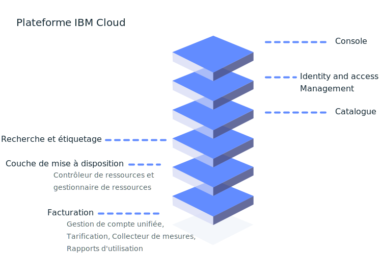

---

copyright:
  years: 2016, 2019
lastupdated: "2019-06-20"

keywords: console, platform overview, overview

subcollection: overview

---

{:shortdesc: .shortdesc}
{:new_window: target="_blank"}

# De quoi est composée la plateforme {{site.data.keyword.Bluemix_notm}} ?
{: #whatis-platform}

La plateforme de cloud d'IBM associe la plateforme sous forme de service (PaaS) à l'infrastructure sous forme de service (IaaS) afin d'offrir une expérience intégrée. La plateforme s'adapte à la fois à de petites organisations et équipes de développement et à de grandes entreprises et les prend en charge. Globalement déployée dans des centres de données dans le monde entier, la solution générée sur {{site.data.keyword.cloud}} est rapide et s'exécute en toute fiabilité dans un environnement testé et pris en charge digne de confiance.
{: .shortdesc}

Comme illustré dans le diagramme ci-après, la plateforme {{site.data.keyword.Bluemix_notm}} inclut plusieurs composants qui offrent une expérience cohérente et fiable. 

  * Une console robuste utilisée comme serveur frontal pour la création, l'affichage et la gestion de vos ressources de cloud
  * Un composant Identity and Access Management (IAM) qui authentifie de manière sécurisée les utilisateurs pour les services de plateforme et contrôle l'accès aux ressources de manière cohérente dans {{site.data.keyword.Bluemix_notm}}
  * Un catalogue qui inclut des centaines d'offres {{site.data.keyword.Bluemix_notm}}
  * Un mécanisme de recherche et d'étiquetage pour le filtrage et l'identification de vos ressources
  * Un système de gestion de compte et de facturation présentant une utilisation exacte des plans de facturation et une protection contre la fraude aux cartes de crédit
  

Que vous disposiez d'un [code existant](/docs/apps/tutorials?topic=creating-apps-tutorial-byoc#tutorial-byoc) que vous souhaitez moderniser et placer sur le cloud ou que vous développiez une [toute nouvelle application](/docs/apps/tutorials?topic=creating-apps-tutorial-starterkit), vos développeurs peuvent bénéficier de l'écosystème à croissance rapide des services disponibles et des infrastructures d'exécution d'{{site.data.keyword.Bluemix_notm}}.

## Configuration de votre compte
{: #set-up-account}

Si vous testez {{site.data.keyword.Bluemix_notm}}, vous pouvez accéder directement au catalogue et commencer à évaluer les services que vous souhaitez explorer et ajouter à votre compte d'essai ou Lite. Toutefois, si vous êtes prêt à utiliser un environnement pour un groupe de développeurs ou l'ensemble d'une organisation et placer vos applications en production, pensez à configurer les éléments fondamentaux de votre compte :

* Groupes d'accès pour l'organisation des utilisateurs et ID de service dans une entité afin de faire de l'affectation d'accès un processus rationalisé.
* Groupes de ressources pour l'organisation de vos ressources pour l'affectation rapide et simple de l'accès à un ensemble de ressources.
* Règles d'accès pour vos groupes d'accès ou des développeurs individuels qui ont besoin de règles d'accès IAM ou de rôles d'espace et d'organisation Cloud Foundry.

Pour plus d'informations, voir les [meilleures pratiques pour la configuration de votre compte](/docs/account?topic=account-account_setup) et les [meilleures pratiques pour l'affectation d'accès](/docs/iam?topic=iam-account_setup). 

## Tarification et facturation
{: #pricing-billing}

Quel que soit votre type de compte, vous pouvez explorer {{site.data.keyword.Bluemix_notm}} en utilisant des plants Lite offrant un quota gratuit. Lorsque vous choisissez un service dans le catalogue et sélectionnez une vignette s'il existe différents types de plans disponibles, vous pouvez voir des informations détaillées sur la tarification. Si vous choisissez un plan de service avec un plan payant, vous pouvez estimer vos coûts en utilisant l'outil d'estimation de coûts. Pour plus d'informations, voir [Estimation des coûts](/docs/billing-usage?topic=billing-usage-cost).

La facturation {{site.data.keyword.Bluemix_notm}} offre plusieurs services qui garantissent le fait que la plateforme {{site.data.keyword.Bluemix_notm}} peut gérer en toute sécurité la tarification, les comptes, l'utilisation, etc.

### Gestion des comptes
{: #account-mgmt}

La gestion des comptes gère les échanges liés à la facturation avec le client. Chaque compte est une entité de facturation qui représente un client. Ce service contrôle l'organisation, la relation utilisateur, l'abonnement et le cycle de vie de compte.

### Tarification
{: #pricing}

Le service de plateforme de tarification vous permet de définir, gérer et extraire des informations de tarification pour les ressources du catalogue {{site.data.keyword.Bluemix_notm}}.

### Usage metering
{: #metering}

Usage Metering permet aux fournisseurs de services de soumettre des mesures collectées pour les instances de ressource mises à disposition par les utilisateurs {{site.data.keyword.Bluemix_notm}}. Les fournisseurs de services tiers qui offrent un service de facturation intégrée doivent soumettre toutes les heures l'utilisation pour toutes les instances de service actives. 

### Rapports d'utilisation
{: #usage}

Les rapports d'utilisation incluent le récapitulatif du compte pendant le mois indiqué. Les responsables de facturation de compte sont autorisés à accéder aux rapports.

## Catalogue {{site.data.keyword.Bluemix_notm}}
{: #catalog}

Le catalogue {{site.data.keyword.Bluemix_notm}} stocke les définitions d'offre (description, fonctions, images, URL, etc.) des ressources disponibles dans la console {{site.data.keyword.Bluemix_notm}}. Les offres sont gérées dans différentes zones géographiques de la même façon que le système d'enregistrement. Le catalogue prend en charge des interfaces de ligne de commande et une API RESTful où les utilisateurs peuvent extraire des informations sur les offres existantes et créer, gérer et supprimer leurs ressources. Pour plus d'informations, voir [Gestion du catalogue](/docs/overview?topic=overview-manage-catalog).

## Création de ressources
{: #provisioning-layer}

Le contrôleur de ressources constitue la couche de mise à disposition de plateforme {{site.data.keyword.Bluemix_notm}} de nouvelle génération qui gère le cycle de vie des ressources {{site.data.keyword.Bluemix_notm}} dans votre compte. Les ressources sont mises à disposition dans une portée de compte. Le contrôleur de ressources prend en charge la mise à disposition synchrone et asynchrone de ressources. Exemples de ressources : bases de données, comptes, processeurs, limites de mémoire et de stockage. 

En général, les ressources suivies par la couche de mise à disposition sont conçues de telle sorte que la facturation et les mesures d'utilisation soient associées mais ce n'est pas toujours le cas. Dans la plupart des cas, les ressources peuvent être associées à la couche de mise à disposition afin de garantir que le cycle de vie des ressources peut être géré en même temps que le cycle de vie des comptes. Le contrôleur de ressources utilise {{site.data.keyword.Bluemix_notm}} Identity and Access Management (IAM) pour l'authentification et l'autorisation des actions effectuées dans la couche de mise à disposition.

### Gestion du cycle de vie des ressources
{: #lifecycle}

Le contrôleur de ressources fournit des API communes afin de contrôler le cycle de vie des ressources composé des étapes suivantes : création de données d'identification d'accès, retrait d'accès, suppression d'une instance.

## Gestion de vos ressources
{: #resource-manager}

Une collection de ressources est gérée par des [groupes de ressources](/docs/overview?topic=overview-whatis-rgs). Un groupe de ressources est associé à votre compte. Toutes les ressources {{site.data.keyword.Bluemix_notm}} doivent être affectées à un groupe de ressources. Lorsque vous créez un compte, un groupe de ressources par défaut est créé pour vous. Toutes les ressources activées par IAM {{site.data.keyword.Bluemix_notm}} doivent être mises à disposition dans un groupe de ressources. Si vous avez un compte Lite, vous ne pouvez avoir qu'un seul groupe de ressources. Si vous disposez d'un compte Paiement à la carte ou Abonnement, vous pouvez créer plusieurs groupes de ressources. Si un compte est suspendu, le groupe de ressources correspondant est également suspendu ainsi que toutes les ressources du groupe. 

## Recherche et étiquetage de ressources
{: #search-and-tag}

Le service de recherche est un référentiel de propriétés de ressources global et partagé intégré à la plateforme {{site.data.keyword.Bluemix_notm}}. Il est utilisé pour le stockage et la recherche des attributs des ressources de cloud et catégorise et classe les ressources. Les ressources sont identifiées de manière unique par un identificateur [CRN (non de ressource de cloud)](/docs/overview?topic=overview-crn). Les propriétés d'une ressource incluent des étiquettes et des propriétés système. Les deux propriétés sont définies dans un compte de facturation {{site.data.keyword.Bluemix_notm}} et s'appliquent à plusieurs régions.

Ce service gère également les étiquettes associées à une ressource. Vous pouvez créer, supprimer, rechercher, associer ou dissocier des étiquettes à l'aide de l'API d'étiquetage. Les étiquettes sont identifiées de manière unique par un identificateur CRN. Les étiquettes ont un nom, qui doit être unique dans un compte de facturation. Pour les créer, vous pouvez utiliser des paires clé:valeur ou un format de libellé.

## Surveillance de vos ressources
{: #resources_observability}

L'observabilité offre un emplacement unique à partir duquel vous pouvez surveiller et observer vos applications et services dans {{site.data.keyword.Bluemix_notm}}. 

Le service {{site.data.keyword.la_full}} vous permet d'ajouter des fonctions de gestion de journal à votre architecture {{site.data.keyword.Bluemix_notm}} et de gérer les journaux d'application et les journaux système. Il offre des fonctions avancées de surveillance et de traitement des incidents, de définition d'alertes et de conception de tableaux de bord personnalisés. {{site.data.keyword.la_full_notm}} est exploité par LogDNA en partenariat avec {{site.data.keyword.IBM_notm}}. Pour plus d'informations, voir [Initiation à {{site.data.keyword.la_full_notm}}](/docs/services/Log-Analysis-with-LogDNA?topic=LogDNA-getting-started).

Le service {{site.data.keyword.mon_full_notm}} vous permet de gagner en visibilité opérationnelle concernant les performances et l'intégrité de vos applications, services et plateformes. Il offre une télémétrie de pile complète avec des fonctions avancées de surveillance et de traitement des incidents, de définition d'alertes et de conception de tableaux de bord personnalisés. {{site.data.keyword.mon_full_notm}} est exploité par Sysdig en partenariat avec {{site.data.keyword.IBM_notm}}. Pour plus d'informations, voir [Initiation à IBM Cloud Monitoring avec le service Sysdig](/docs/services/Monitoring-with-Sysdig?topic=Sysdig-getting-started#getting-started)

## Surveillance de votre compte 
{: #account_observability}

Utilisez le service {{site.data.keyword.at_full}} pour surveiller l'activité de votre compte {{site.data.keyword.Bluemix_notm}}, rechercher des activités anomales et des actions critiques et vous conformer aux exigences en matière de vérification réglementaire. De plus, vous pouvez recevoir des alertes lorsque des actions se produisent. Les événements collectés sont conformes à la norme CADF (Cloud Auditing Data Federation). Pour plus d'informations, voir [Initiation à {{site.data.keyword.at_full_notm}}](/docs/services/Activity-Tracker-with-LogDNA?topic=logdnaat-getting-started).
