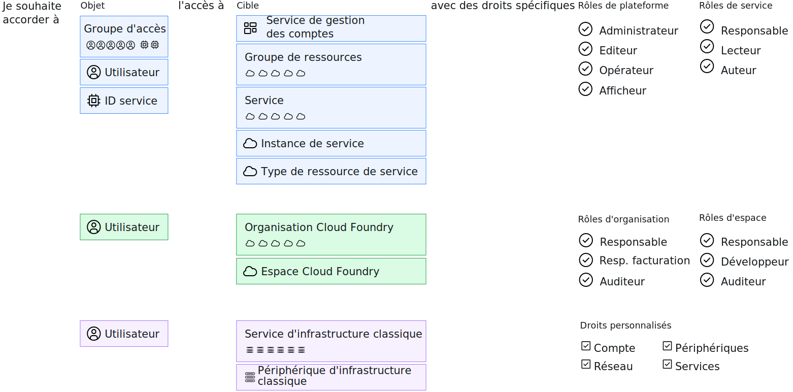

---

copyright:

  years: 2017, 2019

lastupdated: "2018-04-02"

keywords: users level of access, user control, access control, permissions

subcollection: overview

---

{:shortdesc: .shortdesc}
{:codeblock: .codeblock}
{:screen: .screen}
{:new_window: target="_blank"}

# Gestion des accès dans {{site.data.keyword.Bluemix_notm}}
{: #cloudaccess}

La gestion des accès vous permet de contrôler quels utilisateurs affichent, créent, utilisent et gèrent les ressources de votre compte. Pour accorder l'accès, vous pouvez affecter des rôles qui donnent à des niveaux utilisateur l'autorisation d'exécuter des tâches de gestion de plateforme et d'accéder à des ressources du compte.
{: shortdesc}

La manière dont vous traitez les accès dans {{site.data.keyword.Bluemix}} dépend du type de ressource auxquelles vous voulez accorder l'accès. {{site.data.keyword.Bluemix_notm}} Identity and Access Management (IAM) est le système de gestion des accès permettant de gérer de façon cohérente les ressources organisées dans un groupe de ressources sur la plateforme {{site.data.keyword.Bluemix_notm}}. L'infrastructure classique et les ressources Cloud Foundry ne sont pas gérées en utilisant Cloud IAM. Ces types de ressource disposent de leur propre système de gestion des accès. 

Si vous avez une combinaison de types de ressource, vous gérez chaque type séparément :

* Pour les ressources IAM, accédez à **Gérer** &gt; **Accès (IAM)** puis sélectionnez **Utilisateurs**, **Groupes d'accès** ou **ID de service** pour commencer.
* Pour l'affectation de l'accès à vos [ressources de l'infrastructure classique](/docs/iam?topic=iam-infrapermission), vous devez définir des droits en sélectionnant **Gérer** > **Accès (IAM)** dans l'onglet Infrastructure classique pour l'utilisateur auquel vous souhaitez affecter l'accès. 
* Pour l'affectation de l'accès aux [ressources Cloud Foundry](/docs/iam?topic=iam-cfaccess), vous devez affecter des utilisateurs à des organisations et définir des rôles d'accès d'organisation et d'espace Cloud Foundry dans **Gérer** > **Accès (IAM)** sur l'onglet Cloud Foundry pour l'utilisateur.

Alors que chaque type d'accès est géré séparément, toutes les règles d'accès sont constituées d'un objet auquel vous souhaitez affecter l'accès, d'une cible pour la règle permettant de définir les éléments auxquels l'objet a accès et pour finir d'un rôle IAM, d'un rôle Cloud Foundry ou d'un droit d'infrastructure classique permettant de déterminer le niveau d'accès dont dispose l'objet sur la cible.

Pour les règles IAM, l'objet peut être un groupe d'accès, un utilisateur ou un ID de service. De plus, la cible peut être un service de gestion de compte, un groupe de ressources, un service du compte, une instance de service spécifique ou un type de ressource dans un service. Les rôles de plateforme et de service peuvent être sélectionnés pour définir la portée du niveau d'accès pour l'objet. Pour l'accès Cloud Foundry, un utilisateur se voit accorder l'accès à un espace et à une organisation Cloud Foundry via la sélection de chaque élément et l'affectation d'un rôle d'organisation et d'un rôle d'espace. Pour l'infrastructure classique, un utilisateur est sélectionné puis l'accès peut être défini pour un service ou un périphérique avec des droits spécifiques affectés.

## Droits pour la gestion de l'accès
{: #perms-manageaccess}

En tant que propriétaire de compte, vous pouvez gérer les accès à toutes les ressources e votre compte. Vous pouvez également déléguer la tâche de gestion de l'accès à des ressources de la plateforme en affectant à un utilisateur de votre compte le rôle d'administrateur pour tous les services, uniquement le service spécifique ou le groupe de ressources devant être géré par cet utilisateur.

Si votre compte inclut des services Cloud Foundry, vous pouvez affecter à un autre utilisateur le rôle de responsable de l'organisation ou de l'espace de sorte qu'il puisse ajouter des utilisateurs et affecter des rôles Cloud Foundry pour l'accès à des instances de l'organisation ou de l'espace qu'il gère.

## Mise en route
{: #cloudaccess-getstarted}

Accédez à **Gérer** &gt; **Accès (IAM)** puis sélectionnez **Utilisateurs** pour commencer à gérer l'accès pour les utilisateurs de votre compte. Sélectionnez un utilisateur dans la liste. Seules les options de gestion des accès que vous êtes autorisé à gérer s'affichent. Par exemple, si vous n'êtes pas propriétaire de compte ni un responsable d'organisation ou d'espace, l'option de gestion des accès Cloud Foundry ne s'affiche pas.

Vous pouvez également affecter des rôles d'accès à des applications et à des services en utilisant des ID de service. Pour ce faire, accédez à la page **ID de service**. Pour savoir comment être rapidement opérationnel avec {{site.data.keyword.Bluemix_notm}}, voir le [tutoriel d'initiation](/docs/iam?topic=iam-getstarted).
