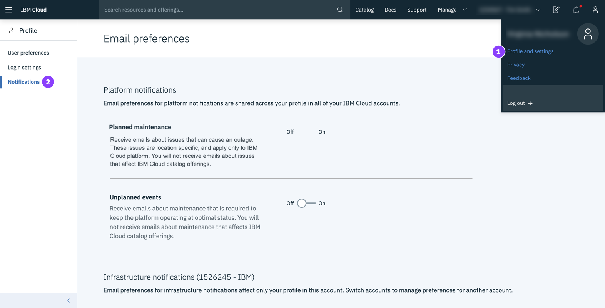

---

copyright:
  years: 2015, 2019
lastupdated: "2019-06-25"

keywords: ui, components, using the console, SoftLayer, classic infrastructure

subcollection: overview

---

{:shortdesc: .shortdesc}
{:tip: .tip}
{:note: .note}
{:new_window: target="_blank"}

# Navigation dans la console {{site.data.keyword.cloud_notm}} 
{: #ui}

La console {{site.data.keyword.cloud}} est une interface utilisateur qui vous aide à gérer l'intégralité de vos ressources {{site.data.keyword.cloud_notm}}. En accédant à la [console](https://cloud.ibm.com){: new_window} , vous pouvez créer un compte gratuit, vous connecter, accéder à la documentation, accéder au catalogue, afficher les informations de tarification, obtenir de l'aide ou vérifier le statut des composants {{site.data.keyword.cloud_notm}}. Une fois que vous êtes connecté, la barre de menus contient une icône de menu  ainsi que des liens supplémentaires.
{: shortdesc}

## Utilisation de la console
{: #consoleoptions}

Lorsque vous vous connectez à {{site.data.keyword.cloud_notm}}, votre tableau de bord affiche des widgets qui présentent le statut de votre compte. Si vous souhaitez ajouter ou retirer des widgets, voir [Personnalisation de votre tableau de bord](/docs/overview?topic=overview-custom-dashboard).

  * Utilisez le lien **Catalogue** pour créer de nouvelles ressources.
  * Utilisez le lien **Docs** pour accéder à la documentation du produit. 
  * Utilisez le lien **Support** pour accéder au centre de support.  
  * Dans le menu **Gérer**, vous pouvez accéder à vos options de compte, de facturation ainsi qu'à celles concernant Identity and Access Management.
  * Cliquez sur l'icône Estimateur de coût  pour ouvrir cet estimateur.
  * Cliquez sur l'icône Notifications  pour accéder aux annonces et aux événements planifiés et à ceux non planifiés.

## Recherche de ressources
{: #search}

Vous pouvez rechercher des ressources par nom ou par étiquette à partir de tout emplacement de la console {{site.data.keyword.cloud_notm}} pour les ressources devant se trouver dans la liste de ressources. Entrez le nom d'une ressource ou une étiquette dans la zone de recherche de la barre de menu de la console.

Pour plus d'informations, voir [Recherche de ressources](/docs/resources?topic=resources-searching-for-resources). 

## Gestion des ressources de la liste de ressources
{: #dashboardview}

Accédez à l'icône Menu  &gt; **Liste de ressources** pour accéder à la liste de vos ressources de compte. Vous pouvez utiliser la liste des ressources pour afficher et utiliser des ressources {{site.data.keyword.cloud_notm}} et des instances de service Cloud Foundry. Voir [Qu'est-ce qu'une ressource ?](/docs/resources?topic=resources-resource) pour plus d'informations sur les différents types de ressources.

### Affichage des ressources
Dans le tableau de bord, vous pouvez afficher toutes les ressources des régions liées à la liste de ressources. Pour afficher les éléments les plus importants pour vous, triez votre liste avec les filtres pour chaque en-tête de colonne. Par exemple, si vous souhaitez afficher et utiliser les ressources d'un emplacement spécifique, développez le menu **Emplacement** puis sélectionnez-en un dans la liste.

### Utilisation des ressources
Vous pouvez utiliser vos ressources de différentes manières à partir de la liste de ressources :

  * Chaque ressource est affichée sur sa propre ligne avec une icône Actions  en fin de ligne. Cliquez sur l'icône Actions  pour démarrer, arrêter, renommer ou supprimer une ressource.
  * Pour définir des données d'identification ou des connexions pour une ressource, cliquez sur le nom de la ressource afin d'accéder à la page des détails de la ressource. Sélectionnez ensuite **Données d'identification pour le service** ou **Connexions**. Pour plus d'informations, voir [Ajout de données d'identification](/docs/resources?topic=resources-service_credentials) et [Gestion des connexions](/docs/resources?topic=resources-connect_app).

## Utilisation du catalogue
{: #catalogcreate}

Pour créer une ressource, cliquez sur **Créer** dans votre liste de ressources. Vous êtes alors dirigé vers le catalogue. Lorsque vous sélectionnez une vignette dans le catalogue, vous pouvez déterminer où la ressource est disponible. Les ressources du catalogue ne sont pas nécessairement disponibles dans toutes les régions.

Après avoir cliqué sur la vignette de la ressource que vous voulez créer, vous pouvez sélectionner l'emplacement où vous voulez la déployer.

  * Pour les ressources Cloud Foundry, vous pouvez sélectionner une région spécifique, puis sélectionner l'organisation et l'espace auxquels l'instance de service doit être affectée.
  * Pour les ressources gérées par {{site.data.keyword.cloud_notm}} Identity and Access Management (IAM), vous sélectionnez un emplacement pour le déploiement. Ensuite, vous sélectionnez un groupe de ressources auquel affecter l'instance de service.

## Passage à l'expérience {{site.data.keyword.cloud_notm}}
{: #redirect-cloud}

Lors de la migration de SoftLayer vers {{site.data.keyword.cloud_notm}}, familiarisez-vous avec la console {{site.data.keyword.cloud_notm}} que vous pouvez utiliser pour gérer vos ressources de plateforme et d'infrastructure. Le processus de liaison de tous les comptes SoftLayer et {{site.data.keyword.cloud_notm}} est en cours. C'est pourquoi, l'accès au compte peut ne pas encore être disponible. Dès que c'est le cas, vous disposez de la nouvelle expérience. 

L'élément précédemment nommé SoftLayer s'appelle désormais l'infrastructure classique {{site.data.keyword.cloud_notm}}.
{: note}

### Localisation de vos éléments d'infrastructure
{: #sl-links}

Cliquez sur l'**icône Menu**  > **Infrastructure classique** pour trouver rapidement périphériques, stockage, réseau, sécurité et services. 

Vous pouvez également consulter vos périphériques et vos éléments de stockage dans la liste de ressources en cliquant sur l'**icône Menu**  > **Resource List**.
{: tip}

### Gestion des utilisateurs, des accès et des clés d'API
{: #billing-items}

Vous pouvez gérer les utilisateurs dans votre compte, l'accès à l'infrastructure classique pour vos utilisateurs, ainsi que vos clés d'API, à partir de la section Accès (IAM) de la console.  

* Pour inviter de nouveaux utilisateurs, retirer des utilisateurs, ou encore gérer un les paramètres de connexion d'un utilisateur particulier, les restrictions IP, le mot de passe VPN, et bien d'autres options, accédez à **Gérer** > **Access (IAM)**, puis sélectionnez **Utilisateurs**.
* Pour commencer à gérer l'accès à l'infrastructure classique d'un utilisateur, accédez à **Gérer** > **Access (IAM)**, puis sélectionnez **Utilisateurs**. Pour plus de détails, voir [Gestion de l'accès à l'infrastructure classique](/docs/iam?topic=iam-mngclassicinfra).
* Pour créer et gérer des clés d'API {{site.data.keyword.cloud_notm}} ou une clé d'API d'infrastructure classique, accédez à **Gérer** > **Access (IAM)**, puis sélectionnez **Clés d'API**. Pour plus d'informations, voir [Gestion des clés d'API](/docs/iam?topic=iam-manapikey).

### Passer une commande
{: #place-order}

Utilisez le catalogue pour passer une commande. Vous pouvez accéder au catalogue de l'une des façons suivantes :

  * Cliquez sur **Catalogue** dans la barre de menus.
  * Cliquez sur l'icône **Menu **  > **Liste de ressources**. Cliquez ensuite sur **Créer une ressource**.

### Paiement
{: #payments}

Vous pouvez effectuer un paiement à partir de la section Facturation et utilisation de la console. Accédez à **Gérer** > **Facturation et utilisation** et sélectionnez **Paiements**. 

### Accès à vos factures
{: #invoices}

Vous pouvez accéder à vos factures à partir de la section Facturation et utilisation de la console. Accédez à **Gérer** > **Facturation et utilisation** et sélectionnez **Factures**.

### Accès à vos articles en vente
{: #sales}

Vos devis et mises à niveau de périphérique, vos commandes, vos annulations et vos expéditions se trouvent dans la section Facturation et utilisation de la console. Accédez à **Gérer** > **Facturation et utilisation** et sélectionnez **Ventes**. 

### Accès à vos cas de support
{: #support-mng}

Pour accéder à vos cas de support en cours, cliquez sur **Support** > **Gérer les cas**. Vous pouvez également accéder à vos cas archivés en cliquant sur **Afficher les cas archivés**.

### Envoi de commentaires en retour
{: #feedback-profile}

Vous pouvez soumettre une critique élogieuse, une suggestion ou tout autre commentaire. Pour nous contacter, choisissez l'une des méthodes suivantes :

  * Cliquez sur le bouton **Commentaires** se trouvant sur le bord de la page de la console. 
  * Cliquez sur l'**icône Avatar**  > **Commentaires**. 

### Définition des préférences de courrier
{: #email-prefsl}

Vous pouvez définir vos préférences de réception des courriers relatifs aux notifications de plateforme et d'infrastructure. Cliquez sur l'**icône d'avatar**  > **Profil et paramètres**, puis sélectionnez **Notifications**.

### Sélection de votre point d'accès VPN
{: #vpn-access}

Vous pouvez vous connecter à la console {{site.data.keyword.cloud_notm}} à l'aide d'un point d'accès VPN. Accédez à [Accès VPN](https://www.ibm.com/cloud-computing/bluemix/vpn-access) et sélectionnez un point d'accès dans les listes.

