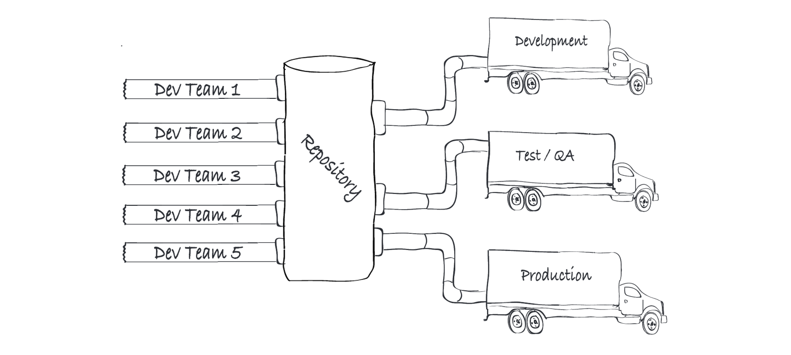

---

copyright:
  years: 2016, 2019
lastupdated: "2019-01-03"

---
{:new_window: target="_blank"}
{:shortdesc: .shortdesc}
{:screen: .screen}
{:codeblock: .codeblock}
{:pre: .pre}
{:tip: .tip}

# Esplora l'esperienza di sviluppo in {{site.data.keyword.cloud_notm}}
{: #dev-journey}

Come sviluppatore, decidi il punto di ingresso migliore per il tuo codice. Puoi scegliere di generare il tuo codice tramite i nostri strumenti forniti o puoi utilizzare il tuo codice e distribuirlo a {{site.data.keyword.cloud}}!
{: shortdesc}

{{site.data.keyword.cloud_notm}} ha una serie di funzionalità per iniziare a creare le applicazioni in pochi minuti. Gli strumenti per gli sviluppatori {{site.data.keyword.cloud_notm}} creano una fondazione ad alte prestazioni di cui hai bisogno per essere operativo. Vengono offerti due strumenti principali per lo sviluppo:
 * Console web {{site.data.keyword.cloud_notm}} (portali sviluppatori)
 * Interfaccia riga di comando (CLI) {{site.data.keyword.cloud_notm}}

Con {{site.data.keyword.cloud_notm}}, puoi:

* Selezionare i kit starter che sono specifici per il caso di utilizzo e creare delle applicazioni pronte per la produzione in diversi linguaggi di programmazione e modelli architetturali.
* Utilizzare un [modello di codice IBM Developer ](https://developer.ibm.com/patterns/){:new_window} per creare rapidamente la tua applicazione e distribuirla a {{site.data.keyword.cloud_notm}}.
* Visualizzare e gestire le risorse di cui è stato eseguito automaticamente il provisioning dal tuo kit starter o che hai manualmente aggiunto alla tua applicazione.
* Se disponi di un'applicazione in un repository esistente, puoi utilizzare un kit starter vuoto per creare un record dell'applicazione e collegarlo al tuo repository di origine e a una toolchain DevOps.
* Con il codice dell'applicazione portatile, puoi eseguire la distribuzione a diversi ambienti cloud.
* Creare una [toolchain DevOps](../services/ContinuousDelivery/index.html#cd_getting_started) in pochi clic.
* Utilizzare l'[interfaccia riga di comando](/docs/cli/index.html#overview) per lo sviluppo locale.
* Sfogliare o cercare nel [catalogo {{site.data.keyword.cloud_notm}} ](https://{DomainName}/catalog){: new_window} le applicazioni e i servizi che puoi creare e iniziare a utilizzare oggi.

Per comprendere meglio come la nostra esperienza può aiutarti a creare rapidamente applicazioni di alta qualità pronte per la produzione, diamo un'occhiata a questi elementi in modo più dettagliato.

## Portali sviluppatori
{: #dev-portals}

{{site.data.keyword.cloud_notm}} ha portali per gli sviluppatori in diverse aree di interesse (come Watson, Security o Finance) o un canale digitale (come Mobile o Applicazioni Web). Puoi accedere a questi portali dall'icona **Menu** .

Ogni portale sviluppatori fornisce i kit starter rilevanti per l'area specifica dei portali. I portali offrono un flusso di lavoro coerente e intuitivo per la creazione di un'applicazione pronta per la produzione e funzionante in pochi minuti.

## Applicazioni
{: #app-projects}

Un'applicazione comprende codice, dati, servizi e toolchain. Ad esempio, l'applicazione mobile {{site.data.keyword.cloud_notm}} contiene il codice dispositivo, insieme alla logica di backend, all'archiviazione dei dati e ai servizi di analisi e di sicurezza ed è configurata per la fornitura continua.

Puoi creare e gestire un'applicazione utilizzando qualsiasi portale sviluppatori {{site.data.keyword.cloud_notm}} o {{site.data.keyword.dev_cli_notm}}.

Puoi creare direttamente delle applicazioni vuote semplici o crearne di più complesse utilizzando i nostri kit starter. Se scegli di creare delle applicazioni vuote senza l'aiuto di un kit starter, puoi farlo dal [dashboard {{site.data.keyword.cloud_notm}} ](https://{DomainName}){: new_window} senza visitare un portale!

Puoi creare un modello di codice per creare rapidamente la tua applicazione e distribuirla a {{site.data.keyword.cloud_notm}}. Dal [sito web di IBM Developer ](https://developer.ibm.com/patterns/){:new_window}, scegli un modello di codice. Puoi visualizzare il codice in GitHub o creare e compilare un'applicazione su {{site.data.keyword.cloud_notm}}, dove puoi utilizzare una toolchain DevOps per distribuire automaticamente la tua applicazione.

## Kit starter
{: #starter-kits}

Con i kit starter, la tua esperienza dovrebbe essere facile da usare e personalizzabile. I kit starter generano un'applicazione di produzione di base, nel linguaggio desiderato, pronta per la distribuzione cloud. Ogni kit starter include un linguaggio, un framework e un modello per un caso di utilizzo specifico e per il riutilizzo del codice.

Se un kit starter richiede delle risorse specifiche, nessun problema. Con le risorse di cui è stato eseguito il provisioning in automatico, {{site.data.keyword.cloud_notm}} crea automaticamente le istanze per quelle risorse quando crei la tua applicazione. Puoi accedere ai kit starter dal portale sviluppatori o dall'interfaccia riga di comando per le istruzioni pertinenti sulla tua area specifica e sul tuo flusso di lavoro!

### Come i kit starter si differenziano dagli esempi?
I kit starter sono pronti per la produzione e si focalizzano sulla dimostrazione di un'implementazione del modello chiave utilizzando un runtime (ad esempio, Node.js e Express). In alcuni casi, i kit starter offrono un'esperienza utente semplice per sottolineare l'integrazione del servizio. In altri casi i kit starter rappresentano un'implementazione personalizzabile di un caso di utilizzo sofisticato.

* Un **frammento** è un paio di righe di codice che viene spesso presentato in una IDE. I frammenti aiutano uno sviluppatore ad integrare una sintassi del linguaggio di programmazione o del supporto con una API definita.
* Una **dimostrazione** è solitamente di elevata qualità e accuratezza e utilizza una gamma di servizi e punti di integrazione. Spesso richiede del tempo di configurazione e viene utilizzata per dimostrare un problema di business o una funzione della piattaforma. La puoi utilizzare per valutare le fasi di adozione cloud. A volte è il codice che è incluso nel codice di produzione.
* Un **esempio** è un piccolo esempio di una funzionalità, funzione, servizio o esperienza dell'utente specifici. Puoi riutilizzare un esempio o includerlo in un'applicazione di produzione. In genere viene utilizzato per mostrare capacità tecniche e un possibile approccio alla risoluzione di un problema tecnico.
* Un **kit starter** è un modello pronto per la produzione che può essere integrato con una serie di servizi per generare un asset pronto per la produzione che può essere distribuito direttamente in una pipeline DevOps e un cluster Kubernetes. Un kit starter contiene i metadati descrittivi fornendo all'utente informazioni sufficienti per sapere cosa fa. Contiene inoltre le istruzioni che indicano a {{site.data.keyword.cloud_notm}} cosa produrre. L'output è subito pronto per la produzione e può essere ripetuto per ulteriori miglioramenti in base alle pratiche consigliate da IBM. Il contenuto del kit starter non è così complesso come una dimostrazione e non è banale come un frammento o un esempio. Sono creati dinamicamente in base ai requisiti dello sviluppatore.

## Risorse di provisioning automatico
{: #auto-provision}

Se un kit starter specifica le risorse necessarie, {{site.data.keyword.cloud_notm}} crea automaticamente le istanze per quelle risorse quando crei la tua applicazione. Puoi anche eseguire il provisioning manualmente delle risorse o selezionare le istanze della risorsa esistente da aggiungere alla tua applicazione dopo averne eseguito la creazione. Puoi vedere un elenco di istanze del servizio associate alla tua applicazione nella vista dei dettagli dell'applicazione insieme alle credenziali, nel caso ne avessi bisogno.

## Codice portatile
{: #portable-code}

La creazione di un'applicazione da un kit starter crea automaticamente il codice al tuo posto che ha un formato coerente ed è indipendente dal runtime. Puoi distribuire il codice nel tuo ambiente di scelta, ad esempio Kubernetes o Cloud Foundry, senza fare modifiche.

Puoi anche dare una rapida occhiata al tuo codice dell'applicazione facendo clic su **Download code** nella pagina **App Details** della tua applicazione. Il tuo codice viene scaricato come un file `.zip` che contiene l'intera struttura del codice applicativo. Puoi facilmente estrarre il file ed eseguire il codice localmente utilizzando la {{site.data.keyword.dev_cli_notm}} o aggiungerlo al tuo repository di gestione del codice.

### Quale codice viene creato?

Quando crei direttamente un'applicazione o tramite l'aiuto di un kit starter, l'applicazione contiene il codice portatile. Il codice portatile contiene il codice di abilitazione cloud per più ambienti cloud.Puoi quindi creare il codice in quattro aree fondamentali:
* Codice che segue le procedure consigliate per un linguaggio specifico
* Codice che abilita l'esecuzione sul cloud dell'applicazione
* Codice che viene inizializzato per il collegamento ai servizi cloud
* Codice specifico per un caso di utilizzo

La generazione di questi componenti ti consente di risparmiare del tempo prezioso e ti assicura di stare utilizzando un'architettura all'avanguardia.

* **Logica del caso di utilizzo** fornisce funzioni per la funzione principale di un caso di utilizzo particolare. Gli esempi potrebbero essere il codice per un servizio chat di Watson Conversation o il codice per un'applicazione Visual recognition mobile.
* **Componenti del linguaggio** sono file e componenti del codice specifici per il linguaggio di programmazione che selezioni per il tuo kit starter. Ad esempio, i programmatori node.js hanno bisogno di un file package.json per la gestione della dipendenza e questo file viene automaticamente creato per te.
* **Abilitazione del servizio** è il codice che consente alla tua applicazione di collegarsi e utilizzare i servizi che aggiungi. Gestione delle credenziali, codice di inizializzazione e SDK specifici del servizio sono esempi di elementi di abilitazione del servizio.
* **Abilitazione cloud** è il codice che consente alla tua applicazione l'esecuzione su {{site.data.keyword.cloud_notm}}. Ad esempio, i grafici Helm che consentono alla tua applicazione l'esecuzione su un cluster Kubernetes {{site.data.keyword.cloud_notm}}.

Quando crei un'applicazione da un kit starter {{site.data.keyword.cloud_notm}}, la tua applicazione inizia con un'architettura comprovata che riflette anche le procedure consigliate per il linguaggio che hai selezionato.

Ogni applicazione include un file readme che contiene i dettagli tecnici dell'applicazione e spiega cosa è necessario perché la tua applicazione sia in esecuzione se non lo è immediatamente.
{: tip}

## Porta il tuo codice e distribuiscilo a {{site.data.keyword.cloud_notm}}
{: byoc}

Se disponi di un'applicazione in un repository esistente, puoi utilizzare un kit starter vuoto per creare un record dell'applicazione in {{site.data.keyword.cloud_notm}} e collegare l'applicazione al tuo repository di origine e alla tua toolchain DevOps.

Puoi iniziare dal dashboard {{site.data.keyword.cloud_notm}} o da qualsiasi kit starter vuoto. Dopo aver fornito un nome alla tua applicazione e selezionato un gruppo di risorse, seleziona il punto di partenza [**Porta il tuo codice**](/docs/apps/tutorials/tutorial_byoc.html), fornisci l'URL del repository Git che contiene il tuo codice e fai clic su **Create**.

Puoi connettere la tua toolchain DevOps esistente oppure crearne una e fornire in modo continuo la tua applicazione all'ambiente di tua scelta, come ad esempio Kubernetes o Cloud Foundry.

## Toolchain DevOps
{: #devops}

La toolchain DevOps comprende le procedure e gli strumenti per l'accesso, lo sviluppo, la distribuzione e l'utilizzo della tua applicazione. Una toolchain DevOps è una serie di servizi collegati che automatizza le tue attività DevOps. È possibile eseguire DevOps manualmente con applicazioni semplici, ma il bisogno di automazione aumenta rapidamente con la complessità dell'applicazione e l'automazione della toolchain è indispensabile per la fornitura continua.

Il componente principale di una toolchain DevOps è un repository di controllo della versione del codice come GitHub. Ulteriori strumenti possono includere la traccia di backlog, la pipeline di fornitura, l'IDE e il servizio di monitoraggio come [{{site.data.keyword.cloud_notm}} {{site.data.keyword.DRA_short}}](/docs/services/DevOpsInsights/index.html#gettingstarted).

Se crei un'applicazione utilizzando un kit starter, puoi creare una nuova toolchain e distribuire la tua applicazione semplicemente facendo clic su **Deploy to cloud** nella pagina **App Details**. È stata creata una toolchain che dispone di un repository del codice, un repository dei problemi, la pipeline di fornitura e l'IDE web.

Puoi quindi utilizzare questa toolchain per ospitare più team e distribuire ad ambienti separati per lo sviluppo, il test e la produzione. Stabilisci un modello di fornitura continua collaborativo a livello aziendale per la tua applicazione.

## Interfaccia riga di comando
{: cli}

Utilizza l'interfaccia riga di comando per codificare, creare ed eseguire la tua applicazione localmente. Un modello comune consiste nel creare la tua applicazione da un portale sviluppatori nella console {{site.data.keyword.cloud_notm}}, utilizzare gli strumenti per gli sviluppatori per sviluppare localmente e poi trasmettere gli aggiornamenti al tuo repository e unirli per avviare la tua toolchain di distribuzione.

## Sviluppo del metodo Garage
{: #developer_concepts}

Se stai cercando dove eseguire degli esperimenti con le tue idee migliori e con delle tecnologie emergenti, assicurati di consultare le distribuzioni del [metodo Garage](https://www.ibm.com/cloud/garage/){: new_window} . Puoi ottenere delle informazioni su come IBM può aiutarti a sviluppare le applicazioni nella tua organizzazione.

 *Panoramica fasi metodo Garage*

{{site.data.keyword.cloud_notm}} ti aiuta a produrre correttamente le applicazioni di produzione al livello aziendale utilizzando il metodo Garage o qualsiasi metodo preferisci. Per capire meglio cosa {{site.data.keyword.cloud_notm}} offre agli sviluppatori, diamo un'occhiata veloce alle competenze necessarie per creare un'applicazione moderna.

## Competenze dello sviluppatore
{: #skills}

Gli utenti si aspettano molto di più dalle loro applicazioni rispetto a prima. Vogliono applicazioni per fornire informazioni approfondite da dati in tempo reale e archiviati, che sono sempre disponibili e che soddisfano i loro bisogni individuali più accuratamente. Per soddisfare queste aspettative, le funzionalità per gli sviluppatori in IBM Cloud si allineano a serie di competenze specifiche e consentono al tuo team di utilizzare una piattaforma per produrre, distribuire, eseguire e gestire le applicazioni.Ad esempio, un'applicazione cognitiva sofisticata, può richiedere contributi di sviluppatori digitali, di sviluppatori nativi cloud, di sviluppatori di flussi, di data scientist e di specialisti DevOps.

 

* **Sviluppatori digitali** autore in un canale digitale particolare come web mobile, voce e chat. Gli sviluppatori digitali sono generalmente concentrati sui casi di utilizzo e soddisfano direttamente i bisogni degli utenti come un'esperienza completa.
* **Sviluppatori nativi cloud** specializzati in costruzione e interconnessione dei componenti cloud. Gli autori di microservizi e back-end-for-frontend rientrano in questa categoria.
* **Sviluppatori flussi** si concentrano sull'elaborazione e l'ottenimento delle informazioni dai flussi di dati. Ad esempio, uno sviluppatore dei flussi può analizzare e avviare un'azione sul testo in entrata, sull'audio o sui flussi video.
* **Data scientist** utilizzano le analisi e il machine learning per produrre modelli predittivi. Questi modelli sono utilizzati nelle metriche di business e forniscono informazioni approfondite agli utenti dell'applicazione.
* **Specialisti DevOps** sono esperti nella risoluzione dei problemi di distribuzione e della toolchain. Per le applicazioni semplici, gli specialisti dedicati non sono generalmente necessari poiché i membri del team di sviluppo gestiscono DevOps con la squadra. Ma per le applicazioni aziendali complesse, con molte dipendenze, gli specialisti DevOps sono essenziali per mantenere la tua applicazione correttamente in produzione.

Le funzionalità degli sviluppatori integrate in {{site.data.keyword.cloud_notm}} si allineano su queste serie di competenze e consentono al tuo team di utilizzare una piattaforma per produrre, distribuire, eseguire e gestire la tua applicazione. Ad esempio, uno sviluppatore digitale che crea un'applicazione mobile potrebbe utilizzare il [Portale per sviluppatori mobili](https://{DomainName}/developer/mobile/dashboard){: new_window}  {{site.data.keyword.cloud_notm}}. Un generatore di applicazioni cognitive potrebbe utilizzare il [Portale per sviluppatori Watson](https://{DomainName}/developer/watson/dashboard){: new_window}  insieme a [Watson Studio](https://{DomainName}/catalog/services/watson-studio){: new_window} . Uno sviluppatore di flussi può utilizzare [IBM Real-Time Analytics](/docs/services/StreamingAnalytics/index.html). Il [servizio {{site.data.keyword.cloud_notm}} Continuous Delivery](/docs/services/ContinuousDelivery/index.html) semplifica il lavoro di uno specialista DevOps.

[Pronto per iniziare a creare applicazioni pronte per la produzione e di elevata qualità? ](/docs/apps/tutorials/tutorial_web.html)
