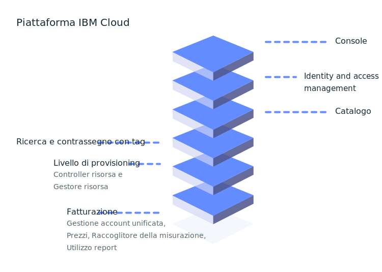

---

copyright:
  years: 2016, 2019
lastupdated: "2019-05-31"

keywords: console, platform overview, overview

subcollection: overview

---

{:shortdesc: .shortdesc}
{:new_window: target="_blank"}

# Cos'è la piattaforma {{site.data.keyword.Bluemix_notm}}?
{: #whatis-platform}

La piattaforma cloud di IBM combina la soluzione PaaS (platform as a service) con la soluzione IaaS (infrastructure as a service) per fornire un'esperienza integrata. La piattaforma esegue il ridimensionamento e supporta sia le organizzazioni e i piccoli team di sviluppo che i grandi business aziendali. Distribuito globalmente tra i data center di tutto il mondo, la soluzione che crei su {{site.data.keyword.cloud}} si avvia velocemente e viene eseguita in modo affidabile in un ambiente supportato e verificato di cui ti puoi fidare.
{: .shortdesc}

Come illustrato dal seguente diagramma, la piattaforma {{site.data.keyword.Bluemix_notm}} è composta da più componenti che lavorano insieme per fornire un'esperienza cloud coerente e affidabile. 

  * Una console solida che funge da frontend per la creazione, la visualizzazione e la gestione delle tue risorse cloud
  * Un componente di gestione dell'identità e dell'accesso che autentica in modo sicuro gli utenti per i servizi di piattaforma e controlla l'accesso alle risorse in modo coerente tramite {{site.data.keyword.Bluemix_notm}}
  * Un catalogo composto da centinaia di offerte {{site.data.keyword.Bluemix_notm}}
  * Un meccanismo di ricerca e contrassegno con tag per filtrare e identificare le tue risorse
  * Un sistema di gestione dell'account e della fatturazione che fornisce l'utilizzo esatto per i piani dei prezzi e la protezione antifrode della carta di credito
  
  

Se hai del [codice esistente](/docs/apps/tutorials?topic=creating-apps-tutorial-byoc#tutorial-byoc) che vuoi modernizzare e portare nel cloud o stai sviluppando una [nuova applicazione](/docs/apps/tutorials?topic=creating-apps-tutorial-starterkit), i tuoi sviluppatori possono attingere all'ecosistema in continua espansione di framework di runtime e servizi disponibili in {{site.data.keyword.Bluemix_notm}}.

## Configurazione del tuo account
{: #set-up-account}

Se stai solo provando {{site.data.keyword.Bluemix_notm}}, puoi andare direttamente al catalogo e cominciare a consultare le offerte che ti piacerebbe esplorare e aggiungere al tuo account Lite. Tuttavia, se sei pronto per iniziare ad utilizzare un ambiente per un gruppo di sviluppatori o per un'intera organizzazione e hai delle applicazioni in esecuzione nella produzione, prendi in considerazione di configurare le informazioni di base nel tuo account:

* Gruppi di accesso utenti per l'organizzazione degli utenti e degli ID del servizio in una sola entità per rendere l'assegnazione dell'accesso un processo semplice.
* Gruppi di risorse per l'organizzazione delle tue risorse per eseguire l'assegnazione dell'accesso a una serie di risorse in modo veloce e semplice.
* Politiche di accesso per i tuoi gruppi di accesso o sviluppatori individuali che necessitano delle politiche di accesso IAM o dei ruoli dell'organizzazione e dello spazio Cloud Foundry.

Per ulteriori informazioni, consulta le [procedure consigliate per la configurazione del tuo account](/docs/account?topic=account-account_setup) e le [procedure consigliate per l'assegnazione dell'accesso](/docs/iam?topic=iam-account_setup). 

## Prezzi e fatturazione
{: #pricing-billing}

Indipendentemente dal tuo tipo di account, puoi esplorare {{site.data.keyword.Bluemix_notm}} utilizzando i piani Lite per i servizi che forniscono una quota gratuita. Quando stai scegliendo un servizio dal catalogo e selezioni un tile, se esistono diversi tipi di piani disponibili, puoi visualizzare i dettagli sulle informazioni sui prezzi. Se scegli un piano del servizio con un piano a pagamento, puoi stimare i tuoi costi utilizzando lo strumento di stima dei costi. Per ulteriori informazioni, vedi [Stima dei costi](/docs/billing-usage?topic=billing-usage-cost).

La fatturazione {{site.data.keyword.Bluemix_notm}} fornisce più servizi che garantiscono che la piattaforma {{site.data.keyword.Bluemix_notm}} possa gestire in modo sicuro i prezzi, gli account, l'utilizzo e altro.

### Gestione dell'account
{: #account-mgmt}

La gestione dell'account mantiene la relazione di fatturazione con il cliente. Ogni account è un'entità di fatturazione che rappresenta un cliente. Questo servizio controlla il ciclo di vita dell'account, la sottoscrizione, la relazione utente e l'organizzazione.

### Prezzi
{: #pricing}

Il servizio della piattaforma dei prezzi ti aiuta a definire, gestire e richiamare le informazioni sui prezzi per le risorse nel catalogo {{site.data.keyword.Bluemix_notm}}.

### Misurazione utilizzo
{: #metering}

Con la misurazione dell'utilizzo, i provider di servizi possono inoltrare metriche che vengono raccolte per le istanze della risorsa di cui viene eseguito il provisioning da utenti {{site.data.keyword.Bluemix_notm}}. I provider di servizi di terze parti che offrono un servizio di fatturazione integrato devono inoltrare l'utilizzo per tutte le istanze del servizio attive ogni ora. 

### Report sull'utilizzo
{: #usage}

I report sull'utilizzo restituiscono il riepilogo per l'account per il mese specificato. I gestori della fatturazione dell'account sono autorizzati ad accedere ai report.

## Catalogo {{site.data.keyword.Bluemix_notm}}
{: #catalog}

Il catalogo {{site.data.keyword.Bluemix_notm}} memorizza le definizioni delle offerte (descrizione, funzioni, immagini, URL e così via) delle risorse disponibili nella console {{site.data.keyword.Bluemix_notm}}. Le offerte sono gestite in diverse aree geografiche come SOR (system of record). Il comando supporta le interfacce riga di comando (CLI) e una API RESTful dove gli utenti possono richiamare le informazioni sulle offerte esistenti e creare, gestire ed eliminare le loro risorse. Per ulteriori informazioni, vedi [Gestione del catalogo](/docs/overview?topic=overview-manage-catalog).

## Creazione delle risorse
{: #provisioning-layer}

Il controller delle risorse è il livello di provisioning della piattaforma {{site.data.keyword.Bluemix_notm}} di prossima generazione che gestisce il ciclo di vita delle risorse {{site.data.keyword.Bluemix_notm}} nel tuo account. Viene eseguito il provisioning delle risorse globalmente in un ambito dell'account. Il controller delle risorse supporta il provisioning sincrono e asincrono delle risorse. Esempi di risorse includono database, account, processori, memoria e limiti di archiviazione. 

In generale, è previsto che alle risorse tracciate dal livello di provisioning siano associate delle metriche di utilizzo e una fatturazione ma non è sempre così. In alcuni casi, la risorsa potrebbe essere associata al livello di provisioning per garantire che il ciclo di vita della risorsa possa essere gestito insieme al ciclo di vita dell'account. Il controller delle risorse utilizza {{site.data.keyword.Bluemix_notm}} IAM (Identity and Access Management) per l'autenticazione e l'autorizzazione di azioni eseguite sul livello di provisioning.

### Gestione del ciclo di vita della risorsa
{: #lifecycle}

Il controller delle risorse fornisce delle API comuni per controllare il ciclo di vita delle risorse, dalla creazione di un'istanza alla creazione delle credenziali di accesso, alla rimozione dell'accesso e all'eliminazione di un'istanza.

## Gestione delle tue risorse
{: #resource-manager}

Una raccolta di risorse è gestita dai [gruppi di risorse](/docs/overview?topic=overview-whatis-rgs). Un gruppo di risorse è associato al tuo account. Tutte le risorse {{site.data.keyword.Bluemix_notm}} devono essere assegnate a un gruppo di risorse. Quando crei un account, il gruppo di risorse predefinito viene creato per tuo conto. Deve essere eseguito il provisioning di tutte le risorse abilitate IAM {{site.data.keyword.Bluemix_notm}} all'interno di un gruppo di risorse. Se hai un account Lite, puoi avere solo un singolo gruppo di risorse. Se hai un account Pagamento a consumo o Sottoscrizione, puoi creare più di un gruppo di risorse. Se un account viene sospeso, viene sospeso anche il gruppo di risorse corrispondente e lo sono anche tutte le risorse al suo interno. 

## Ricercare e contrassegnare con tag le risorse
{: #search-and-tag}

Il servizio di ricerca è un repository di proprietà della risorsa condiviso e globale integrato nella piattaforma {{site.data.keyword.Bluemix_notm}}. Viene utilizzato per archiviare e cercare attributi di una risorsa cloud e organizza in categorie e classifica le risorse. Le risorse sono identificate in modo univoco da un identificativo [CRN (Cloud Resource Name)](/docs/overview?topic=overview-crn). Le proprietà di una risorsa includono delle proprietà di sistema e delle tag. Entrambe le proprietà sono definite all'interno di un account di fatturazione {{site.data.keyword.Bluemix_notm}} e si estendono su molte regioni.

Questo servizio gestisce anche le tag che vengono associate a una risorsa. Puoi creare, eliminare, ricercare, collegare o annullare il collegamento delle tag con l'API Tagging. Le tag sono identificate in modo univoco da un identificativo CRN. Le tag hanno un nome, che deve essere univoco all'interno di un account di fatturazione. Puoi creare delle tag in coppie chiave:valore o in formato etichetta.

## Monitoraggio delle tue risorse
{: #resources_observability}

L'osservabilità offre una singola ubicazione in cui puoi monitorare e osservare i tuoi servizi e applicazioni in {{site.data.keyword.Bluemix_notm}}. 

Con il servizio {{site.data.keyword.la_full}}, puoi aggiungere le funzionalità di gestione dei log alla tua architettura {{site.data.keyword.Bluemix_notm}} e gestire i log delle applicazioni e del sistema. Offre funzioni avanzate per monitorare e risolvere i problemi, definire gli avvisi e progettare dashboard personalizzati. {{site.data.keyword.la_full_notm}} è gestito da LogDNA in collaborazione con {{site.data.keyword.IBM_notm}}. Per ulteriori informazioni, vedi [Introduzione a {{site.data.keyword.la_full_notm}}](/docs/services/Log-Analysis-with-LogDNA?topic=LogDNA-getting-started).

Il servizio {{site.data.keyword.mon_full_notm}}, ti consente di ottenere visibilità operativa sulle prestazioni e sull'integrità delle applicazioni, dei servizi e delle piattaforme. Offre una telemetria di stack completa con funzioni avanzate per monitorare e risolvere i problemi, definire gli avvisi e progettare dashboard personalizzati. {{site.data.keyword.mon_full_notm}} è gestito da Sysdig in collaborazione con {{site.data.keyword.IBM_notm}}. Per ulteriori informazioni, vedi [Introduzione a IBM Cloud Monitoring con il servizio Sysdig](/docs/services/Monitoring-with-Sysdig?topic=Sysdig-getting-started#getting-started)

## Monitoraggio del tuo account 
{: #account_observability}

Utilizza il servizio {{site.data.keyword.at_full}} per monitorare l'attività del tuo account {{site.data.keyword.Bluemix_notm}}, analizzare attività anomale e azioni critiche e rispettare i requisiti di controllo normativi. Inoltre, puoi essere avvertito sulle azioni non appena si verificano. Gli eventi vengono raccolti conformi agli standard CADF (Cloud Auditing Data Federation). Per ulteriori informazioni, vedi [Introduzione a {{site.data.keyword.at_full_notm}}](/docs/services/Activity-Tracker-with-LogDNA?topic=logdnaat-getting-started).
