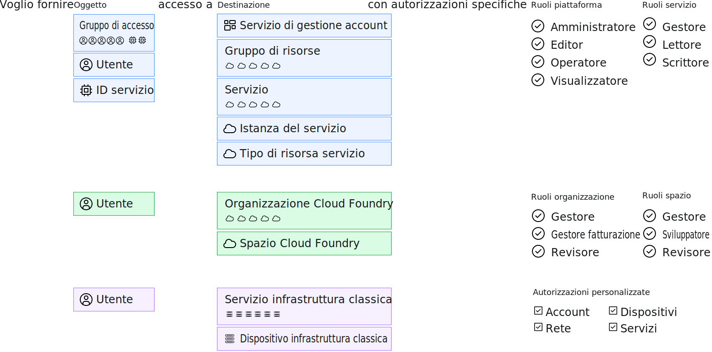

---

copyright:

  years: 2017, 2019

lastupdated: "2018-04-02"

keywords: users level of access, user control, access control, permissions

subcollection: overview

---

{:shortdesc: .shortdesc}
{:codeblock: .codeblock}
{:screen: .screen}
{:new_window: target="_blank"}

# Gestione dell'accesso in {{site.data.keyword.Bluemix_notm}}
{: #cloudaccess}

La gestione dell'accesso ti consente di controllare quali utenti vedono, creano, utilizzano e gestiscono le risorse nel tuo account. Per concedere l'accesso, puoi assegnare ruoli che offrano agli utenti dei livelli di accesso per completare le attività di gestione della piattaforma e accedere alle risorse dell'account.
{: shortdesc}

Il modo in cui gestisci l'accesso in {{site.data.keyword.Bluemix}} dipende dal tipo di risorsa a cui vuoi assegnare l'accesso. {{site.data.keyword.Bluemix_notm}} Identity and Access Management (IAM) è il sistema di gestione degli accessi utilizzato per gestire in modo coerente le risorse organizzate in un gruppo di risorse attraverso la piattaforma {{site.data.keyword.Bluemix_notm}}. Le risorse di Cloud Foundry e dell'infrastruttura classica non vengono gestite mediante Cloud IAM. Questi tipi di risorse hanno i loro propri sistemi di gestione degli accessi. 

Se hai una combinazione di tipi di risorse, gestisci ciascun tipo separatamente: 

* Per le risorse IAM, vai a **Gestisci** &gt; **Accesso (IAM)** e poi seleziona **Utenti**, **Gruppi di accesso** o **ID servizio** per iniziare.
* Per assegnare l'accesso alle tue [risorse dell'infrastruttura classica](/docs/iam?topic=iam-infrapermission), configura le autorizzazioni in **Gestisci** > **Accesso (IAM)** nella scheda Infrastruttura classica per l'utente a cui vuoi assegnare l'accesso. 
* Per assegnare l'accesso alle [risorse Cloud Foundry](/docs/iam?topic=iam-cfaccess), assegna gli utenti alle organizzazioni e configura i ruoli di accesso dello spazio e dell'organizzazione Cloud Foundry in **Gestisci** > **Accesso (IAM)** nella scheda Cloud Foundry per l'utente.

Mentre ogni tipo di accesso viene gestito separatamente, tutte le politiche di accesso sono composte di un oggetto a cui vuoi assegnare l'accesso, una destinazione per la politica per determinare a cosa ha accesso l'oggetto ed infine un ruolo IAM, un ruolo Cloud Foundry o un'autorizzazione dell'infrastruttura classica per determinare il livello di accesso che l'oggetto ha sulla destinazione.

Per le politiche IAM, l'oggetto può essere un gruppo di accesso, un utente o un ID servizio. Inoltre, la destinazione può essere un servizio di gestione dell'account, un gruppo di risorse, un servizio nell'account, una specifica istanza del servizio o un tipo di risorsa all'interno di un servizio. I ruoli della piattaforma e del servizio possono essere selezionati per determinare il livello di accesso dell'oggetto. Per l'accesso Cloud Foundry, a un utente viene fornito l'accesso a un'organizzazione e spazio Cloud Foundry selezionandoli e assegnando un ruolo organizzazione e spazio. Per l'infrastruttura classica, viene selezionato un utente e successivamente può essere determinato l'accesso a un servizio o dispositivo con delle autorizzazioni specifiche assegnate.

## Autorizzazioni per la gestione dell'accesso
{: #perms-manageaccess}

In qualità di proprietario dell'account, puoi gestire l'accesso a tutte le risorse nel tuo account. Puoi anche delegare il compito di gestire l'accesso alle risorse della piattaforma assegnando a un utente nel tuo account il ruolo di amministratore per tutti i servizi, solo per il servizio specifico o per il gruppo di risorse che desideri venga gestito da tale utente.

Se hai dei servizi Cloud Foundry nel tuo account, puoi assegnare a un altro utente il ruolo di gestore dell'organizzazione o dello spazio in modo che possa aggiungere utenti e assegnare ruoli di Cloud Foundry per accedere alle istanze nell'organizzazione o nello spazio che gestisce.

## Introduzione
{: #cloudaccess-getstarted}

Passa a **Gestisci** &gt; **Accesso (IAM)** e seleziona quindi **Utenti** per iniziare a gestire l'accesso per gli utenti nel tuo account. Seleziona un utente dall'elenco per iniziare. Vedi solo le opzioni di gestione dell'accesso che sei autorizzato a gestire. Ad esempio, se non sei il proprietario dell'account né un gestore dell'organizzazione o dello spazio, non visualizzerai l'opzione per gestire l'accesso a Cloud Foundry.

Puoi anche assegnare i ruoli di accesso alle applicazioni e ai servizi utilizzando gli ID del servizio. Per iniziare, vai alla pagina **ID servizio**. Per ulteriori informazioni su come iniziare subito a lavorare con {{site.data.keyword.Bluemix_notm}} IAM, consulta l'[Esercitazione introduttiva](/docs/iam?topic=iam-getstarted).
