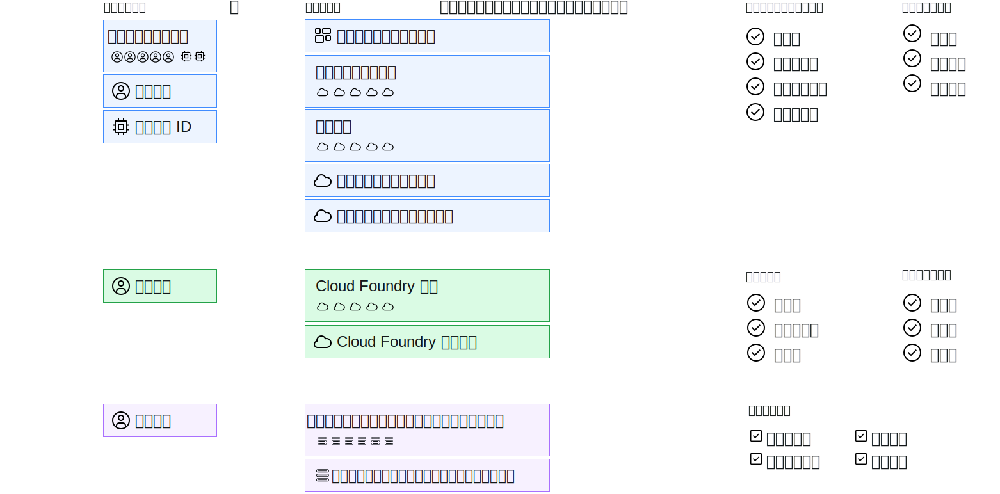

---

copyright:

  years: 2017, 2019

lastupdated: "2019-06-20"

keywords: users level of access, user control, access control, permissions

subcollection: overview

---

{:shortdesc: .shortdesc}
{:codeblock: .codeblock}
{:screen: .screen}
{:new_window: target="_blank"}

# {{site.data.keyword.Bluemix_notm}} でのアクセス管理
{: #cloudaccess}

アクセス管理によって、どのユーザーがアカウント内のリソースを表示、作成、使用、および管理できるのかを制御することができます。 アクセスを認可するために、役割を割り当てることができます。役割は、プラットフォーム管理タスクの実行およびアカウント・リソースへのアクセスを行うためのアクセス・レベルをユーザーに許可します。
{: shortdesc}

{{site.data.keyword.Bluemix}} でのアクセス管理の方法は、アクセス権限を割り当てたいリソースのタイプによって異なります。 {{site.data.keyword.Bluemix_notm}} Identity and Access Management (IAM) は、リソース・グループに編成されているリソースを {{site.data.keyword.Bluemix_notm}} プラットフォーム全体で一貫して管理するために使用されるアクセス管理システムです。 クラシック・インフラストラクチャーおよび Cloud Foundry のリソースは Cloud IAM を使用して管理されません。 これらのリソース・タイプには独自のアクセス管理システムがあります。 

複数のリソース・タイプを組み合わせて使用する場合は、各タイプを別々に管理します。

* IAM リソースの場合は、**「管理」** &gt; **「アクセス (IAM)」**に進み、次に**「ユーザー」**、**「アクセス・グループ」**、または**「サービス ID」**を選択して開始します。
* [クラシック・インフラストラクチャー・リソース ](/docs/iam?topic=iam-infrapermission) へのアクセス権限を割り当てるには、アクセス権を割り当てるユーザーの「クラシック・インフラストラクチャー」タブの**「管理」** > **「アクセス (IAM)」**内で許可を設定します。 
* [Cloud Foundry リソース](/docs/iam?topic=iam-cfaccess)へのアクセス権限を割り当てるには、ユーザーを組織に割り当て、ユーザーの「Cloud Foundry」タブの**「管理」** > **「アクセス (IAM)」**内で Cloud Foundry 組織および Cloud Foundry スペースのアクセス役割を設定します。

アクセス権限の各タイプは個別に管理されますが、すべてのアクセス・ポリシーは、アクセス権限が割り当てられるサブジェクト、サブジェクトがアクセス可能なスコープを設定するポリシーのターゲット、さらに最後に、ターゲットに対してサブジェクトが持つアクセス・レベルを決定する IAM 役割、Cloud Foundry の役割、またはクラシック・インフラストラクチャー許可で構成されます。

IAM ポリシーの場合、サブジェクトはアクセス・グループ、ユーザー、またはサービス ID にすることができます。 また、ターゲットは、アカウント管理サービス、リソース・グループ、 アカウント内のサービス、特定のサービス・インスタンス、またはサービス内のリソース・タイプにすることができます。 プラットフォームの役割およびサービスの役割を選択して、サブジェクトのアクセス・レベルのスコープを設定することができます。 Cloud Foundry アクセス権限の場合、Cloud Foundry 組織および Cloud Foundry スペースのそれぞれを選択し、組織の役割およびスペースの役割を割り当てることによって、Cloud Foundry 組織および Cloud Foundry スペースへのアクセス権限がユーザーに付与されます。 クラシック・インフラストラクチャーの場合、ユーザーを選択し、次に特定の許可を割り当てたアクセス権限のスコープをサービスまたはデバイスに設定できます。

## アクセス権限を管理するための権限
{: #perms-manageaccess}

アカウント所有者は、アカウント内のすべてのリソースへのアクセス権限を管理できます。 また、アカウント内のユーザーに、すべてのサービス、特定のサービス、またはそのユーザーに管理させるリソース・グループの管理者役割を割り当てることによって、プラットフォーム・リソースへのアクセスを管理するタスクを委任することもできます。

アカウント内に Cloud Foundry サービスがある場合、他のユーザーに組織またはスペースの管理者役割を割り当てることができます。そうすると、そのユーザーは、管理する組織またはスペース内のインスタンスにアクセスできるよう、ユーザーを追加して Cloud Foundry 役割を割り当てることができるようになります。

## 開始
{: #cloudaccess-getstarted}

**「管理」** &gt; **「アクセス (IAM)」**と進みます。次に、アカウント内のユーザーに関するアクセス管理を始めるため、**「ユーザー」** を選択します。 まず、リストからユーザーを選択します。 管理する許可のあるアクセス管理オプションのみが表示されます。 例えば、アカウント所有者でなく、組織またはスペースの管理者でもない場合、Cloud Foundry アクセスを管理するためのオプションは表示されません。

また、サービス ID を使用して、アプリおよびサービスにアクセス役割を割り当てることもできます。 **「サービス ID」**ページに移動して作業を始めます。 {{site.data.keyword.Bluemix_notm}} IAM を素早く稼働中にする方法について詳しくは、『[概説チュートリアル](/docs/iam?topic=iam-getstarted)』を参照してください。
