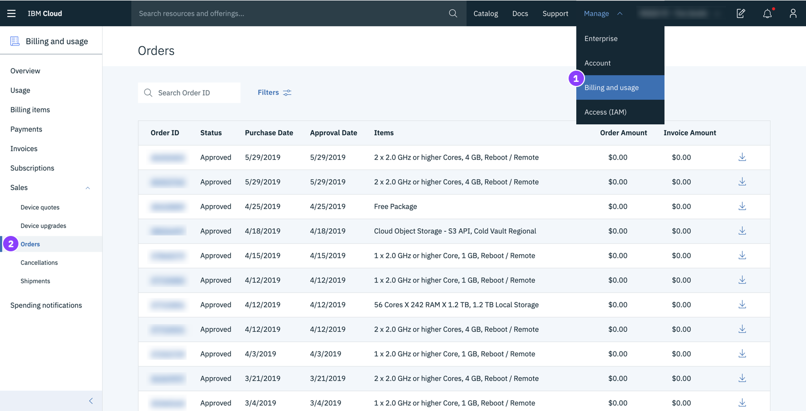

---

copyright:
  years: 2015, 2019
lastupdated: "2019-06-25"

keywords: ui, components, using the console, SoftLayer, classic infrastructure

subcollection: overview

---

{:shortdesc: .shortdesc}
{:tip: .tip}
{:note: .note}
{:new_window: target="_blank"}

# {{site.data.keyword.cloud_notm}} コンソールのナビゲート 
{: #ui}

{{site.data.keyword.cloud}} コンソールは、お客様のすべての {{site.data.keyword.cloud_notm}} リソースの管理を支援するユーザー・インターフェースです。 [コンソール](https://cloud.ibm.com){: new_window}  にアクセスすると、無料アカウントの作成、ログイン、資料へのアクセス、カタログへのアクセス、料金情報の表示、サポートの利用、{{site.data.keyword.cloud_notm}} コンポーネントの状況の確認を行うことができます。 ログイン後、メニュー・バーには、メニュー・アイコン  と追加リンクが含まれています。
{: shortdesc}

## コンソールの使用
{: #consoleoptions}

{{site.data.keyword.cloud_notm}} にログインすると、ダッシュボードが表示され、アカウントの状況を要約するウィジェットが示されます。 ウィジェットの追加または削除が必要な場合、[ダッシュボードのカスタマイズ](/docs/overview?topic=overview-custom-dashboard)を参照してください。

  * 新規リソースを作成するには、**「カタログ」**リンクを使用します。
  * 製品資料にアクセスするには、**「資料」**リンクを使用します。 
  * サポート・センターにアクセスするには、**「サポート」**リンクを使用します。  
  * **「管理」**メニューからは、「アカウント」、「請求および使用量」、および「ID およびアクセス管理」のオプションにアクセスできます。
  * コスト見積もりツール・アイコン  をクリックすると、コスト見積もりツールが開きます。
  * 発表、および計画イベントと計画外イベントにアクセスするには、通知アイコン  をクリックします。

## リソースの検索
{: #search}

リソース・リストで検出の必要なリソースについて、{{site.data.keyword.cloud_notm}} コンソール内の任意の場所から、名前またはタグによってリソースを検索できます。 コンソールのメニュー・バーで検索フィールドにリソースまたはタグの名前を入力します。

詳しくは、[リソースの検索](/docs/resources?topic=resources-searching-for-resources)を参照してください。 

## リソース・リストでのリソースの管理
{: #dashboardview}

メニュー・アイコン  &gt; **「リソース・リスト」**に移動して、アカウント・リソースのリストにアクセスします。 リソース・リストを使用して、{{site.data.keyword.cloud_notm}} リソースおよび Cloud Foundry サービス・インスタンスの表示および処理を行うことができます。 さまざまなタイプのリソースについて詳しくは、[リソースとは](/docs/resources?topic=resources-resource)を参照してください。

### リソースの表示
ご使用のアカウントの、すべての地域のすべてのリソースをリソース・リストで表示できます。 自分にとって重要な項目を表示するには、各列ヘッダーのフィルターを使用してリストをフィルタリングします。 例えば、特定のロケーションのリソースを表示および処理する場合は、**「ロケーション」**フィルターを展開し、リストからロケーションを選択します。

### リソースの処理
リソースに関するさまざまな処理をリソース・リストから行うことができます。

  * 各リソースはそのリソースごとの行に表示され、アクション・アイコン  が行の最後に組み込まれます。 アクション・アイコン  をクリックして、リソースを開始、停止、名前変更、または削除します。
  * リソースに対して資格情報または接続をセットアップするには、リソースの名前をクリックして、リソース詳細ページに移動します。 次に、**「サービス資格情報」**または**「接続」**を選択します。 詳しくは、[資格情報の追加](/docs/resources?topic=resources-service_credentials)および[接続の管理](/docs/resources?topic=resources-connect_app)を参照してください。

## カタログでの作業
{: #catalogcreate}

リソースを作成するには、リソース・リストで**「作成」**をクリックします。 そうすると、カタログが表示されます。 カタログからタイルを選択すると、そのリソースが使用可能な場所を確認できます。 カタログにリストされているすべてのリソースがすべての地域で使用可能というわけではありません。

作成したいリソースのタイルをクリックした後、デプロイする場所を選択できます。

  * Cloud Foundry リソースの場合、特定の地域を選択してから、サービス・インスタンスが割り当てられる先の組織およびスペースを選択できます。
  * {{site.data.keyword.cloud_notm}} Identity and Access Management (IAM) によって管理されるリソースの場合、デプロイする場所を選択します。 次に、サービス・インスタンスを割り当てる先のリソース・グループを選択します。

## {{site.data.keyword.cloud_notm}} エクスペリエンスへの移行
{: #redirect-cloud}

SoftLayer から {{site.data.keyword.cloud_notm}} へのマイグレーションの一部として、プラットフォーム・リソースとインフラストラクチャー・リソースの両方を管理するために使用する {{site.data.keyword.cloud_notm}} コンソールについて理解しておいてください。現在、すべての SoftLayer アカウントと {{site.data.keyword.cloud_notm}} アカウントをリンクしているところです。 そのため、お使いのアカウントはまだアクセスできない可能性があります。 アクセスできるようになったらすぐに、新しいエクスペリエンスを確認することができます。 

以前の SoftLayer という名称は、{{site.data.keyword.cloud_notm}} クラシック・インフラストラクチャーに変更されました。
{: note}

### インフラストラクチャー項目を見つける
{: #sl-links}

**「メニュー」アイコン**  > **「クラシック・インフラストラクチャー」**をクリックすると、デバイス、ストレージ、ネットワーク、セキュリティー、およびサービスを素早く見つけることができます。 

また、**「メニュー」アイコン**  > **「リソース・リスト」**の順にクリックして、リソース・リストでデバイスとストレージ項目を表示することもできます。
{: tip}

### ユーザー、アクセス、API キーの管理
{: #billing-items}

ご使用のアカウント内のユーザー、ユーザーのクラシック・インフラストラクチャー・アクセス権限、および API キーは、コンソールの「アクセス (IAM)」セクションから管理できます。 

* 新規ユーザーの招待、ユーザーの削除、特定ユーザーのログイン設定、IP 制限、VPN パスワードなどの管理を行うには、**「管理」** > **「アクセス (IAM)」**に進み、**「ユーザー」**を選択します。
* ユーザーのクラシック・インフラストラクチャー・アクセス権限の管理を開始するには、**「管理」** > **「アクセス (IAM)」**と進み、 ** 「ユーザー」**を選択します。 詳しくは、『[クラシック・インフラストラクチャー・アクセス権限の管理](/docs/iam?topic=iam-mngclassicinfra)』を参照してください。
* {{site.data.keyword.cloud_notm}} API キーまたはクラシック・インフラストラクチャー API キーを作成して管理するには、**「管理」** > **「アクセス (IAM)」**に進み、**「API キー」**を選択します。詳しくは、『[API キーについて](/docs/iam?topic=iam-manapikey)』を参照してください。

### 注文する
{: #place-order}

注文するにはカタログを使用します。 次のいずれかの方法でカタログにナビゲートすることができます。

  * メニュー・バーから**「カタログ」**をクリックします。
  * **「メニュー」アイコン**  > **「リソース・リスト」**をクリックします。 次に、**「リソースの作成」**をクリックします。

### 支払いを行う
{: #payments}

支払いは、コンソールの「請求および使用量」セクションから行うことができます。 **「管理」** > **「請求および使用量」**と進み、**「支払い」**を選択します。 

### 送り状にアクセスする
{: #invoices}

送り状には、コンソールの「請求および使用量」セクションからアクセスできます。**「管理」** > **「請求および使用量」**と進み、**「送り状」**を選択します。

### 注文項目へのアクセス
{: #sales}

デバイスの見積もりとアップグレード、注文、取り消し、および出荷は、コンソールの「請求および使用量」セクションにあります。 **「管理」** > **「請求および使用量」**と進み、**「セールス」**を選択します。 

### サポート Case へのアクセス
{: #support-mng}

現在のサポート Case にアクセスするには、**「サポート」** > **「Case の管理」**をクリックします。 また、**「アーカイブされた Case の表示」**をクリックして、アーカイブされた Case にもアクセスできます。

### フィードバックの送信
{: #feedback-profile}

絶賛、提案、またはその他のフィードバックを送信できます。 フィードバックをお送りいただくには、次の方法から選択してください。

  * コンソール・ページの端にある**「フィードバック」**ボタンをクリックします。 
  * **「アバター」アイコン**  > **「フィードバック」**をクリックします。 

### E メールの設定
{: #email-prefsl}

プラットフォームとインフラストラクチャーの通知に関する E メールを受信するための設定を行うことができます。**「アバター」アイコン**  > **「プロファイルと設定」**をクリックし、**「通知」**を選択します。

### VPN アクセス・ポイントの選択
{: #vpn-access}

VPN アクセス・ポイントを使用して {{site.data.keyword.cloud_notm}} コンソールにログインできます。[VPN アクセス](https://www.ibm.com/cloud-computing/bluemix/vpn-access)に進み、リストからアクセス・ポイントを選択します。

