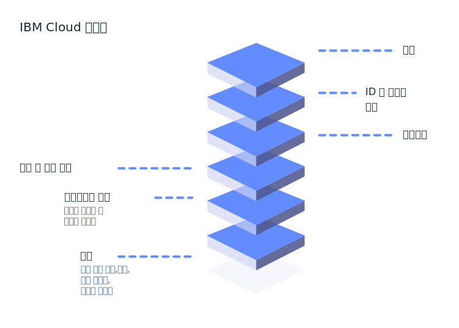

---

copyright:
  years: 2016, 2019
lastupdated: "2019-05-31"

keywords: console, platform overview, overview

subcollection: overview

---

{:shortdesc: .shortdesc}
{:new_window: target="_blank"}

# {{site.data.keyword.Bluemix_notm}} 플랫폼의 개념
{: #whatis-platform}

IBM의 클라우드 플랫폼은 PaaS(Platform as a Service)를 IaaS(Infrastructure as a Service)와 결합하여 통합 환경을 제공합니다. 이 플랫폼은 소규모 개발 팀 및 조직과 대규모 엔터프라이즈 비즈니스를 모두 스케일링하고 지원합니다. {{site.data.keyword.cloud}}에서 빌드하는 이 솔루션은 전세계의 데이터 센터에 글로벌로 배치되어 신뢰할 수있는 테스트되고 지원되는 환경에서 신속하게 스핀업되고 안정적으로 수행됩니다.
{: .shortdesc}

다음 다이어그램에 표시된 바와 같이, {{site.data.keyword.Bluemix_notm}} 플랫폼은 일관되고 신뢰할 수 있는 클라우드 경험을 제공하기 위해 함께 작동하는 여러 컴포넌트로 구성됩니다.  

  * 클라우드 리소스 작성, 보기 및 관리를 위한 프론트 엔드 역할을 하는 강력한 콘솔
  * 두 플랫폼 서비스 모두에 대해 사용자를 안전하게 인증하고 {{site.data.keyword.Bluemix_notm}}에서 일관적으로 리소스에 대한 액세스를 제어하는 ID 및 액세스 관리 컴포넌트
  * 수백 개의 {{site.data.keyword.Bluemix_notm}} 오퍼링으로 구성된 카탈로그
  * 리소스를 필터링하고 식별하기 위한 검색 및 태그 지정 메커니즘
  * 가격 플랜을 위한 정확한 사용량과 안전한 신용카드 사기 방지를 제공하는 계정 및 청구 관리 시스템
  
  

현대화하여 클라우드로 가져오려는 [기존 코드](/docs/apps/tutorials?topic=creating-apps-tutorial-byoc#tutorial-byoc)가 있거나 [새로운 애플리케이션](/docs/apps/tutorials?topic=creating-apps-tutorial-starterkit)을 개발 중인지에 관계없이 개발자는 {{site.data.keyword.Bluemix_notm}}에서 사용 가능한 서비스 및 런타임 프레임워크의 빠르게 설정하는 에코시스템을 활용할 수 있습니다.

## 계정 설정
{: #set-up-account}

{{site.data.keyword.Bluemix_notm}}를 사용해 보는 중이라면 바로 카탈로그로 이동하여 관심이 있는 오퍼링을 살펴보고 Lite 계정에 추가할 수 있습니다. 그러나 개발자 그룹 또는 전체 조직을 위한 환경을 시작하고 프로덕션에서 앱을 실행할 준비가 되어 있는 경우 계정의 기본사항 설정을 고려해 보십시오.

* 사용자와 서비스 ID를 하나의 엔티티로 구성하여 액세스 지정을 간소화된 프로세스로 만들기 위한 사용자 액세스 그룹
* 리소스 세트에 대한 액세스를 쉽고 빠르게 지정할 수 있도록 리소스를 구성하기 위한 리소스 그룹
* IAM 액세스 정책 또는 Cloud Foundry 조직 및 영역 역할이 필요한 액세스 그룹 또는 개별 개발자를 위한 액세스 정책

자세한 정보는 [계정 설정 우수 사례](/docs/account?topic=account-account_setup) 및 [액세스 지정 우수 사례](/docs/iam?topic=iam-account_setup)를 참조하십시오. 

## 가격 및 청구
{: #pricing-billing}

계정 유형에 관계없이 무료 할당량을 제공하는 서비스에 대해 Lite 플랜을 사용하여 {{site.data.keyword.Bluemix_notm}}를 탐색할 수 있습니다. 카탈로그에서 서비스를 선택 중이고 타일을 선택하는 경우 다양한 유형의 사용 가능한 플랜이 있으면 가격 정보에 대한 세부사항을 볼 수 있습니다. 유료 플랜이 있는 서비스 플랜을 선택하는 경우 비용 추정기 도구를 사용하여 비용을 추정할 수 있습니다. 자세한 정보는 [비용 추정](/docs/billing-usage?topic=billing-usage-cost)을 참조하십시오.

{{site.data.keyword.Bluemix_notm}} 청구는 {{site.data.keyword.Bluemix_notm}} 플랫폼에서 가격, 계정, 사용량 등을 안전하게 관리할 수 있도록 하는 여러 서비스를 제공합니다.

### 계정 관리
{: #account-mgmt}

계정 관리는 고객과의 청구 관계를 유지보수합니다. 각 계정은 고객을 나타내는 청구 엔티티입니다. 이 서비스는 계정 라이프사이클, 구독, 사용자 관계 및 조직을 제어합니다.

### 가격
{: #pricing}

가격 플랫폼 서비스는 사용자가 {{site.data.keyword.Bluemix_notm}} 카탈로그에 있는 리소스에 대한 가격 정보를 정의하고, 관리하고 검색하는 데 도움을 줍니다.

### 사용량 측정
{: #metering}

서비스 제공업체는 사용량 측정을 사용하여 {{site.data.keyword.Bluemix_notm}} 사용자가 프로비저닝한 리소스 인스턴스에 대해 수집된 메트릭을 제출할 수 있습니다. 통합 청구 서비스를 제공하는 서드파티 서비스 제공업체는 매시간 모든 활성 서비스 인스턴스에 대한 사용량을 제출해야 합니다. 

### 사용량 보고서
{: #usage}

사용량 보고서는 지정된 월에 대한, 특정 계정의 요약을 리턴합니다. 계정 청구 관리자는 이 보고서에 액세스할 수 있도록 권한 부여됩니다.

## {{site.data.keyword.Bluemix_notm}} 카탈로그
{: #catalog}

{{site.data.keyword.Bluemix_notm}} 카탈로그는 {{site.data.keyword.Bluemix_notm}} 콘솔에서 사용 가능한 리소스의 오퍼링 정의(설명, 기능, 이미지, URL 등)를 저장합니다. 오퍼링은 여러 지역 간에 SOR(System of Record)로서 관리됩니다. 카탈로그는 사용자가 기존 오퍼링에 대한 정보를 검색하고 해당 리소스를 작성, 관리 및 삭제할 수 있는 명령행 인터페이스(CLI) 및 RESTful API를 지원합니다. 자세한 정보는 [카탈로그 관리](/docs/overview?topic=overview-manage-catalog)를 참조하십시오.

## 리소스 작성
{: #provisioning-layer}

리소스 제어기는 사용자의 계정에 있는 {{site.data.keyword.Bluemix_notm}} 리소스의 라이프사이클을 관리하는 차세대 {{site.data.keyword.Bluemix_notm}} 플랫폼 프로비저닝 계층입니다. 리소스는 계정 범위에서 글로벌로 프로비저닝됩니다. 리소스 제어기는 동기 및 비동기 리소스 프로비저닝을 모두 지원합니다. 리소스의 예로는 데이터베이스, 계정, 프로세서, 메모리 및 스토리지 한계가 있습니다. 

일반적으로 프로비저닝 계층에서 추적하는 리소스는 사용량 메트릭과 청구를 연관시키는 데 사용되지만 항상 그렇지는 않습니다. 리소스 라이프사이클을 계정 라이프사이클과 함께 관리할 수 있도록 리소스가 프로비저닝 계층과 연관되는 경우도 있습니다. 리소스 제어기는 프로비저닝 계층에 대해 수행되는 조치의 인증 및 권한 부여를 위해 {{site.data.keyword.Bluemix_notm}} Identity and Access Management(IAM)를 사용합니다.

### 리소스 라이프사이클 관리
{: #lifecycle}

리소스 제어기는 인스턴스 작성에서 액세스 인증 정보 작성, 액세스 제거 및 인스턴스 삭제까지의 리소스 라이프사이클을 제어하는 일반 API를 제공합니다.

## 리소스 관리
{: #resource-manager}

리소스 집합은 [리소스 그룹](/docs/overview?topic=overview-whatis-rgs)에 의해 관리됩니다. 리소스 그룹은 사용자의 계정과 연관됩니다. 모든 {{site.data.keyword.Bluemix_notm}} 리소스는 리소스 그룹에 지정되어야 합니다. 계정을 생성하면 기본 리소스 그룹이 작성됩니다. 모든 {{site.data.keyword.Bluemix_notm}} IAM 사용 리소스가 리소스 그룹 내에 프로비저닝되어야 합니다. 그러나 Lite 계정을 보유한 경우에는 하나의 리소스 그룹만 보유할 수 있습니다. 종량과금제 또는 구독 계정이 있는 경우에는 둘 이상의 리소스 그룹을 작성할 수 있습니다. 계정이 일시중단되면 해당 리소스 그룹도 일시중단되며 리소스 그룹 내의 모든 리소스가 일시중단됩니다. 

## 리소스 검색 및 태그 지정
{: #search-and-tag}

검색 서비스는 {{site.data.keyword.Bluemix_notm}} 플랫폼 내에 통합된 글로벌 공유 리소스 특성 저장소입니다. 이는 클라우드 리소스의 속성을 저장하고 검색하는 데 사용되며 리소스를 분류합니다. 리소스는 [클라우드 리소스 이름(CRN)](/docs/overview?topic=overview-crn) ID로 고유하게 식별됩니다. 리소스의 특성에는 태그 및 시스템 특성이 포함됩니다. 두 특성 모두 {{site.data.keyword.Bluemix_notm}} 청구 계정 내에 정의되며 여러 지역에 걸쳐 적용됩니다.

또한 이 서비스는 리소스와 연관된 태그를 관리합니다. 태그 지정 API를 사용하여 태그를 작성, 삭제, 검색, 첨부 또는 분리할 수 있습니다. 태그는 CRN ID로 고유하게 식별됩니다. 태그에는 이름이 있으며, 이름은 청구 계정 내에서 고유해야 합니다. 사용자는 키:값 쌍 또는 레이블 형식으로 태그를 작성할 수 있습니다.

## 리소스 모니터링
{: #resources_observability}

관찰 가능성은 {{site.data.keyword.Bluemix_notm}}에서 애플리케이션과 서비스를 모니터하고 관찰할 수 있는 하나의 위치를 제공합니다.  

{{site.data.keyword.la_full}} 서비스를 사용할 경우 {{site.data.keyword.Bluemix_notm}} 아키텍처에 로그 관리 기능을 추가하고 시스템 및 애플리케이션 로그를 관리할 수 있습니다. 이 서비스는 모니터 및 문제 해결을 수행하고, 경보를 정의하며, 사용자 정의 대시보드를 디자인하는 고급 기능을 제공합니다. {{site.data.keyword.la_full_notm}}는 {{site.data.keyword.IBM_notm}}과의 파트너십을 통해 LogDNA에 의해 작동합니다. 자세한 정보는 [{{site.data.keyword.la_full_notm}} 시작하기](/docs/services/Log-Analysis-with-LogDNA?topic=LogDNA-getting-started)를 참조하십시오. 

{{site.data.keyword.mon_full_notm}} 서비스를 사용할 경우 애플리케이션, 서비스 및 플랫폼의 성능 및 상태에 대한 작동 가시성을 확인할 수 있습니다. 이 서비스는 모니터 및 문제 해결을 수행하고, 경보를 정의하며, 사용자 정의 대시보드를 디자인하는 고급 기능과 함께 전체 스택 텔레메트리를 제공합니다. {{site.data.keyword.mon_full_notm}}은 {{site.data.keyword.IBM_notm}}과의 파트너십을 통해 Sysdig에 의해 작동합니다. 자세한 정보는
[IBM Cloud Monitoring with Sysdig 서비스 시작하기](/docs/services/Monitoring-with-Sysdig?topic=Sysdig-getting-started#getting-started)를 참조하십시오. 

## 계정 모니터링 
{: #account_observability}

{{site.data.keyword.at_full}} 서비스를 사용하여 {{site.data.keyword.Bluemix_notm}} 계정의 활동을 모니터하고, 비정상적인 활동과 중요한 조치를 조사하며, 규정 감사 요구사항을 준수할 수 있습니다. 이외에도 조치가 발생할 경우 이에 대한 경보를 받을 수 있습니다. 수집되는 이벤트는 CADF(Cloud Auditing Data Federation) 표준을 준수합니다. 자세한 정보는 [{{site.data.keyword.at_full_notm}} 시작하기](/docs/services/Activity-Tracker-with-LogDNA?topic=logdnaat-getting-started)를 참조하십시오. 
