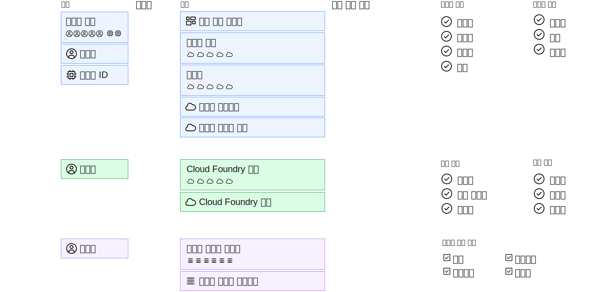

---

copyright:

  years: 2017, 2019

lastupdated: "2018-04-02"

keywords: users level of access, user control, access control, permissions

subcollection: overview

---

{:shortdesc: .shortdesc}
{:codeblock: .codeblock}
{:screen: .screen}
{:new_window: target="_blank"}

# {{site.data.keyword.Bluemix_notm}}에서 액세스 관리
{: #cloudaccess}

액세스 관리를 사용하면 계정의 리소스를 보고 작성하고 사용하며 관리하는 사용자를 제어할 수 있습니다. 액세스를 부여하기 위해, 플랫폼 관리 태스크의 완료 및 계정 리소스의 액세스를 위한 사용자 레벨의 액세스를 허용하는 역할을 지정할 수 있습니다.
{: shortdesc}

{{site.data.keyword.Bluemix}}에서 액세스를 관리하는 방법은 액세스가 지정되는 리소스의 유형에 따라 다릅니다. {{site.data.keyword.Bluemix_notm}} Identity and Access Management(IAM)는 {{site.data.keyword.Bluemix_notm}} 플랫폼에서 리소스 그룹에 구성된 리소스를 일관적으로 관리하는 데 사용되는 액세스 관리 시스템입니다. 클래식 인프라 및 Cloud Foundry 리소스는 Cloud IAM을 사용하여 관리되지 않습니다. 이러한 리소스 유형에는 고유 액세스 관리 시스템이 있습니다. 

리소스 유형이 조합된 경우에는 각각의 유형을 별도로 관리합니다.

* IAM 리소스의 경우 **관리** &gt; **액세스(IAM)**로 이동한 다음 **사용자**, **액세스 그룹** 또는 **서비스 ID**를 선택하여 시작하십시오.
* [클래식 인프라 리소스](/docs/iam?topic=iam-infrapermission)에 대한 액세스를 지정하려면 클래식 인프라 탭의 **관리** > **액세스(IAM)** 내에서 액세스를 지정하려는 사용자에 대한 권한을 설정합니다. 
* [Cloud Foundry 리소스](/docs/iam?topic=iam-cfaccess)에 대한 액세스를 지정하려면 사용자를 조직에 지정하고 Cloud Foundry 탭의 **관리** > **액세스(IAM)** 내에서 사용자의 Cloud Foundry 조직 및 영역 액세스 역할을 설정합니다.

각 액세스 유형은 개별적으로 관리하지만 모든 액세스 정책은 액세스 권한을 지정할 주체, 주체가 액세스할 수 있는 범위에 대한 정책의 대상 및 대상에 대한 주체의 액세스 레벨을 결정하는 IAM 역할, Cloud Foundry 역할 또는 클래식 인프라 권한으로 구성됩니다.

IAM 정책의 경우 주체는 액세스 그룹, 사용자 또는 서비스 ID일 수 있습니다. 또한 대상은 계정 관리 서비스, 리소스 그룹, 계정의 서비스, 특정 서비스 인스턴스 또는 서비스의 리소스 유형일 수 있습니다. 주체의 액세스 레벨 범위를 지정하기 위해 플랫폼과 서비스 역할을 선택할 수 있습니다. Cloud Foundry 액세스의 경우 각 사용자를 선택하고 조직 역할과 영역 역할을 지정하여 사용자에게 Cloud Foundry 조직과 영역에 대한 액세스 권한을 부여합니다. 클래식 인프라의 경우 사용자를 선택한 다음 특정 권한이 지정된 서비스나 디바이스로 액세스의 범위를 지정할 수 있습니다.

## 액세스 관리 권한
{: #perms-manageaccess}

계정 소유자인 경우에는 계정의 모든 리소스에 대한 액세스를 관리할 수 있습니다. 모든 서비스, 특정 서비스만 또는 해당 사용자가 관리하도록 하려는 리소스 그룹에 대한 관리자 역할을 계정의 사용자에게 지정하여 플랫폼 리소스에 대한 액세스를 관리하는 태스크를 위임할 수도 있습니다.

계정에 Cloud Foundry 서비스가 있는 경우에는 사용자를 추가할 수 있도록 다른 사용자에게 조직 및 영역 관리자 역할을 지정할 수 있으며, 관리 중인 조직이나 영역의 인스턴스에 액세스하기 위한 Cloud Foundry 역할을 지정할 수 있습니다.

## 시작하기
{: #cloudaccess-getstarted}

**관리** &gt; **액세스(IAM)**로 이동한 후 **사용자**를 선택하여 계정의 사용자에 대한 액세스 관리를 시작할 수 있습니다. 시작하려면 목록에서 사용자를 선택하십시오. 관리 권한이 있는 액세스 관리 옵션만 표시됩니다. 예를 들어, 계정 소유자가 아니며 조직 또는 영역 관리자가 아닌 경우에는 Cloud Foundry 액세스를 관리하는 옵션이 보이지 않습니다.

서비스 ID를 사용하여 앱과 서비스에 액세스 역할을 지정할 수도 있습니다. 시작하려면 **서비스 ID** 페이지로 이동하십시오. {{site.data.keyword.Bluemix_notm}} IAM을 빠르게 시작하고 실행하는 방법에 대한 자세한 정보는 [시작하기 튜토리얼](/docs/iam?topic=iam-getstarted)을 참조하십시오.
