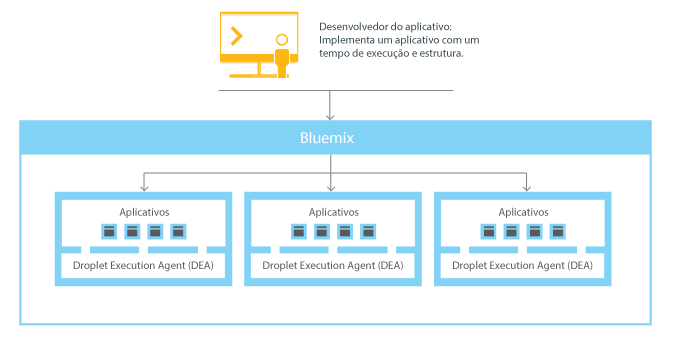
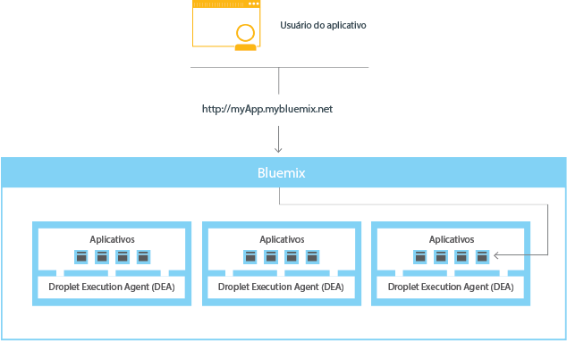
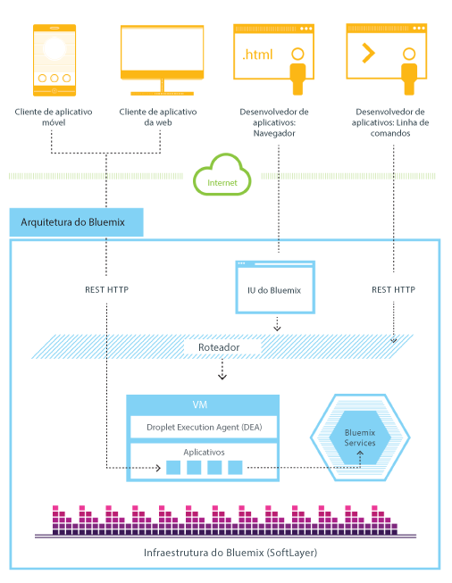
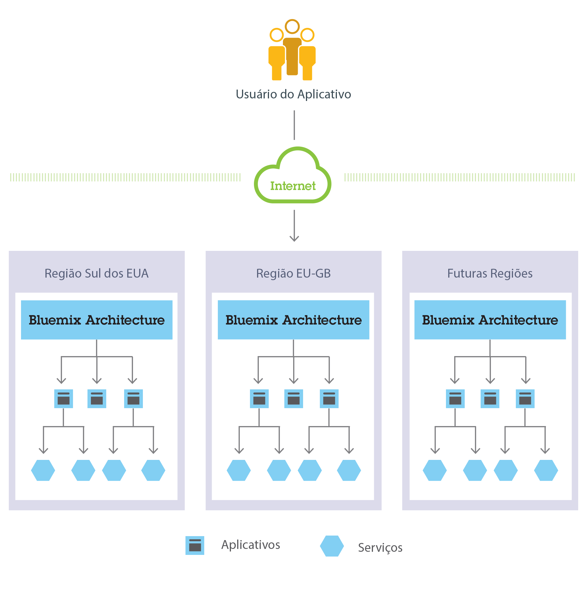

---


copyright:
  years: 2016, 2017
lastupdated: "2017-09-16"

---

{:shortdesc: .shortdesc}
{:new_window: target="_blank"}

# Como o Cloud Foundry funciona com o {{site.data.keyword.cloud_notm}}
{: #howwork}

Ao implementar um app no Cloud Foundry, deve-se configurar o {{site.data.keyword.cloud_notm}} com informações suficientes para suportar o app.

* Para um app móvel, o {{site.data.keyword.cloud_notm}} contém um artefato que representa o backend do app móvel, tal como os serviços que o app móvel usa para se comunicar com um servidor.
* Para um app da web, deve-se assegurar que as informações sobre o tempo de execução e a estrutura sejam comunicadas ao {{site.data.keyword.cloud_notm}}, para que o {{site.data.keyword.cloud_notm}} possa configurar o
ambiente de execução adequado para executar o app.

Cada ambiente de execução, incluindo o ambiente móvel e
o ambiente da web, é isolado do ambiente de execução de outros apps. Os ambientes de execução são isolados embora esses apps estejam
na mesma máquina física. A figura a seguir mostra o fluxo básico de como Cloud Foundry gerencia a implementação de apps no {{site.data.keyword.cloud_notm}}:



Figura 1. Implementando um app

Quando você cria um app e o implementa no Cloud Foundry, o ambiente {{site.data.keyword.cloud_notm}} determina um servidor virtual apropriado para o qual enviar o app ou os artefatos que o app representa. Para um aplicativo móvel, uma projeção de backend móvel é criada no {{site.data.keyword.cloud_notm}}. Qualquer código para o app móvel em execução na nuvem finalmente é executado
no ambiente do {{site.data.keyword.cloud_notm}}. Para um app da web, o código em execução na nuvem é o próprio app que o desenvolvedor implementa no {{site.data.keyword.cloud_notm}}. A determinação do servidor virtual é baseada em vários fatores, incluindo:

* A carga que já está na máquina
* Tempos de execução ou estruturas suportados por esse servidor virtual.

Após um servidor virtual ser escolhido, um gerente de aplicativos em cada servidor virtual instala a estrutura e o tempo de execução apropriados para o aplicativo. Em seguida, o app pode ser implementado nessa estrutura. Quando a implementação é concluída, os artefatos de aplicativo são iniciados.

A figura a seguir mostra a estrutura de um servidor virtual, também conhecida como Droplet Execution Agent (DEA), que possui vários apps implementados nele:


Figura 2. Design de um servidor virtual

Em cada servidor virtual, um gerente de aplicativos se comunica com o restante da infraestrutura do {{site.data.keyword.cloud_notm}} e gerencia os apps implementados nesse servidor virtual. Cada servidor virtual possui contêineres para separar e proteger os apps. Em cada contêiner, o {{site.data.keyword.cloud_notm}} instala
a estrutura e o tempo de execução apropriados necessários para cada app.

Quando o app for implementado, se ele tiver uma interface da web
(como um app da web Java) ou outros serviços baseados em REST (como
serviços móveis expostos publicamente para o app móvel), os usuários do app poderão se comunicar com ele usando solicitações normais de HTTP.



Figura 3. Chamando um app {{site.data.keyword.cloud_notm}}

Cada app pode ter uma ou mais URLs associadas a ele, mas todas elas devem apontar para o terminal do {{site.data.keyword.cloud_notm}}. Quando uma solicitação entra, o {{site.data.keyword.cloud_notm}} a examina, determina para qual app ela se destina e, em seguida, seleciona uma instância do app para recebê-la.


## Arquitetura Cloud Foundry no {{site.data.keyword.cloud_notm}}
{: #architecture}

Em geral, você não precisa se preocupar com o sistema operacional e as camadas de infraestrutura ao executar apps no {{site.data.keyword.cloud_notm}} no Cloud Foundry. Camadas
como sistemas de arquivos raiz e componentes de middleware são abstraídas para que você possa focar em seu
código do aplicativo. No entanto, é possível saber mais sobre estas camadas se precisar de informações específicas sobre onde seu
app está sendo executado.

Veja [Visualizando camadas de infraestrutura do {{site.data.keyword.cloud_notm}}](/docs/manageapps/infra.html#viewinfra) para obter detalhes.

Como desenvolvedor, é possível interagir com a infraestrutura do {{site.data.keyword.cloud_notm}},
usando uma interface com o usuário baseada no navegador. Também é possível usar uma interface de linha de comandos Cloud Foundry, chamada cf, para implementar apps da web.

Os clientes, que podem ser apps móveis, apps executados externamente, apps que são construídos no {{site.data.keyword.cloud_notm}} ou desenvolvedores que
estão usando navegadores, interagem com os aplicativos hospedados no {{site.data.keyword.cloud_notm}}. Os clientes usam APIs REST ou HTTP para rotear solicitações por meio do {{site.data.keyword.cloud_notm}} para
uma das instâncias do app ou para os serviços compostos.

A figura a seguir mostra a arquitetura de alto nível do Cloud Foundry no {{site.data.keyword.cloud_notm}}.



Figura 4. Arquitetura Cloud Foundry no {{site.data.keyword.cloud_notm}}

É possível implementar seus apps em diferentes regiões do {{site.data.keyword.cloud_notm}}, para considerações de latência ou segurança. É possível optar por implementar para uma região ou entre várias regiões.




Figura 5. Implementação do aplicativo multiregion

## Regiões
{: #ov_intro_reg}

Uma região do {{site.data.keyword.cloud_notm}} é um território geográfico definido no qual é possível implementar seus apps. Você pode criar apps e instâncias de serviço em diferentes
regiões com a mesma infraestrutura do
{{site.data.keyword.cloud_notm}} para gerenciamento de
aplicativos e a mesma visualização de detalhes de uso para faturamento. É possível implementar seus apps para a região que está mais próxima de seus clientes para obter baixa latência do aplicativo. Para direcionar problemas de segurança, também é possível selecionar a região na qual você deseja manter os dados do aplicativo. Ao construir apps em diversas regiões, se uma região se tornar indisponível, os apps que estão nas outras regiões continuarão executando. A concessão de seu recurso é a mesma para cada região que você usa.

Se você usar o console do {{site.data.keyword.cloud_notm}}, as informações serão mostradas automaticamente para a região geográfica saudável mais próxima. O balanceamento de carga global para o console assegura que se por alguma razão a região geográfica mais próxima estiver inativa, o console exibirá as informações para a próxima região mais perto. Desta forma, você sempre tem acesso ao console sem ter que tomar qualquer ação para acessar as informações necessárias.

Use o seletor de região no console para filtrar sua visualização. Por exemplo, se você estiver acessando seus apps e serviços em sua região de Dallas, EUA, mas desejar visualizar seus apps e serviços para a região de Londres, será possível usar o seletor de região para mudar sua visualização:

1. Clique no link preferências de conta do usuário.
2. Expanda **Região** no menu.
3. Selecione a região que você requer na lista.

Filtrar a visualização por região também permite alternar rapidamente as visualizações para trabalhar com organizações, espaços e usuários designados às diferentes regiões.

Se você usar a interface da linha de comandos cf para se conectar à região {{site.data.keyword.cloud_notm}} com a qual deseja trabalhar, use o comando cf api e especifique o terminal da API da região. Por exemplo, insira o comando a seguir para conectar-se à região do Reino Unido na Europa
{{site.data.keyword.cloud_notm}}:

```
cf api https://api.eu-gb.bluemix.net
```

Um prefixo exclusivo é designado a cada região. O {{site.data.keyword.cloud_notm}} fornece
as regiões e os prefixos de regiões a seguir.

| **Nome da região** | **Local geográfico** | **Terminal de API do cf** |
|-----------------|-------------------------|-------------------|
| Região Sul dos EUA | Dallas, EUA | api.ng.bluemix.net | 
| Região do Reino Unido | Londres, Inglaterra | api.eu-gb.bluemix.net | 
| Região de Sydney | Sydney, Austrália | api.au-syd.bluemix.net | 
| Região da Alemanha | Frankfurt, Alemanha | api.eu-de.bluemix.net | 
{: caption="Tabela 1.  {{site.data.keyword.cloud_notm}} lista de região" caption-side="top"}

## Resiliência do {{site.data.keyword.cloud_notm}}
{: #resiliency}

O {{site.data.keyword.cloud_notm}} é projetado para hospedar apps e artefatos de aplicativos resilientes e escaláveis que podem escalar para atender às suas necessidades, permanecer altamente disponível e ser rápido para recuperar-se de problemas. O {{site.data.keyword.cloud_notm}} separa os componentes que controlam o estado das interações (stateful) daqueles que não controlam (stateless). Essa separação permite que o {{site.data.keyword.cloud_notm}} mova apps flexivelmente, conforme necessário, para obter escalabilidade e resiliência.

Pode haver uma ou mais
instâncias em execução para seu app. Para várias instâncias de um único app, o app é transferido por upload somente uma vez. No entanto, o {{site.data.keyword.cloud_notm}} implementa o número solicitado de instâncias do app e as distribui entre quantos servidores virtuais for possível.

Deve-se salvar todos os dados persistentes em um armazenamento de dados stateful que esteja fora de seu app, tal como em um dos serviços de armazenamento de dados que o {{site.data.keyword.cloud_notm}} fornece. Como qualquer coisa armazenada em cache na memória ou no disco pode ainda não estar disponível após uma reinicialização, é possível usar o espaço de memória ou o sistema de arquivos de uma única instância do {{site.data.keyword.cloud_notm}} como um cache de breve transação única. Com uma configuração de instância única, a solicitação para seu app pode ser interrompida por causa da
natureza stateless do {{site.data.keyword.cloud_notm}}. Uma melhor prática é usar pelo menos três instâncias para cada app para assegurar sua disponibilidade.

Toda a infraestrutura do
{{site.data.keyword.cloud_notm}},
os componentes do Cloud Foundry e os componentes de gerenciamento
específicos da {{site.data.keyword.cloud_notm}} são altamente
disponíveis. Várias instâncias da infraestrutura são usadas
para equilibrar a carga.

## Integração com sistemas de registro
{: #sor}

O {{site.data.keyword.cloud_notm}} pode ajudar os desenvolvedores, conectando duas categorias amplas de sistemas em um ambiente de nuvem:

* *Sistemas de registro* inclui apps e bancos de dados que armazenam registros de negócios e automatizam processos padronizados.
* *Sistemas
de engajamento* são recursos que expandem a utilidade dos
sistemas de registro e os tornam mais envolventes para os usuários.

Ao integrar um sistema de registro ao app que você cria no
{{site.data.keyword.cloud_notm}}, pode executar as
seguintes ações:

 * Ativar a comunicação segura entre o app e o banco de dados de backend, fazendo
o download e instalando um conector seguro no local.
 * Chamar um banco de dados de uma maneira segura.
 * Criar APIs a partir de fluxos de integração com bancos de dados e sistemas de
backend, como o sistema de gerenciamento de relacionamento com o cliente.
 * Expor somente os esquemas e as tabelas que você deseja que
sejam expostos ao app.
 * Como gerente da organização {{site.data.keyword.cloud_notm}},
publique uma API como um serviço privado que seja visível somente aos membros de sua organização.

Para integrar um sistema de registro com o app que você cria no
{{site.data.keyword.cloud_notm}}, use o serviço Cloud
Integration. Com o serviço Cloud Integration, é possível criar uma API de Cloud Integration e publicar a API como um serviço privado para sua organização.

<dl>
<dt>API de Cloud Integration</dt>
    <dd>Uma API de Cloud Integration fornece acesso seguro para os sistemas de registro que residem por trás de um firewall por meio das APIs da web. Ao criar a API de Cloud Integration, escolha o recurso que deseja acessar por meio da API da web, especifique as operações que são permitidas e inclua SDKs e amostras para acessar a API. Para obter mais informações sobre como criar uma API de Cloud Integration, veja [Introdução ao Cloud Integration](/docs/services/CloudIntegration/CldInt_GetStart.html).</dd>
<dt>Serviço privado</dt>
    <dd>Um serviço privado consiste em uma API de Cloud Integration, SDKs e políticas de autorização. O serviço privado também pode conter documentação ou outros itens do provedor de serviços. Somente o gerenciador de organização pode publicar uma API de Cloud Integration como um serviço privado. Para
ver os serviços privados que estão disponíveis para você,
marque a caixa de seção Privado no catálogo do {{site.data.keyword.cloud_notm}}. É
possível selecionar e ligar um serviço privado a um app sem se conectar ao serviço Cloud Integration. Você
liga serviços privados ao seu app da mesma maneira que faz com outros
serviços {{site.data.keyword.cloud_notm}}. Para obter informações sobre como publicar uma API como um serviço privado,
consulte Publicando uma API como um serviço privado.</dd>
</dl>

### Cenário: Criando um app móvel avançado para conexão
com o sistema de registro
{: #scenario}

O {{site.data.keyword.cloud_notm}} fornece uma
plataforma na qual é possível integrar seu app móvel, os serviços de
nuvem e os sistemas corporativos de registro para fornecer um app que interaja com os dados no local.

Por exemplo, é possível construir um app
móvel para interagir com o sistema de gerenciamento de relacionamento com o cliente
que reside no local protegido por um firewall. É possível chamar o
sistema de registro de uma maneira segura e alavancar os serviços móveis no {{site.data.keyword.cloud_notm}} para que seja possível construir um app móvel avançado.

Primeiro, seu desenvolvedor de integração cria o app de backend
móvel no {{site.data.keyword.cloud_notm}}. Eles usam o modelo de Nuvem para dispositivo móvel que usa o tempo de execução Node.js com o qual estão mais familiarizados.

Em seguida, usando o serviço Cloud Integration na interface com o usuário do {{site.data.keyword.cloud_notm}}, eles expõem uma API por meio de um conector seguro. Seu desenvolvedor de
integração faz o download do conector seguro e instala-o no local
para permitir uma comunicação segura entre sua API e o banco de dados. Após criar o terminal de banco de dados, podem examinar todos os esquemas e extrair as tabelas que desejam expor como APIs para o app.

O desenvolvedor de integração inclui o serviço de push para entregar notificações móveis aos consumidores interessados. Eles também incluem um serviço de parceiro de negócios para publicar um tweet quando um novo registro de cliente é criado com uma API do Twitter.

Em seguida, como desenvolvedor de aplicativos,
é possível efetuar login no {{site.data.keyword.cloud_notm}},
fazer o download do kit de ferramentas de desenvolvimento do Android e desenvolver código que chame
as APIs criadas pelo desenvolvedor de integração. É possível
desenvolver um app móvel que permita aos usuários inserir suas
informações em seus dispositivos móveis. O app móvel cria então um registro do cliente
no sistema de gerenciamento do cliente. Quando o registro é criado, o
app envia uma notificação para um dispositivo móvel e inicia
um tweet sobre o novo registro.
