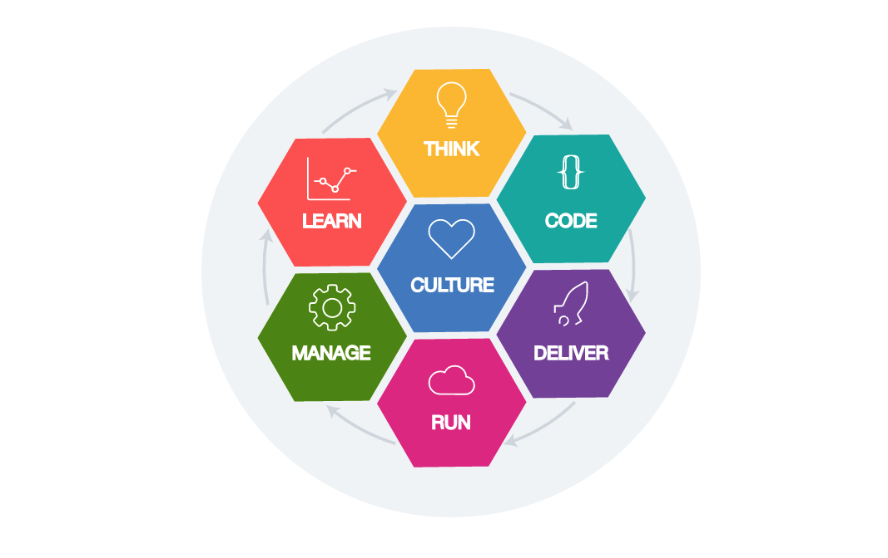

---

copyright:
  years: 2016, 2017, 2018
lastupdated: "2018-11-28"

---
{:new_window: target="_blank"}
{:shortdesc: .shortdesc}
{:screen: .screen}
{:codeblock: .codeblock}
{:pre: .pre}
{:tip: .tip}

# Explorar a jornada do desenvolvedor no {{site.data.keyword.cloud_notm}}
{: #dev-journey}

Como um desenvolvedor, você decide o melhor ponto de entrada para o código. É possível optar por gerar o código por meio de nossas ferramentas fornecidas ou trazer seu próprio código e implementá-lo no {{site.data.keyword.cloud}}.
{: shortdesc}

O {{site.data.keyword.cloud_notm}} tem um conjunto de recursos que permite iniciar a construção de apps em minutos. As
ferramentas do desenvolvedor do {{site.data.keyword.cloud_notm}} criam uma base de alto desempenho necessária
para que você se torne funcional. Duas ferramentas principais são oferecidas para o desenvolvimento:
 * Console da web do {{site.data.keyword.cloud_notm}} (Portais do desenvolvedor)
 * {{site.data.keyword.cloud_notm}}interface de linha de comandos (CLI)

Dentro dos Portais do desenvolvedor do {{site.data.keyword.cloud_notm}}, é possível:

* Selecionar os kits do iniciador que são específicos do caso de uso e produzir apps prontos para produção em várias linguagens de programação e padrões arquiteturais.
* Consultar e gerenciar os recursos fornecidos automaticamente por meio do kit do iniciador ou incluí-los manualmente no app.
* Se você tiver um app em um repositório existente, será possível usar um kit do iniciador em branco para criar um registro de app e conectá-lo ao repositório de origem e à cadeia de ferramentas do DevOps.
* Com o código de app móvel, é possível implementar em vários ambientes de nuvem.
* Criar uma [cadeia de ferramentas do DevOps](../services/ContinuousDelivery/index.html#cd_getting_started) com alguns cliques.
* Use uma [interface da linha de comandos](/docs/cli/index.html#overview) para o desenvolvimento local.

Para entender melhor como a nossa experiência pode ajudá-lo a construir rapidamente apps prontos para produção de alta qualidade, vamos examinar esses elementos com mais detalhes.

## Portais do desenvolvedor
{: #dev-portals}

O {{site.data.keyword.cloud_notm}} tem Portais do desenvolvedor em diferentes áreas de interesse (como Watson, segurança ou finanças) ou um canal digital (como Dispositivo móvel ou aplicativos da web). É possível acessar esses portais por meio do ícone **Menu** .

Cada Portal do Desenvolvedor fornece kits do iniciador relevantes à área de foco dos portais. Os portais oferecem um fluxo de trabalho consistente e intuitivo para criar um app funcional pronto para produção em minutos.

## Apps
{: #app-projects}

Um app inclui código, dados, serviços e cadeias de ferramentas. Por exemplo, o app móvel do {{site.data.keyword.cloud_notm}} contém o código de dispositivo, com a lógica de back-end,
o armazenamento de dados, a análise de dados e os serviços de segurança, e é configurado para entrega contínua.

É possível criar e gerenciar um app usando qualquer Portal do Desenvolvedor do {{site.data.keyword.cloud_notm}} ou o {{site.data.keyword.dev_cli_notm}}.

É possível criar diretamente apps simples em branco ou criar apps mais complexos usando os kits do iniciador. Se você optar por criar apps em branco sem a ajuda de um kit do iniciador, será possível fazer isso por meio do [Painel do {{site.data.keyword.cloud_notm}} ](https://{DomainName}){: new_window} sem visitar um portal.

## Kits iniciadores
{: #starter-kits}

Com os kits do iniciador, queremos que a sua experiência seja fácil de usar e customizável. Os kits do iniciador montam um app de produção de estrutura básica, na linguagem de sua escolha, pronto para implementação na nuvem. Cada kit
do iniciador inclui uma linguagem, uma estrutura e um padrão para um caso de uso específico e para a reutilização do
código.

Se um kit do iniciador requer recursos específicos, não há problema. Com os recursos fornecidos automaticamente, o {{site.data.keyword.cloud_notm}} cria automaticamente as instâncias para esses recursos quando você cria o app. É
possível acessar os kits do iniciador por meio do Portal do Desenvolvedor ou da interface da linha de comandos para obter
as instruções relevantes para a sua área e fluxo de trabalho de foco.

### O quanto os kits do iniciador são diferentes das amostras?
Os kits do iniciador são prontos para produção e focam em demonstrar uma implementação padrão de chave usando um tempo de execução (por exemplo, Node.js e Express). Em alguns casos, os kits do iniciador oferecem uma experiência do usuário simples para destacar a integração do serviço. Em outros casos, os kits do iniciador representam uma implementação customizável de um caso de uso sofisticado.

* Um **fragmento** consiste em algumas linhas de código frequentemente apresentadas em um IDE. Os fragmentos ajudam um desenvolvedor a integrar-se a uma sintaxe de linguagem de programação ou a suportar a integração com uma API definida.
* Uma **demonstração** geralmente tem alta qualidade e fidelidade e usa uma gama de serviços e pontos de integração. Ela geralmente requer tempo de configuração e é usada para provar um problema de negócios ou demonstrar um recurso de plataforma. É possível usá-la para avaliar os estágios de adoção de nuvem. Às
vezes, seu código é incluído no código de produção.
* Uma **amostra** é um pequeno exemplo de um recurso específico, uma função, um serviço ou uma jornada do usuário. Uma amostra pode ser reutilizada ou incluída em um aplicativo de produção. Ela é geralmente usada para mostrar recursos técnicos e uma abordagem possível para solucionar um problema técnico.
* Um **kit do iniciador** é um padrão pronto para produção que pode ser integrado a um conjunto de serviços para gerar um ativo pronto para produção que pode ser implementado diretamente em um pipeline do
DevOps e em um cluster do Kubernetes. Um kit do iniciador contém metadados descritivos que fornecem ao usuário informações suficientes para saber o que o kit é ou faz. Ele também contém instruções que indicam ao {{site.data.keyword.cloud_notm}} o que produzir. A saída está pronta para produção e pronta para utilização e pode ser iterada por aprimoramentos adicionais, com base nas melhores práticas da IBM. O conteúdo do kit do iniciador não é tão complexo como uma demonstração e não tão trivial como um fragmento ou amostra. Ele é criado dinamicamente com base nos requisitos do desenvolvedor.

## Recursos autoprovisionados
{: #auto-provision}

Se um kit do iniciador especifica os recursos necessários, o {{site.data.keyword.cloud_notm}} cria automaticamente as instâncias desses recursos quando você cria seu app. Também é possível fornecer recursos manualmente ou selecionar instâncias de recurso existentes a serem incluídas no app depois que ele é criado. É
possível ver uma lista de instâncias de serviço associadas ao app na visualização Detalhes do app com as
credenciais, caso você precise delas.

## Código móvel
{: #portable-code}

A criação de um app por meio de um kit do iniciador cria automaticamente o código que tem um formato consistente e não é dependente do tempo de execução. É possível implementar o código no ambiente de sua escolha, como o Kubernetes ou o Cloud Foundry, sem fazer mudanças.

É possível dar uma olhada rápida no código de app clicando em **Fazer download do código**
na página **Detalhes do app** do seu app. O código é transferido por download como um arquivo `.zip` que contém a estrutura do código do app completa. É possível extrair facilmente o arquivo e executar o código localmente usando o {{site.data.keyword.dev_cli_notm}} ou incluí-lo em seu repositório de gerenciamento de código.

### Qual código é criado?

Quando você cria um app diretamente ou com a ajuda de um kit do iniciador, o app contém um código móvel. O código móvel contém o código de ativação de nuvem para múltiplos ambientes de nuvem. Então, é possível produzir o código
em quatro áreas fundamentais:
* Código que segue as melhores práticas para uma determinada linguagem
* Código que permite que o app seja executado na nuvem
* Código que é inicializado para se conectar aos serviços de nuvem
* Código que é específico para um caso de uso

Gerar esses componentes economiza tempo valioso e assegura que você esteja usando uma arquitetura de ponta.

* **Lógica de caso de uso** fornece funções para a função principal de um caso de uso específico. Os exemplos podem ser código para um robô de bate-papo do Watson Conversation ou código para um app de reconhecimento visual móvel.
* **Componentes de linguagem** são componentes de código e arquivos específicos para a linguagem de programação que você seleciona para o seu kit do iniciador. Por exemplo, os programadores de node.js precisam de um arquivo package.json para o gerenciamento de dependência e esse arquivo é criado automaticamente.
* **Ativação de serviço** é o código que permite que seu app se conecte e use os serviços que você inclui. O gerenciamento de credencial, o código de inicialização e os SDKs específicos do serviço são exemplos de itens de ativação de serviço.
* **Ativação de nuvem** é o código que permite que seu app seja executado no {{site.data.keyword.cloud_notm}}. Por exemplo, os gráficos Helm que permitem que seu app seja executado em um cluster do Kubernetes do {{site.data.keyword.cloud_notm}}.

Ao criar um app por meio de um kit do iniciador do {{site.data.keyword.cloud_notm}}, seu app iniciará com arquitetura comprovada que também reflete as melhores práticas para a linguagem selecionada.

Cada aplicativo inclui um arquivo leia-me que contém detalhes técnicos do app e explica o que é necessário para deixar seu app em execução caso ele não seja executado pronto para utilização.
{: tip}

## Traga seu próprio código e implemente-o no {{site.data.keyword.cloud_notm}}
{: byoc}

Se você tiver um app em um repositório existente, será possível usar um kit do iniciador em branco para criar um
registro do app no {{site.data.keyword.cloud_notm}} e conectá-lo ao seu repositório de origem e à sua
cadeia de ferramentas do DevOps.

É possível iniciar por meio do painel do {{site.data.keyword.cloud_notm}} ou de qualquer kit do iniciador em branco. Depois
de nomear o app e selecionar um grupo de recursos, selecione o ponto de início
[**Trazer seu próprio código**](/docs/apps/tutorials/tutorial_byoc.html), forneça a URL do repositório Git que contém o código e clique em **Criar**.

É possível conectar a cadeia de ferramentas do DevOps existente ou criar uma e entregar continuamente o app para o
ambiente de sua escolha, como o Kubernetes ou o Cloud Foundry.

## Cadeia de ferramentas do DevOps
{: #devops}

A cadeia de ferramentas do DevOps inclui procedimentos e ferramentas para acessar, desenvolver, implementar e operar o app. Uma cadeia de ferramentas do DevOps é um conjunto de serviços vinculados que automatizam as tarefas do DevOps. É possível
executar o DevOps manualmente com apps simples, mas a necessidade de automação aumenta rapidamente à medida que a
complexidade do app aumenta e a automação da cadeia de ferramentas é uma necessidade para a entrega contínua.

O componente principal de uma cadeia de ferramentas do DevOps é um repositório de controle de versão do código como o GitHub. Mais ferramentas podem incluir rastreamento de lista não processada, pipeline de entrega, IDE e serviço de monitoramento, como o [{{site.data.keyword.cloud_notm}} {{site.data.keyword.DRA_short}}](/docs/services/DevOpsInsights/index.html#gettingstarted).

Se você criar um app usando um kit do iniciador, será possível criar uma nova cadeia de ferramentas e implementar o app simplesmente clicando em **Implementar na nuvem** na página **Detalhes do app**. Uma cadeia de ferramentas que tem um repositório de código, repositório de problemas, pipeline de entrega e IDE da web é criada.

É possível, então, construir nessa cadeia de ferramentas para acomodar múltiplas equipes e implementar em ambientes separados para desenvolvimento, teste e produção. Estabeleça um modelo de entrega contínua colaborativa de classificação corporativa para o app.

## Interface da linha de comandos
{: cli}

Use a interface da linha de comandos para codificar, construir e executar o app localmente. Um padrão comum é criar o app por meio de um Portal do Desenvolvedor no console do {{site.data.keyword.cloud_notm}}, usar as ferramentas do desenvolvedor para desenvolver localmente e, em seguida, enviar por push as atualizações para o repositório e mesclar para iniciar a cadeia de ferramentas de implementação.

## Desenvolvimento do método Garage
{: #developer_concepts}

Se você está procurando um local no qual seja possível experimentar com grandes ideias e tecnologias emergentes, certifique-se de verificar as implementações do [Método Garage](https://www.ibm.com/cloud/garage/){: new_window} . É possível saber como a IBM pode ajudá-lo a desenvolver apps em sua organização. 

*Visão geral de fases do Método Garage*

O {{site.data.keyword.cloud_notm}} ajuda a produzir apps de produção de classificação corporativa bem-sucedidos usando o método Garage ou o seu método preferido. Para entender melhor o que o {{site.data.keyword.cloud_notm}} oferece aos desenvolvedores, vamos dar uma olhada rápida nas qualificações necessárias para construir um app moderno.

## Qualificações do desenvolvedor
{: #skills}

Os usuários esperam mais de seus aplicativos do que antes. Eles desejam que seus apps entreguem percepções profundas de dados armazenados e em tempo real, estejam sempre disponíveis e correspondam às suas necessidades individuais mais estritamente. Para atender a essas expectativas, os recursos do desenvolvedor no IBM Cloud se alinham a conjuntos de qualificações específicos e permitem que sua equipe use uma plataforma para produzir, entregar, executar e gerenciar apps. Por exemplo, um aplicativo cognitivo sofisticado pode requerer contribuições de desenvolvedores digitais, desenvolvedores de nuvem nativa, desenvolvedores de fluxos, cientistas de dados e especialistas do DevOps.

 

* Os **Desenvolvedores digitais** criam um canal digital específico, como web móvel, voz e bate-papo. Os desenvolvedores digitais são geralmente focados em casos de uso e atendem diretamente às necessidades dos usuários como uma experiência abrangente.
* Os **Desenvolvedores nativos de nuvem** são especializados em construir e interconectar componentes de nuvem. Os autores de microsserviço e de backend para frontend se enquadram nessa categoria.
* Os **Desenvolvedores de fluxos** focam no processamento e obtêm insights de fluxos de dados. Por exemplo, um desenvolvedor de fluxos pode analisar e iniciar a ação em fluxos de texto, fala ou vídeo recebidos.
* Os **Cientistas de dados** usam analítica e aprendizado de máquina para produzir modelos preditivos. Esses modelos são usados em métricas de negócios e fornecem percepções profundas aos usuários do aplicativo.
* Os **Especialistas do DevOps** são especialistas em resolver problemas de implementação e cadeia de ferramentas. Para apps simples, especialistas dedicados geralmente não são necessários porque os membros da equipe de desenvolvimento gerenciam o DevOps com a equipe. Mas para aplicativos corporativos complexos, com muitas dependências, os especialistas do DevOps são essenciais para manter seu app de produção em execução sem problemas.

Os recursos do desenvolvedor integrados no {{site.data.keyword.cloud_notm}} se alinham a esses conjuntos de habilidades e permitem que a sua equipe use uma plataforma para produzir, entregar, executar e gerenciar o app. Por exemplo, um desenvolvedor digital que cria um app móvel pode usar o {{site.data.keyword.cloud_notm}}Portal do Desenvolvedor móvel do {: new_window} , um construtor de app cognitivo pode usar o [Portal do Desenvolvedor do Watson](https://{DomainName}/developer/watson/dashboard){: new_window}  juntamente com o [Watson Studio](https://{DomainName}/catalog/services/watson-studio){: new_window} , um desenvolvedor de fluxos pode usar o [IBM Real-Time Analytics](/docs/services/StreamingAnalytics/index.html) e o serviço [{{site.data.keyword.cloud_notm}} Continuous Delivery](/docs/services/ContinuousDelivery/index.html) simplifica a tarefa de um especialista do DevOps.

Pronto para começar a construir apps de alta qualidade prontos para produção? [Clique aqui](/docs/apps/tutorials/tutorial_web.html) para construir um app no {{site.data.keyword.cloud_notm}} agora!
