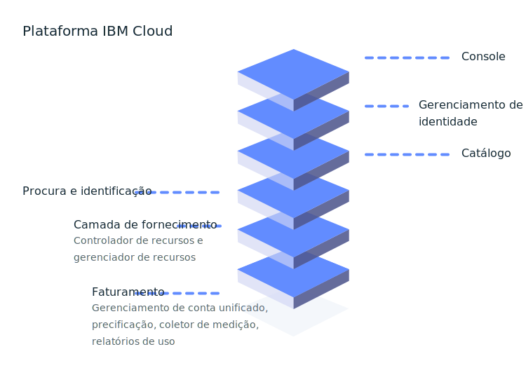

---

copyright:
  years: 2016, 2019
lastupdated: "2019-06-20"

keywords: console, platform overview, overview

subcollection: overview

---

{:shortdesc: .shortdesc}
{:new_window: target="_blank"}

# O que é a plataforma {{site.data.keyword.Bluemix_notm}}?
{: #whatis-platform}

A plataforma em nuvem da IBM combina a plataforma como um serviço (PaaS) com a infraestrutura como um serviço (IaaS) para fornecer uma experiência integrada. A plataforma escala e suporta pequenas equipes de desenvolvimento e organizações e grandes empresas corporativas. Globalmente
implementada em data centers em todo o mundo, a solução que você constrói no {{site.data.keyword.cloud}} inicia
rapidamente e é executada de forma confiável em um ambiente testado e suportado no qual é possível confiar.
{: .shortdesc}

Como o diagrama a seguir ilustra, a plataforma {{site.data.keyword.Bluemix_notm}} é composta de diversos componentes que trabalham juntos para fornecer uma experiência de nuvem consistente e confiável. 

  * Um console robusto que funciona como o front-end para criar, visualizar e gerenciar os recursos em nuvem
  * Um componente de gerenciamento de acesso e identidade que autentica os usuários com segurança para ambos os serviços de
plataforma e controla o acesso aos recursos de forma consistente no {{site.data.keyword.Bluemix_notm}}
  * Um catálogo que consiste em centenas de ofertas do {{site.data.keyword.Bluemix_notm}}
  * Um mecanismo de procura e identificação para filtragem e identificação dos recursos
  * Um sistema de gerenciamento de conta e faturamento que fornece o uso exato para os planos de precificação e proteção
segura contra fraude de cartão de crédito
  

Se você tem [código existente](/docs/apps/tutorials?topic=creating-apps-tutorial-byoc#tutorial-byoc) que deseja modernizar e trazer
para a nuvem ou está desenvolvendo um [aplicativo
novo](/docs/apps/tutorials?topic=creating-apps-tutorial-starterkit), seus desenvolvedores podem acessar o ecossistema disponível de serviços e estruturas de tempo de execução
que cresce continuamente no {{site.data.keyword.Bluemix_notm}}.

## Configurando sua conta
{: #set-up-account}

Se você estiver apenas experimentando o {{site.data.keyword.Bluemix_notm}}, será possível ir direto ao catálogo e começar a verificar as ofertas que você gostaria de explorar e incluir em sua conta Lite. No entanto, se
você está pronto para começar com um ambiente para um grupo de desenvolvedores ou uma organização inteira e
colocar os apps em execução na produção, considere configurar o básico em sua conta:

* Grupos de acesso de usuário para organizar os usuários e os IDs de serviço em uma entidade para tornar a designação de
acesso um processo aperfeiçoado.
* Grupos de recursos para organizar os recursos para tornar a designação de acesso a um conjunto de recursos rápida e
fácil.
* Políticas de acesso para os grupos de acesso ou desenvolvedores individuais que precisam de políticas de acesso do IAM
ou das funções de organização e de espaço do Cloud Foundry.

Para obter mais informações, consulte as [melhores práticas
para configurar a conta](/docs/account?topic=account-account_setup) e [melhores práticas para designar acesso](/docs/iam?topic=iam-account_setup). 

## Precificação e faturamento
{: #pricing-billing}

Independentemente de seu tipo de conta, é possível explorar o {{site.data.keyword.Bluemix_notm}} usando os
planos Lite para os serviços que fornecem cota grátis. Quando você estiver escolhendo um serviço no catálogo e
selecionar um bloco, se houver diferentes tipos de planos disponíveis, será possível ver detalhes sobre as informações de
precificação. Se você escolher um plano de serviço com um plano pago, será possível estimar os custos usando a
ferramenta Estimador de custo. Para obter mais informações, consulte [Estimando os custos](/docs/billing-usage?topic=billing-usage-cost).

O faturamento do {{site.data.keyword.Bluemix_notm}} fornece múltiplos serviços que asseguram que a
plataforma {{site.data.keyword.Bluemix_notm}} possa gerenciar com segurança a precificação, as contas, o uso e mais.

### Gerenciamento de conta
{: #account-mgmt}

O gerenciamento de conta mantém o relacionamento de faturamento com o cliente. Cada conta é uma entidade de faturamento que representa um cliente. Esse serviço controla o ciclo de vida da conta, a assinatura, o relacionamento do usuário e a organização.

### Venda
{: #pricing}

O serviço de plataforma de precificação ajuda a definir, gerenciar e recuperar informações de precificação para recursos no catálogo do {{site.data.keyword.Bluemix_notm}}.

### Medição de uso
{: #metering}

Com a medição de uso, os provedores de serviços podem enviar as métricas coletadas para instâncias de recursos provisionadas por usuários do {{site.data.keyword.Bluemix_notm}}. Os provedores de serviços de terceiros que entregam um serviço de faturamento integrado precisam enviar o uso de todas as instâncias de serviço ativo a cada hora. 

### Relatórios de uso
{: #usage}

Os relatórios de uso retornam o resumo da conta do mês especificado. Os gerenciadores de faturamento da conta estão autorizados a acessar os relatórios.

## Catálogo do {{site.data.keyword.Bluemix_notm}}
{: #catalog}

O catálogo do {{site.data.keyword.Bluemix_notm}} armazena as definições de oferta (descrição, recursos, imagens, URLs e assim por diante) dos recursos disponíveis no console do {{site.data.keyword.Bluemix_notm}}. As ofertas são gerenciadas em geografias como o sistema de registro. O catálogo suporta interfaces de linha de comandos (CLIs) e uma API de RESTful na qual os usuários podem recuperar informações sobre ofertas existentes e criar, gerenciar e excluir seus recursos. Para obter mais informações, consulte [Gerenciando o catálogo](/docs/overview?topic=overview-manage-catalog).

## Criando recursos
{: #provisioning-layer}

O controlador de recurso é a camada de fornecimento da plataforma {{site.data.keyword.Bluemix_notm}} de última geração que gerencia o ciclo de vida de recursos do {{site.data.keyword.Bluemix_notm}} em sua conta. Os
recursos são fornecidos globalmente em um escopo de conta. O controlador de recurso suporta o fornecimento síncrono e assíncrono de recursos. Exemplos de recursos incluem bancos de dados, contas e processadores, memória e limites de armazenamento. 

Em geral, os
recursos controlados pela camada de fornecimento destinam-se a associar as métricas de uso e o faturamento, mas esse nem sempre é o
caso. Em alguns casos, o recurso pode ser associado à camada de fornecimento para assegurar que o ciclo de vida do recurso possa ser gerenciado junto com o ciclo de vida da conta. O controlador de recurso usa o {{site.data.keyword.Bluemix_notm}} Identity and Access Management (IAM) para autenticação e autorização de ações que são executadas na camada de fornecimento.

### Gerenciamento de ciclo de vida de recurso
{: #lifecycle}

O controlador de recurso fornece APIs comuns para controlar o ciclo de vida de recursos, da criação de uma instância à criação de credenciais de acesso à remoção do acesso à exclusão de uma instância.

## Gerenciando os recursos
{: #resource-manager}

Uma coleção de recursos é gerenciada por [grupos de recursos](/docs/overview?topic=overview-whatis-rgs). Um grupo de recursos é associado à sua conta. Todos os recursos do {{site.data.keyword.Bluemix_notm}} devem ser designados a um grupo de recursos. Quando você cria uma conta, um grupo de recursos padrão é criado para você. Todos os recursos do {{site.data.keyword.Bluemix_notm}} ativados pelo IAM devem ser provisionados em um grupo de recursos. Se você tiver uma conta Lite, será possível ter apenas um grupo de recursos. Se você tiver uma conta Pré-paga ou de Assinatura, será possível criar mais de um grupo de recursos. Se uma conta for suspensa, o grupo de recursos correspondente também será suspenso e todos os recursos no grupo de recursos serão suspensos. 

## Procurando e identificando recursos
{: #search-and-tag}

O serviço de procura é um repositório de propriedades do recurso global e compartilhado que é integrado na plataforma {{site.data.keyword.Bluemix_notm}}. Ele é usado para armazenamento e procura de atributos de um recurso de nuvem e categoriza e classifica recursos. Os recursos são identificados exclusivamente por um identificador [Nome do recurso em nuvem (CRN)](/docs/overview?topic=overview-crn). As propriedades de um recurso incluem as tags e as propriedades do sistema. Ambas as propriedades são
definidas dentro de uma conta de faturamento do {{site.data.keyword.Bluemix_notm}} e abrangem muitas regiões.

Esse serviço também gerencia as tags associadas a um recurso. É possível criar, excluir, procurar, anexar ou
remover as tags com a API de identificação. As tags são identificadas exclusivamente por um identificador CRN. As tags têm um nome, que deve ser exclusivo em uma conta de faturamento. É possível criar tags em pares de chave:valor ou no formato de rótulo.

## Monitorando seus recursos
{: #resources_observability}

A capacidade de observação oferece um único local no qual é possível monitorar e observar seus aplicativos e serviços no {{site.data.keyword.Bluemix_notm}}. 

Com o serviço {{site.data.keyword.la_full}}, é possível incluir recursos de gerenciamento de log em sua arquitetura do {{site.data.keyword.Bluemix_notm}} e gerenciar os logs do sistema e do aplicativo. Ele oferece recursos avançados para monitorar e solucionar problemas, definir alertas e projetar painéis customizados. O {{site.data.keyword.la_full_notm}} é operado por LogDNA em parceria com o {{site.data.keyword.IBM_notm}}. Para obter mais informações, consulte
[Introdução ao {{site.data.keyword.la_full_notm}}](/docs/services/Log-Analysis-with-LogDNA?topic=LogDNA-getting-started).

O serviço {{site.data.keyword.mon_full_notm}} permite que você obtenha visibilidade operacional sobre o desempenho e o funcionamento de seus aplicativos, serviços e plataformas. Ele oferece uma telemetria de pilha completa, com recursos avançados para monitorar e solucionar problemas, definir alertas e projetar painéis customizados. O {{site.data.keyword.mon_full_notm}} é operado pelo Sysdig em parceria com a {{site.data.keyword.IBM_notm}}. Para obter mais informações, consulte [Introdução ao serviço IBM Cloud Monitoring with Sysdig](/docs/services/Monitoring-with-Sysdig?topic=Sysdig-getting-started#getting-started)

## Monitorando sua conta 
{: #account_observability}

Use o serviço {{site.data.keyword.at_full}} para monitorar a atividade de sua conta do {{site.data.keyword.Bluemix_notm}}, investigar atividades anormais e ações críticas e obedecer a requisitos de auditoria regulamentar. Além disso, é possível receber alertas sobre as ações conforme elas acontecem. Os eventos que são coletados obedecem ao padrão Cloud Auditing Data Federation (CADF). Para obter mais informações, consulte
[Introdução ao {{site.data.keyword.at_full_notm}}](/docs/services/Activity-Tracker-with-LogDNA?topic=logdnaat-getting-started).
