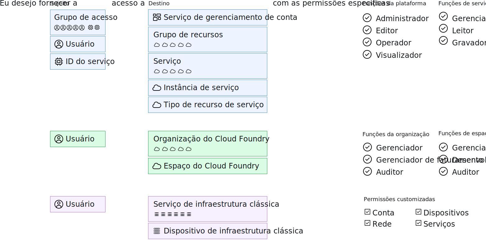

---

copyright:

  years: 2017, 2019

lastupdated: "2019-06-20"

keywords: users level of access, user control, access control, permissions

subcollection: overview

---

{:shortdesc: .shortdesc}
{:codeblock: .codeblock}
{:screen: .screen}
{:new_window: target="_blank"}

# Gerenciando acesso no {{site.data.keyword.Bluemix_notm}}
{: #cloudaccess}

O gerenciamento de acesso permite controlar quais usuários veem, criam, usam e gerenciam recursos em sua conta. Para conceder acesso, é possível designar funções que permitem aos usuários níveis de acesso para concluir tarefas de gerenciamento de plataforma e acessar recursos da conta.
{: shortdesc}

A maneira como você gerencia o acesso no {{site.data.keyword.Bluemix}} depende do tipo de recurso ao qual deseja designar o acesso. O {{site.data.keyword.Bluemix_notm}} Identity and Access Management (IAM) é o sistema de gerenciamento de acesso que é usado para gerenciar consistentemente os recursos organizados em um grupo de recursos na plataforma {{site.data.keyword.Bluemix_notm}}. Os
recursos de infraestrutura clássica e do Cloud Foundry não são gerenciados usando o Cloud IAM. Esses tipos de recursos têm seus próprios sistemas de gerenciamento de acesso. 

Se você tem uma combinação de tipos de recursos, gerencie cada tipo separadamente:

* Para os recursos do IAM, acesse **Gerenciar** &gt; **Acesso (IAM)** e, em seguida, selecione **Usuários**, **Grupos de acesso** ou **IDs de serviço** para iniciar.
* Para designar acesso aos
[recursos da infraestrutura clássica](/docs/iam?topic=iam-infrapermission), configure
as permissões em **Gerenciar** > **Acessar (IAM)** na guia Infraestrutura clássica
para o usuário ao qual deseja designar acesso. 
* Para designar acesso aos [recursos do Cloud Foundry](/docs/iam?topic=iam-cfaccess), você designa usuários a organizações e configura as funções de acesso de organização e espaço do Cloud Foundry em **Gerenciar** > **Acesso (IAM)** na guia do Cloud Foundry para o usuário.

Embora cada tipo de acesso seja gerenciado separadamente, todas as políticas de acesso são compostas por um sujeito ao qual você deseja designar acesso, um destino para a política, a fim de se definir o escopo de acesso do usuário, e por fim uma função do IAM, a função do Cloud Foundry ou a permissão de infraestrutura clássica para determinar o nível de acesso que o sujeito tem no destino.

Para as políticas do IAM, o sujeito pode ser um grupo de acesso, um usuário ou um ID de serviço. E o destino pode ser um serviço de gerenciamento de conta, um grupo de recursos, um serviço na conta, uma instância de serviço específica ou um tipo de recurso em um serviço. As funções de plataforma e de serviço podem ser selecionadas para definir o escopo do nível de acesso do sujeito. Para acesso ao Cloud Foundry, um usuário tem acesso a uma organização e a um espaço do Cloud Foundry selecionando cada um e designando uma função de organização e uma função de espaço. Para a infraestrutura clássica, um usuário é selecionado e, em seguida, o acesso pode ter o escopo definido para um serviço ou dispositivo com permissões específicas designadas.

## Permissões para gerenciamento de acesso
{: #perms-manageaccess}

Como um proprietário da conta, é possível gerenciar o acesso a todos os recursos em sua conta. Também é possível delegar
a tarefa de gerenciamento de acesso aos recursos da plataforma designando a um usuário em sua conta a função de
administrador para todos os serviços, apenas para o serviço específico ou para o grupo de recursos que você deseja que
esse usuário gerencie.

Se você tiver serviços do Cloud Foundry em sua conta, será possível designar a outro usuário a função de
gerenciador da organização ou do espaço para que ele inclua usuários e designe funções do Cloud Foundry para acessar
instâncias na organização ou no espaço gerenciado por eles.

## Introdução
{: #cloudaccess-getstarted}

Acesse **Gerenciar** &gt; **Acessar (IAM)**e, então, selecione
**Usuários** para começar a gerenciar o acesso para os usuários na sua conta. Selecione um usuário da lista para começar. São exibidas apenas as opções de gerenciamento de acesso para as quais você tem permissão para gerenciar. Por exemplo, se você não for o proprietário da conta e não for um gerenciador de organização ou espaço, não verá a opção para gerenciar o acesso ao Cloud Foundry.

Também é possível designar funções de acesso para apps e serviços usando IDs de serviço. Acesse a página **IDs de serviço** para começar. Para obter mais informações sobre como começar a usar rapidamente o {{site.data.keyword.Bluemix_notm}} IAM, consulte o [Tutorial de introdução](/docs/iam?topic=iam-getstarted).
