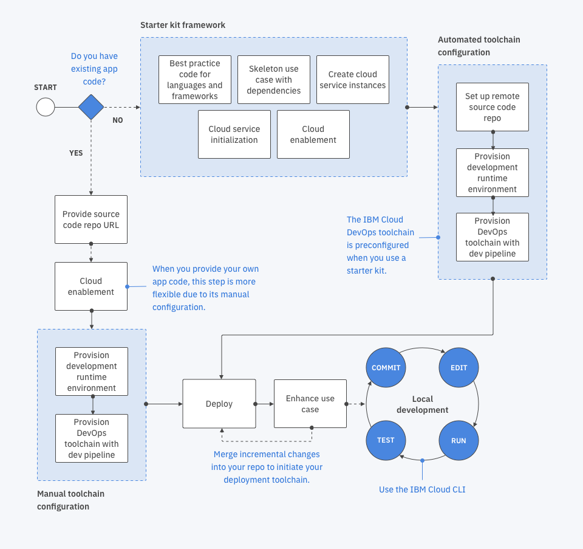
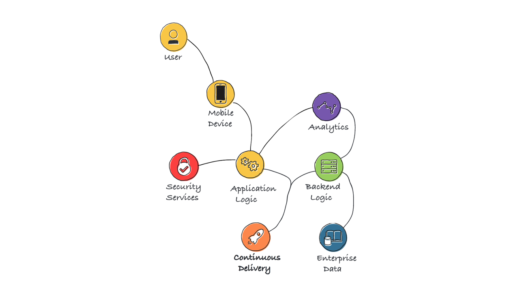

---

copyright:
  years: 2016, 2019
lastupdated: "2019-01-03"

---
{:new_window: target="_blank"}
{:shortdesc: .shortdesc}
{:screen: .screen}
{:codeblock: .codeblock}
{:pre: .pre}
{:tip: .tip}

# 探索 {{site.data.keyword.cloud_notm}} 中开发者旅程
{: #dev-journey}

作为开发者，您可以决定代码的最佳入口点。您可以选择通过我们提供的工具来生成代码，也可以自带代码并将其部署到 {{site.data.keyword.cloud}}！
{: shortdesc}

{{site.data.keyword.cloud_notm}} 有一组功能，可供您在几分钟内开始构建应用程序。{{site.data.keyword.cloud_notm}} Developer Tools 会创建启动和运行所需的高性能基础。提供了两个主要工具用于开发：
 * {{site.data.keyword.cloud_notm}} Web 控制台（开发者门户网站）
 * {{site.data.keyword.cloud_notm}} 命令行界面 (CLI)

通过 {{site.data.keyword.cloud_notm}}，您可以：

* 选择特定于用例的入门模板工具包，并使用各种编程语言和体系结构模式生成生产就绪型应用程序。
* 使用一个 [IBM Developer 代码模式 ](https://developer.ibm.com/patterns/){:new_window} 快速创建应用程序，并将其部署到 {{site.data.keyword.cloud_notm}}。
* 查看和管理入门模板工具包中自动供应的资源或您手动添加到应用程序中的资源。
* 如果在现有存储库中有应用程序，那么可以使用空白入门模板工具包来创建应用程序记录，并将其连接到源存储库和 DevOps 工具链。
* 通过可移植应用程序代码，可以部署到各种云环境。
* 简单地进行几下单击来创建 [DevOps 工具链](../services/ContinuousDelivery/index.html#cd_getting_started)。
* 使用[命令行界面](/docs/cli/index.html#overview)进行本地开发。
* 浏览或搜索 [{{site.data.keyword.cloud_notm}} 目录 ](https://{DomainName}/catalog){: new_window}，以查看现在您可以创建并开始使用的应用程序和服务。

要更好地了解我们的经验可以如何帮助您快速构建高质量的生产就绪型应用程序，下面我们来更详细地了解一下这些元素。

## 开发者门户网站
{: #dev-portals}

{{site.data.keyword.cloud_notm}} 有适用于不同关注领域（如 Watson、安全性或财务）或数字渠道（如移动或 Web 应用程序）的开发者门户网站。可以通过**菜单**图标  来访问这些门户网站。

每个开发者门户网站都提供有与该门户网站的关注领域相关的入门模板工具包。这些门户网站提供一致、直观的工作流程，支持在几分钟内创建有效的生产就绪型应用程序。

## 应用程序
{: #app-projects}

应用程序由代码、数据、服务和工具链构成。例如，{{site.data.keyword.cloud_notm}} 移动应用程序包含设备代码，以及后端逻辑、数据存储器、分析和安全服务，并设置为支持持续交付。

您可以使用任何 {{site.data.keyword.cloud_notm}} 开发者门户网站或 {{site.data.keyword.dev_cli_notm}} 来创建和管理应用程序。

您可以直接创建简单的空白应用程序，也可以使用入门模板工具包来创建更复杂的应用程序。如果选择不借助入门模板工具包来创建空白应用程序，那么可以在 [{{site.data.keyword.cloud_notm}} 仪表板 ](https://{DomainName}){: new_window} 中执行此操作，而无需访问门户网站！

您可以使用代码模式来快速创建应用程序并将其部署到 {{site.data.keyword.cloud_notm}}。从 [IBM Developer Web 站点 ](https://developer.ibm.com/patterns/){:new_window} 中，选择一个代码模式。您可以在 GitHub 中查看代码，也可以在 {{site.data.keyword.cloud_notm}} 中创建并构建应用程序，在其中您可以使用 DevOps 工具链来自动部署应用程序。

## 入门模板工具包
{: #starter-kits}

通过入门模板工具包，您应该会拥有易于使用且可定制的的体验。入门模板工具包按您选择的语言来组合框架生产应用程序，可随时用于云部署。每个入门模板工具包中都包含针对特定用例的语言、框架和模式，并支持复用代码。

如果入门模板工具包需要特定资源，没问题。通过自动供应的资源，当您创建应用程序时，{{site.data.keyword.cloud_notm}} 会自动创建这些资源的实例。您可以通过开发者门户网站或命令行界面来访问入门模板工具包，以获取与您的关注领域和工作流程相关的指示信息！

### 入门模板工具包与样本有何不同？
入门模板工具包是生产就绪型的，专注于使用运行时（例如，Node.js 和 Express）来演示关键模式实现。在某些情况下，入门模板工具包会提供简单的用户体验来着重强调服务的集成。在另一些情况下，入门模板工具包表示对复杂用例的可定制实现。

* **片段**是一些通常显示在 IDE 中的代码行。片段可帮助开发者与编程语言语法集成，或支持与定义的 API 集成。
* 通常，**演示**的质量和精确度较高，并且会使用一系列服务和集成点。演示通常需要设置时间，并用于证明业务问题或演示平台功能。您可以将演示用于评估采用云的阶段。有时，这是生产代码中所包含的代码。
* **样本**是由特定功能、特性、服务或用户旅程组成的一个简单示例。您可以复用样本或者将其包含到生产应用程序中。样本通常用于展示技术功能，以及说明用于解决技术问题的可行方法。
* **入门模板工具包**是一种生产就绪型模式，可与一组服务集成，用于生成可直接部署到 DevOps 管道和 Kubernetes 集群的生产就绪型资产。入门模板工具包中包含描述性元数据，这些元数据信息可帮助用户充分了解工具包的功能和用途。此外，还包含用于指示 {{site.data.keyword.cloud_notm}} 要生成哪些内容的相关说明。输出是现成的生产就绪型内容，可基于 IBM 最佳实践，通过反复迭代而得到进一步的增强。入门模板工具包的内容不像演示那么复杂，但也不像片段或样本那么简单。这些内容是根据开发者的需求动态创建的。

## 自动供应的资源
{: #auto-provision}

如果入门模板工具包指定了所需资源，那么当您创建应用程序时，{{site.data.keyword.cloud_notm}} 会自动创建这些资源的实例。请注意，在创建应用程序后，您也可以手动供应资源或选择现有资源实例以添加到应用程序中。在需要时，您可以在“应用程序详细信息”视图中查看与应用程序相关联的服务实例以及可用凭证的列表。

## 可移植代码
{: #portable-code}

通过入门模板工具包创建应用程序会自动创建与运行时无关的统一格式代码。您可以将代码原封不动地部署到所选环境中，例如 Kubernetes 或 Cloud Foundry。

您还可以通过单击应用程序的**应用程序详细信息**页面上的**下载代码**来快速查看应用程序代码。代码会下载为 `.zip` 文件，其中包含完整的应用程序代码结构。您可以使用 {{site.data.keyword.dev_cli_notm}} 轻松解压缩该文件并在本地运行代码，或者将其添加到代码管理存储库中。

### 将创建哪些代码？

直接创建应用程序或借助入门模板工具包创建应用程序时，该应用程序会包含可移植代码。可移植代码包含适用于多个云环境的云支持代码。随后，您可以生成用于四个基本方面的代码：
* 遵循特定语言的最佳实践的代码
* 支持应用程序在云上运行的代码
* 初始化为连接到云服务的代码
* 特定于用例的代码

生成这些组成部分可节省您宝贵的时间，并确保您使用的是同类中最佳的体系结构。

* **用例逻辑**提供了特定用例核心功能的代码。例如，Watson Conversation 聊天机器人的代码或移动可视识别应用程序的代码。
* **语言组件**是为入门模板工具包选择的编程语言特定的代码组件和文件。例如，node.js 程序员需要 package.json 文件进行依赖项管理，并且会自动创建此文件。
* **服务支持**是让应用程序能够连接和使用所添加服务的代码。服务支持项的示例包括凭证管理、初始化代码和特定于服务的 SDK。
* **云支持**是让应用程序能够在 {{site.data.keyword.cloud_notm}} 上运行的代码。例如，让应用程序能够在 {{site.data.keyword.cloud_notm}} Kubernetes 集群上运行的 Helm 图表。

使用 {{site.data.keyword.cloud_notm}} 入门模板工具包创建应用程序后，应用程序首先会具有一个经过验证的体系结构，该体系结构也会反映出所选语言的最佳实践。

每个应用程序都有一个自述文件，其中包含应用程序的技术详细信息，以及当应用程序无法即装即用时所需的运行条件。
{: tip}

## 自带代码并将其部署到 {{site.data.keyword.cloud_notm}}
{: byoc}

如果在现有存储库中有应用程序，那么可以使用空白入门模板工具包在 {{site.data.keyword.cloud_notm}} 中创建应用程序记录，并将其连接到源存储库和 DevOps 工具链。

您可以从 {{site.data.keyword.cloud_notm}}“仪表板”或空白入门模板工具包开始。在命名应用程序并选择资源组之后，选择[**自带代码**](/docs/apps/tutorials/tutorial_byoc.html)起始点，提供包含代码的 Git 存储库 URL，然后单击**创建**。

您可以连接现有 DevOps 工具链或创建 DevOps 工具链，然后持续将应用程序交付到所选的环境，例如 Kubernetes 或 Cloud Foundry。

## DevOps 工具链
{: #devops}

DevOps 工具链包含用于访问、开发、部署和操作应用程序的过程和工具。DevOps 工具链是一组自动执行 DevOps 任务的链接服务。可以使用简单的应用程序来手动执行 DevOps，但是随着应用程序越来越复杂，自动化的需求会迅速增加，因此工具链自动化是持续交付的必备功能。

DevOps 工具链的核心组件是代码版本控制存储库，例如 GitHub。更多工具可能包括待办事项跟踪、Delivery Pipeline、IDE 和监视服务，例如 [{{site.data.keyword.cloud_notm}} {{site.data.keyword.DRA_short}}](/docs/services/DevOpsInsights/index.html#gettingstarted)。

如果使用入门模板工具包创建了应用程序，那么只需通过单击**应用程序详细信息**页面中的**部署到云**，即可创建新的工具链并部署应用程序。这将创建一个包含代码存储库、问题存储库、Delivery Pipeline 和 Web IDE 的工具链。

然后，可以在此工具链上进行构建，以容纳多个团队，并可部署到单独的环境进行开发、测试和生产。您可为应用程序建立企业级协作式持续交付模型。

## 命令行界面
{: cli}

使用命令行界面可在本地编码、构建和运行应用程序。常用的模式是通过 {{site.data.keyword.cloud_notm}} 控制台中的开发者门户网站来创建应用程序，使用开发者工具在本地进行开发，然后将更新推送到存储库并加以合并来启动部署工具链。

## Garage Method 开发
{: #developer_concepts}

如果您在寻找一个可以实验大胆构想和新兴技术的地方，请确保查看 [Garage Method ](https://www.ibm.com/cloud/garage/){: new_window} 部署。您可以了解 IBM 可以如何帮助您在组织中开发应用程序。

 *Garage Method 各阶段概览图*

{{site.data.keyword.cloud_notm}} 可帮助您通过 Garage Method 或您偏爱的任何方法，成功生成企业级生产应用程序。为了更好地了解 {{site.data.keyword.cloud_notm}} 能为开发者提供哪些功能，下面我们来快速了解一下构建现代应用程序所需的技能。

## 开发者技能
{: #skills}

用户希望应用程序具备比以往任何时候都要多的功能。他们希望应用程序能够深入洞察存储的数据和实时数据，始终可用，并且更能贴合自己的个人需求。为了满足这些期望，IBM Cloud 中的开发者功能与特定技能集相对应，并支持团队使用一个平台来生成、交付、运行和管理应用程序。例如，复杂的认知应用程序可能需要数字开发者、云本机开发者、流开发者、数据研究员和 DevOps 专家等多方的贡献。

 

* **数字开发者**负责编写适用于特定数字渠道（例如，移动 Web、语音和交谈）的内容。数字开发者通常专注于用例和如何直接满足用户需求，以此作为综合体验。
* **云本机开发者**专注于云组件的构造和互连。微服务和服务于前端的后端创建者属于此类别。
* **流开发者**专注于数据流的处理和洞察。例如，流开发者可以对传入文本、语音或视频流进行分析和执行操作。
* **数据研究员**利用分析和机器学习来生成预测模型。这些模型用于业务度量，可让应用程序用户深入了解业务数据。
* **DevOps 专家**负责解决部署和工具链问题。对于简单的应用程序，通常不需要专门的专家，因为开发团队成员会合力来管理 DevOps。但是对于存在大量依赖关系的复杂企业应用程序，则需要 DevOps 专家来确保生产应用程序的顺畅运行。

{{site.data.keyword.cloud_notm}} 中内置的开发者功能与这些技能集相对应，并支持团队使用一个平台来生成、交付、运行和管理应用程序。例如，创建移动应用程序的数字开发者可能会使用 {{site.data.keyword.cloud_notm}} [移动开发者门户网站](https://{DomainName}/developer/mobile/dashboard){: new_window} 。认知应用程序构建器可能会使用 [Watson 开发者门户网站](https://{DomainName}/developer/watson/dashboard){: new_window}  以及 [Watson Studio](https://{DomainName}/catalog/services/watson-studio){: new_window} 。流开发者可以使用 [IBM Real-Time Analytics](/docs/services/StreamingAnalytics/index.html)。[{{site.data.keyword.cloud_notm}} Continuous Delivery 服务](/docs/services/ContinuousDelivery/index.html)简化了 DevOps 专家的工作。

[准备好开始构建高质量的生产就绪型应用程序了吗？](/docs/apps/tutorials/tutorial_web.html)
