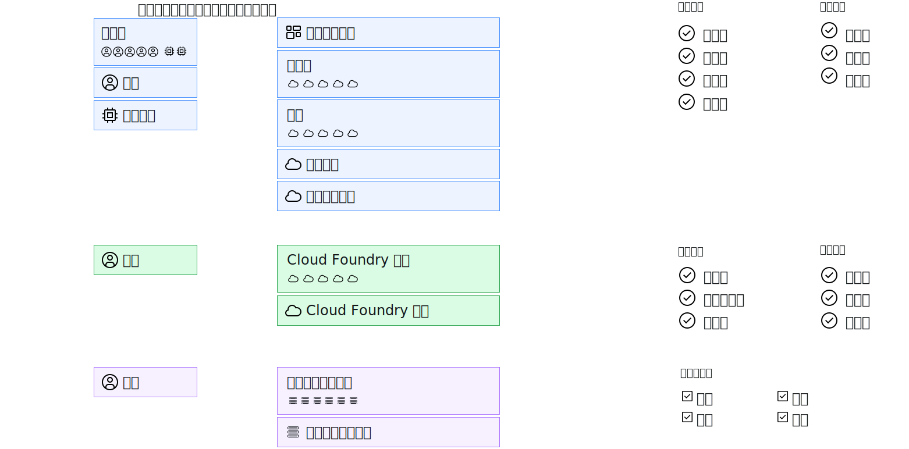

---

copyright:

  years: 2017, 2019

lastupdated: "2019-06-20"

keywords: users level of access, user control, access control, permissions

subcollection: overview

---

{:shortdesc: .shortdesc}
{:codeblock: .codeblock}
{:screen: .screen}
{:new_window: target="_blank"}

# 在 {{site.data.keyword.Bluemix_notm}} 中管理访问权
{: #cloudaccess}

通过访问权管理，您可以控制哪些用户可以查看、创建、使用和管理帐户中的资源。要授予访问权，可以为用户分配角色，使其具有相应的访问级别，以便完成平台管理任务和访问帐户资源。
{: shortdesc}

在 {{site.data.keyword.Bluemix}} 中管理访问权的方式取决于您要分配对何种类型的资源的访问权。{{site.data.keyword.Bluemix_notm}} Identity and Access Management (IAM) 是一种访问管理系统，用于在整个 {{site.data.keyword.Bluemix_notm}} 平台上以一致的方式管理组织为资源组的资源。经典基础架构和 Cloud Foundry 资源不使用 Cloud IAM 进行管理。这些资源类型都有自己的访问权管理系统。 

如果您拥有多种资源类型的组合，那么需要分别管理每种类型：

* 对于 IAM 资源，转至**管理** &gt; **访问权 (IAM)**，然后选择**用户**、**访问组**或**服务标识**以开始使用。
* 要分配对[经典基础架构资源](/docs/iam?topic=iam-infrapermission)的访问权，请在“经典基础架构”选项卡上的**管理** > **访问权 (IAM)** 中，为要对其分配访问权的用户设置许可权。 
* 要分配对 [Cloud Foundry 资源](/docs/iam?topic=iam-cfaccess)的访问权，请在用户的 Cloud Foundry 选项卡上的**管理** > **访问权 (IAM)** 中，将用户分配给组织，然后设置 Cloud Foundry 组织和空间访问角色。

虽然每种类型的访问权是分别进行管理的，但所有访问策略均由主体（您希望分配有对主体的访问权）、策略的目标（用于限定主体有权访问的内容的作用域）以及 IAM 角色、Cloud Foundry 角色或经典基础架构许可权（用于确定主体对目标的访问级别）所组成。

对于 IAM 策略，主体可以是访问组、用户或服务标识。目标可以是帐户管理服务、资源组、帐户中的服务、特定服务实例或服务内的资源类型。可以选择平台和服务角色来限定主体访问级别的作用域。对于 Cloud Foundry 访问权，通过选择每个用户并分配组织角色和空间角色，授予用户对 Cloud Foundry 组织和空间的访问权。对于经典基础架构，选择用户，然后通过分配特定许可权，可以将访问权的作用域限定为某个服务或设备。

## 用于管理访问权的许可权
{: #perms-manageaccess}

帐户所有者可以管理对帐户中所有资源的访问权。此外，还可以通过以下方式向帐户中用户委派管理平台资源访问权的任务：针对希望用户管理的所有服务、仅特定服务，或资源组，为用户分配管理员角色。

如果帐户中有 Cloud Foundry 服务，那么可以将组织或空间管理者角色分配给其他用户，以便该用户可添加自己的用户并分配 Cloud Foundry 角色来访问其所管理的组织或空间中的实例。

## 入门
{: #cloudaccess-getstarted}

转至**管理** &gt; **访问权 (IAM)**，然后选择**用户**以开始管理您帐户中用户的访问权。要完成此操作，需要先从列表中选择一个用户。您只能看到您有权管理的访问权管理选项。例如，如果您既不是帐户所有者，也不是组织或空间管理者，那么将看不到用于管理 Cloud Foundry 访问权的选项。

还可以使用服务标识将访问角色分配给应用程序和服务。要完成此操作，需要先转至**服务标识**页面。有关如何快速入门和熟悉运用 {{site.data.keyword.Bluemix_notm}} IAM 的更多信息，请参阅[入门教程](/docs/iam?topic=iam-getstarted)。
