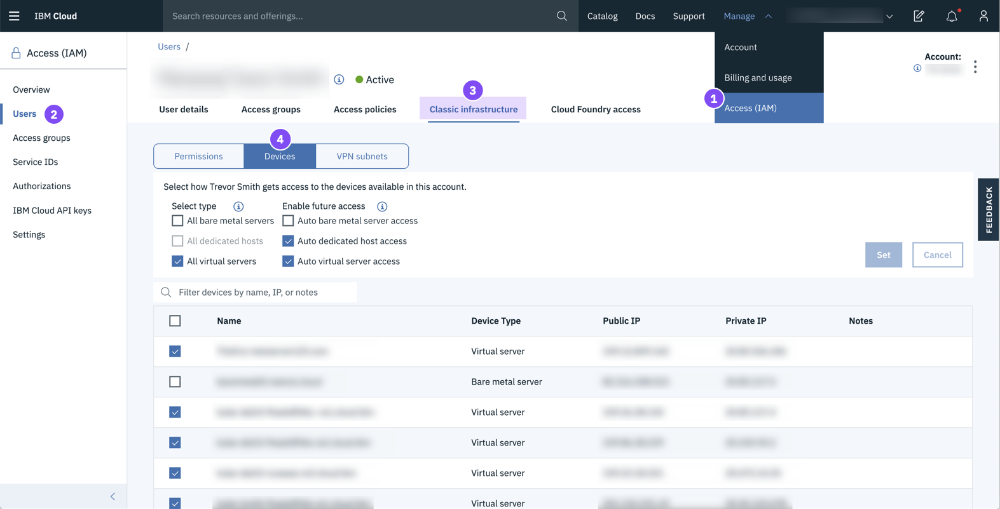

---

copyright:
  years: 2015, 2019
lastupdated: "2019-06-25"

keywords: ui, components, using the console, SoftLayer, classic infrastructure

subcollection: overview

---

{:shortdesc: .shortdesc}
{:tip: .tip}
{:note: .note}
{:new_window: target="_blank"}

# 浏览 {{site.data.keyword.cloud_notm}} 控制台 
{: #ui}

{{site.data.keyword.cloud}} 控制台是一个可帮助您管理所有 {{site.data.keyword.cloud_notm}} 资源的用户界面。访问[控制台](https://cloud.ibm.com){: new_window}  时，可以创建免费帐户、登录、访问文档、访问目录、查看定价信息、获取支持或检查 {{site.data.keyword.cloud_notm}} 组件的状态。登录后，菜单栏会包含“菜单”图标  和更多链接。
{: shortdesc}

## 使用控制台
{: #consoleoptions}

登录到 {{site.data.keyword.cloud_notm}} 后，将显示您的仪表板，其中显示了概述帐户状态的窗口小部件。如果您想要添加或除去窗口小部件，请参阅[定制仪表板](/docs/overview?topic=overview-custom-dashboard)。

  * 使用**目录**链接可创建新资源。
  * 使用**文档**链接可访问产品文档。 
  * 使用**支持**链接可访问支持中心。  
  * 在**管理**菜单中，可以访问帐户、计费和使用情况以及 Identity and Access Management 选项。
  * 单击“成本估算工具”图标  可打开成本估算工具。
  * 单击“通知”图标  可访问声明以及计划内和计划外事件。

## 搜索资源
{: #search}

您可以在 {{site.data.keyword.cloud_notm}} 控制台中的任意位置通过名称或标记搜索资源，以查找期望在资源列表中找到的资源。在控制台菜单栏的搜索字段中输入资源或标记的名称。

有关更多信息，请参阅[搜索资源](/docs/resources?topic=resources-searching-for-resources)。 

## 管理资源列表中的资源
{: #dashboardview}

转至“菜单”图标  &gt; **资源列表**以访问帐户资源的列表。可以使用资源列表来查看和使用 {{site.data.keyword.cloud_notm}} 资源和 Cloud Foundry 服务实例。请参阅[什么是资源？](/docs/resources?topic=resources-resource)以获取有关不同类型资源的更多信息。

### 查看资源
可以在资源列表中查看您帐户中所有区域中的所有资源。要查看对您很重要的项，请使用每个列标题的过滤器来过滤列表。例如，如果要查看和使用特定位置中的资源，请展开**位置**过滤器，然后从列表中选择一个位置。

### 处理资源
可以在资源列表中以多种方式处理资源：

  * 每个资源都会单独显示一行，并且在行末包含“操作”图标 。单击“操作”图标  可启动、停止、重命名或删除资源。
  * 要为资源设置凭证或连接，请单击资源的名称以导航至资源详细信息页面。然后，选择**服务凭证**或**连接**。有关更多信息，请参阅[添加凭证](/docs/resources?topic=resources-service_credentials)和[管理连接](/docs/resources?topic=resources-connect_app)。

## 在目录中执行操作
{: #catalogcreate}

要创建资源，请在资源列表中单击**创建**。然后，系统会将您定向到目录。从目录中选择某个磁贴后，即可查看资源的可用区域。并不是目录中列出的每个资源在每个区域中都可用。

单击要创建的资源的磁贴后，可以选择要部署的位置。

  * 对于 Cloud Foundry 资源，可以选择特定区域，然后选择要将服务实例分配到哪个组织和空间。
  * 对于 {{site.data.keyword.cloud_notm}} Identity and Access Management (IAM) 管理的资源，可以选择要部署的位置。然后，选择要将服务实例分配到哪个资源组。

## 转换为 {{site.data.keyword.cloud_notm}} 体验
{: #redirect-cloud}

在从 SoftLayer 迁移到 {{site.data.keyword.cloud_notm}} 的过程中，请熟悉 {{site.data.keyword.cloud_notm}} 控制台，您将使用该控制台管理平台和基础架构资源。我们当前处于链接所有 SoftLayer 和 {{site.data.keyword.cloud_notm}} 帐户的过程中。因此，您的帐户可能还没有访问权。一旦有了访问权，您就可以开始新的体验。 

先前命名为 SoftLayer，现在称为 {{site.data.keyword.cloud_notm}} 经典基础架构。
{: note}

### 查找基础架构项目
{: #sl-links}

单击**菜单图标**  > **经典基础架构**以快速找到您的设备、存储器、网络、安全性和服务。 

您还可以通过单击**菜单图标**  > **资源列表**来查看资源列表中的设备和存储项目。
{: tip}

### 管理用户、访问权和 API 密钥
{: #billing-items}

您可以从控制台的“访问权 (IAM)”部分管理帐户中的用户，用户的经典基础架构访问权以及您的 API 密钥。 

* 要邀请新用户，除去用户或管理特定用户的登录设置、IP 限制和 VPN 密码等等，请转至**管理** > **访问权 (IAM)**，然后选择**用户**。
* 要开始管理用户的经典基础架构访问权，请转至**管理** > **访问权 (IAM)**，然后选择**用户**。有关更多详细信息，请参阅[管理经典基础架构访问权](/docs/iam?topic=iam-mngclassicinfra)。
* 要创建和管理 {{site.data.keyword.cloud_notm}} API 密钥或经典基础架构 API 密钥，请转至**管理** > **访问权 (IAM)**，然后选择 **API 密钥**。有关更多信息，请参阅[了解 API 密钥](/docs/iam?topic=iam-manapikey)。

### 下订单
{: #place-order}

使用目录下订单。您可以使用以下某种方法导航到目录：

  * 单击菜单栏上的**目录**。
  * 单击**菜单图标**  > **资源列表**。然后，单击**创建资源**。

### 付款
{: #payments}

您可以从控制台的“计费和使用情况”部分进行支付。转至**管理 ** > **计费和使用情况**，然后选择**付款**。
 

### 访问发票
{: #invoices}

您可以从控制台的“计费和使用情况”部分访问发票。转至**管理** > **计费和使用情况**，然后选择**发票**。

### 访问销售商品
{: #sales}

您设备的报价和升级、订单、取消和运输都在控制台的“计费和使用情况”部分中。转至**管理** > **计费和使用情况**，然后选择**销售**。 

### 访问支持案例
{: #support-mng}

要访问当前支持案例，请单击**支持** > **管理案例**。您还可以通过单击**查看归档案例**来访问归档案例。

### 提交反馈
{: #feedback-profile}

您可以提交好评、建议或任何其他反馈。要与我们联系，请从下面的方法进行选择：

  * 单击位于控制台页面边缘的**反馈**按钮。 
  * 单击**头像图标**  > **反馈**。 

### 设置电子邮件首选项
{: #email-prefsl}

您可以将首选项设置为接收有关平台和基础架构通知的电子邮件。单击**头像图标**  > **个人档案和设置**，然后选择**通知**。

### 选择 VPN 访问点
{: #vpn-access}

您可以使用 VPN 访问点登录到 {{site.data.keyword.cloud_notm}} 控制台。请转至 [VPN 访问](https://www.ibm.com/cloud-computing/bluemix/vpn-access)，然后从列表中选择访问点。

