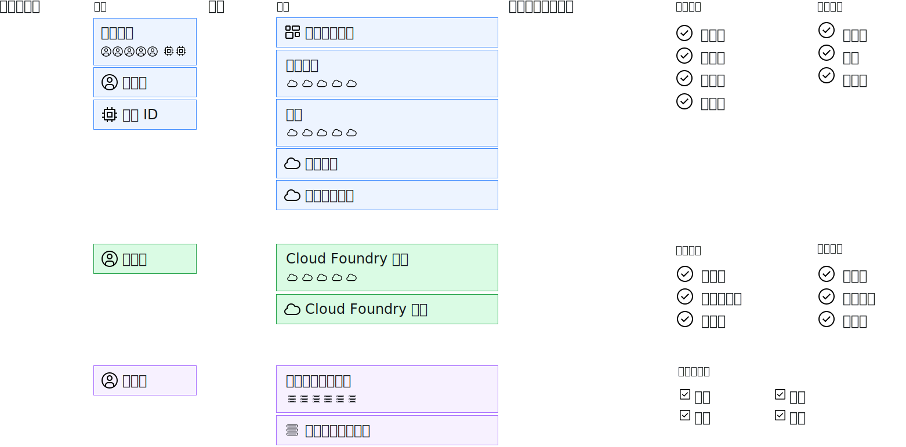

---

copyright:

  years: 2017, 2019

lastupdated: "2018-04-02"

keywords: users level of access, user control, access control, permissions

subcollection: overview

---

{:shortdesc: .shortdesc}
{:codeblock: .codeblock}
{:screen: .screen}
{:new_window: target="_blank"}

# 在 {{site.data.keyword.Bluemix_notm}} 中管理存取權
{: #cloudaccess}

存取權管理可讓您控制哪些使用者可以查看、建立、使用及管理您帳戶中的資源。若要授與存取權，您可以指派角色，以容許使用者完成平台管理作業以及存取帳戶資源的存取權層次。
{: shortdesc}

您在 {{site.data.keyword.Bluemix}} 中管理存取權的方式，取決於要指派存取權的資源類型。{{site.data.keyword.Bluemix_notm}} Identity and Access Management (IAM) 存取管理系統用來在 {{site.data.keyword.Bluemix_notm}} 平台之間一致地管理組織成資源群組的資源。標準基礎架構和 Cloud Foundry 資源不是使用 Cloud IAM 進行管理。這些資源類型有自己的存取權管理系統。 

如果您有資源類型的組合，請個別管理每一種類型：

* 若為 IAM 資源，請移至**管理** &gt; **存取 (IAM)**，然後選取**使用者**、**存取群組**或**服務 ID**，以便開始使用。
* 若要指派對[標準基礎架構資源](/docs/iam?topic=iam-infrapermission)的存取權，請在「標準基礎架構」標籤上的**管理** > **存取 (IAM)** 中，為您要指派存取權的使用者設定許可權。 
* 若要指派對 [Cloud Foundry 資源](/docs/iam?topic=iam-cfaccess)的存取權，請在 Cloud Foundry 標籤上的**管理** > **存取 (IAM)** 內，將使用者指派至組織，並設定 Cloud Foundry 組織和空間存取角色。

雖然每種存取類型個別管理，但所有存取原則都包含您想要指派存取權的主體、供原則界定主體可存取之範圍的目標，以及最後的 IAM 角色、Cloud Foundry 角色或標準基礎架構許可權（決定主體對目標所具有的存取層次）。

對於 IAM 原則，主體可以是存取群組、使用者或服務 ID。此外，目標可以是帳戶管理服務、資源群組、帳戶中的服務、特定服務實例或服務內的資源類型。可以選取平台及服務角色，以設定主體的存取層次範圍。對於 Cloud Foundry 存取權，使用者會藉由選取每一個角色並指派組織角色和空間角色，而獲得 Cloud Foundry 組織及空間的存取權。對於標準基礎架構，選取使用者時，存取權可以設定範圍至服務或裝置，並指派特定的許可權。

## 管理存取權用的許可權
{: #perms-manageaccess}

身為帳戶擁有者，您可以管理帳戶中所有資源的存取權。您也可以針對所有服務、只有特定服務或您要使用者管理的資源群組，為您帳戶中的使用者指派管理者角色，來委派平台資源存取權的管理作業。

如果您的帳戶中有 Cloud Foundry 服務，則可以將組織或空間管理員角色指派給另一位使用者，讓他們能夠新增使用者，以及指派 Cloud Foundry 角色來存取他們所管理之組織或空間中的實例。

## 開始使用
{: #cloudaccess-getstarted}

移至**管理** &gt; **存取 (IAM)**，然後選取**使用者**來開始管理您帳戶中使用者的存取權。請從清單選取使用者以開始使用。您只會看到有權管理的存取權管理選項。例如，如果您不是帳戶擁有者，而且不是組織或空間管理員，則看不到管理 Cloud Foundry 存取權的選項。

您也可以使用服務 ID，將存取角色指派給應用程式和服務。移至**服務 ID** 頁面以開始使用。如需如何快速開始進行 {{site.data.keyword.Bluemix_notm}} IAM 的相關資訊，請參閱[入門指導教學](/docs/iam?topic=iam-getstarted)。
