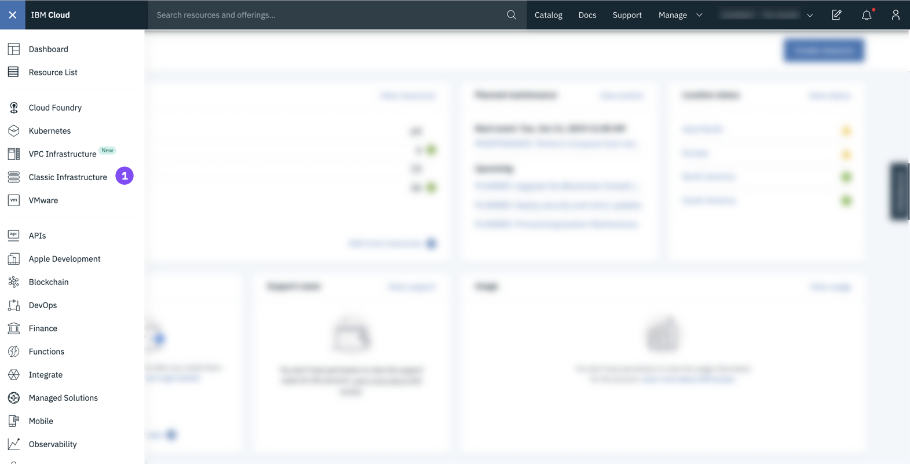
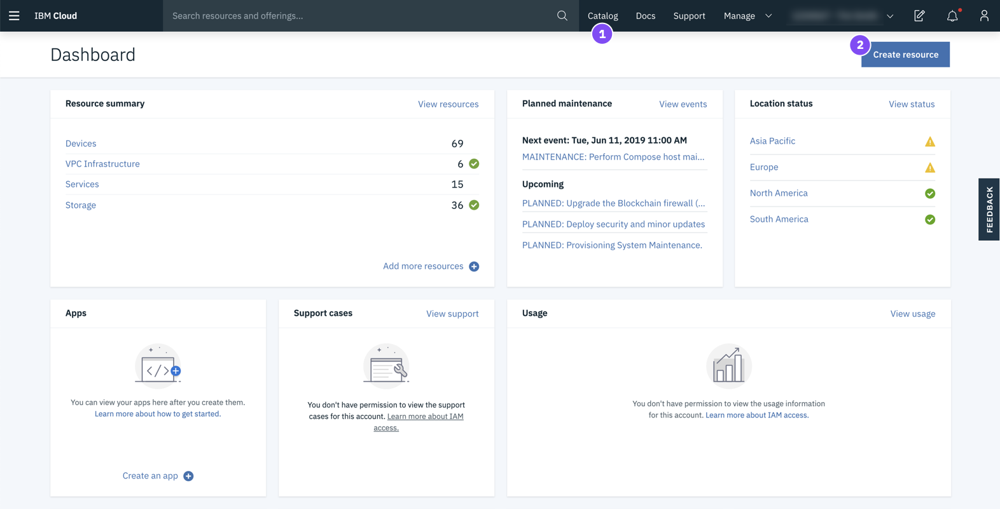

---

copyright:
  years: 2015, 2019
lastupdated: "2019-06-25"

keywords: ui, components, using the console, SoftLayer, classic infrastructure

subcollection: overview

---

{:shortdesc: .shortdesc}
{:tip: .tip}
{:note: .note}
{:new_window: target="_blank"}

# 導覽 {{site.data.keyword.cloud_notm}} 主控台 
{: #ui}

{{site.data.keyword.cloud}} 主控台是一個使用者介面，可協助您管理所有 {{site.data.keyword.cloud_notm}} 資源。當您存取[主控台](https://cloud.ibm.com){: new_window}  時，可以建立免費帳戶、登入、存取文件、存取型錄、檢視定價資訊、取得支援，或檢查 {{site.data.keyword.cloud_notm}} 元件的狀態。登入之後，功能表列會包含「功能表」圖示  及其他鏈結。
{: shortdesc}

## 使用主控台
{: #consoleoptions}

當您登入 {{site.data.keyword.cloud_notm}} 時，會顯示儀表板，其中顯示彙總您帳戶狀態的小組件。如果您對於新增或移除小組件有興趣，請參閱[自訂儀表板](/docs/overview?topic=overview-custom-dashboard)。

  * 使用**型錄**鏈結，以建立新的資源。
  * 使用**文件**鏈結，以存取產品文件。 
  * 使用**支援**鏈結，以存取「支援中心」。  
  * 您可以從**管理**功能表中存取您的帳戶、計費及用量，以及 Identity and Access Management 選項。
  * 按一下「成本預估器」圖示 ，以開啟成本預估器。
  * 按一下「通知」圖示 ，以存取公告及計劃性與非計劃性事件。

## 搜尋資源
{: #search}

您可以從 {{site.data.keyword.cloud_notm}} 主控台的任何位置依名稱或標籤來搜尋資源，以找到您預期在資源清單中看到的資源。在主控台功能表列的搜尋欄位中，鍵入資源或標籤的名稱。

如需相關資訊，請參閱[搜尋資源](/docs/resources?topic=resources-searching-for-resources)。 

## 管理資源清單中的資源
{: #dashboardview}

移至「功能表」圖示  &gt; **資源清單**，以存取您的帳戶資源清單。您可以使用資源清單來檢視及使用 {{site.data.keyword.cloud_notm}} 資源和 Cloud Foundry 服務實例。如需不同類型資源的相關資訊，請參閱[何謂資源？](/docs/resources?topic=resources-resource)。

### 檢視資源
您可以從資源清單中檢視帳戶中所有地區的所有資源。若要查看對您很重要的項目，請對每個直欄標頭使用過濾器來過濾您的清單。例如，如果您要檢視及使用特定位置的資源，請展開**位置**過濾器，並從清單選取某個位置。

### 使用資源
您可以用各種方法來使用資源清單中的資源：

  * 每一個資源都會獨自顯示一列，並且在該列的尾端會包含「動作」圖示 。按一下「動作」圖示 ，以啟動、停止、重新命名或刪除資源。
  * 若要設定資源的認證或連線，請按一下資源的名稱以導覽至資源詳細資料頁面。然後，選取**服務認證**或**連線**。如需相關資訊，請參閱[新增認證](/docs/resources?topic=resources-service_credentials)和[管理連線](/docs/resources?topic=resources-connect_app)。

## 使用型錄
{: #catalogcreate}

若要建立資源，請按一下資源清單中的**建立**。便會將您導向至型錄。當您從型錄選取一個磚時，可以看到可使用資源的位置。並非型錄中列出的每項資源都可在每個地區使用。

在您按一下要建立的資源磚之後，即可選取要在其中部署的位置。

  * 對於 Cloud Foundry 資源，您可以選取特定地區，然後選取要指派服務實例到哪個組織及空間。
  * 對於 {{site.data.keyword.cloud_notm}} Identity and Access Management (IAM) 所管理的資源，您可以選取要在其中部署的位置。然後，選取要指派服務實例到哪個資源群組。

## 轉換為 {{site.data.keyword.cloud_notm}} 體驗
{: #redirect-cloud}

在從 SoftLayer 移轉到 {{site.data.keyword.cloud_notm}} 的過程中，請熟悉 {{site.data.keyword.cloud_notm}} 主控台，您將使用該主控台管理平台和基礎架構資源。我們目前處於鏈結所有 SoftLayer 和 {{site.data.keyword.cloud_notm}} 帳戶的程序中。因此，您的帳戶可能還沒有存取權。一旦有了存取權，您就可以開始新的體驗。 

先前命名為 SoftLayer，現在稱為 {{site.data.keyword.cloud_notm}} 標準基礎架構。
{: note}

### 尋找基礎架構項目
{: #sl-links}

按一下**功能表圖示**  > **標準基礎架構**以快速找到您的裝置、儲存空間、網路、安全和服務。 

{: caption="圖 1. {{site.data.keyword.cloud_notm}} 主控台中的標準基礎架構項目位置" caption-side="bottom"}

您還可以透過按一下**功能表圖示**  > **資源清單**來檢視資源清單中的裝置和儲存空間項目。
{: tip}

### 管理使用者、存取權及 API 金鑰
{: #billing-items}

您可以從主控台的「存取權 (IAM)」區段，管理帳戶中的使用者、使用者的標準基礎架構存取權，以及您的 API 金鑰。 

* 若要邀請新使用者、移除使用者或管理特定使用者的登入設定、IP 限制、VPN 密碼等等，請移至**管理** > **存取權 (IAM)**，然後選取**使用者**。
* 若要開始管理使用者的標準基礎架構存取權，請移至**管理** > **存取權 (IAM)**，然後選取**使用者**。如需詳細資料，請參閱[管理標準基礎架構存取權](/docs/iam?topic=iam-mngclassicinfra)。
* 若要建立及管理 {{site.data.keyword.cloud_notm}} API 金鑰或標準基礎架構 API 金鑰，請移至**管理** > **存取權 (IAM)**，然後選取 **API 金鑰**。如需相關資訊，請參閱[瞭解 API 金鑰](/docs/iam?topic=iam-manapikey)。

{: caption="圖 2. 在 {{site.data.keyword.cloud_notm}} 主控台中管理 IAM 項目" caption-side="bottom"}

### 下訂單
{: #place-order}

使用型錄下訂單。您可以使用下列某種方法導覽到型錄：

  * 按一下功能表列上的**型錄**。
  * 按一下**功能表圖示**  > **資源清單**。然後，按一下**建立資源**。

{: caption="圖 3. 在 {{site.data.keyword.cloud_notm}} 主控台中下訂單" caption-side="bottom"}

### 進行付款
{: #payments}

您可以從主控台的「計費及用量」區段進行支付。移至**管理 ** > **計費及用量**，然後選取**付款**。
 

{: caption="圖 4. 在 {{site.data.keyword.cloud_notm}} 主控台中付款" caption-side="bottom"}

### 存取發票
{: #invoices}

您可以從主控台的「計費及用量」區段存取發票。移至**管理** > **計費及用量**，然後選取**發票**。

{: caption="圖 5. 在 {{site.data.keyword.cloud_notm}} 主控台中存取發票" caption-side="bottom"}

### 存取業務項目
{: #sales}

您裝置的報價和升級、訂單、取消和裝運都在主控台的「計費及用量」區段中。移至**管理** > **計費及用量**，然後選取**業務**。 

{: caption="圖 6. 在 {{site.data.keyword.cloud_notm}} 主控台中存取銷售項目" caption-side="bottom"}

### 存取支援案例
{: #support-mng}

要存取現行支援案例，請按一下**支援** > **管理案例**。您還可以透過按一下**檢視保存案例**來存取保存案例。

{: caption="圖 7. 在 {{site.data.keyword.cloud_notm}} 主控台中存取支援案例" caption-side="bottom"}

### 提交意見回饋
{: #feedback-profile}

您可以提交好評、建議或任何其他意見。要與我們聯繫，請從下面的方法進行選擇：

  * 按一下位於主控台頁面邊緣的**意見**按鈕。 
  * 按一下**虛擬人像圖示**  > **意見**。 

{: caption="圖 8. 在 {{site.data.keyword.cloud_notm}} 主控台中提交意見" caption-side="bottom"}

### 設定電子郵件喜好設定
{: #email-prefsl}

您可以設定喜好設定，以接收關於平台及基礎架構通知的電子郵件。請按一下**虛擬人像圖示**  > **設定檔和設定**，然後選取**通知**。

{: caption="圖 9. 在 {{site.data.keyword.cloud_notm}} 主控台中設定電子郵件喜好設定" caption-side="bottom"}

### 選取 VPN 存取點
{: #vpn-access}

您可以使用 VPN 存取點登入 {{site.data.keyword.cloud_notm}} 主控台。請移至 [VPN Access](https://www.ibm.com/cloud-computing/bluemix/vpn-access)，並從清單選取存取點。

