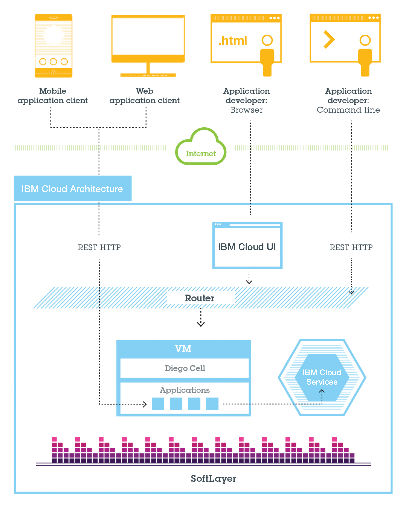

---

copyright:
  years: 2015, 2017
lastupdated: "2017-05-15"

---

{:shortdesc: .shortdesc}
{:codeblock: .codeblock}
{:screen: .screen}
{:new_window: target="_blank"}
{:pre: .pre}
{:table: .aria-labeledby="caption"}

# Show me how to use _serviceName_
{: #show_me_video}

<video width="400px" controls>
<source src="video/BlueMix Mobile Data iOS Demo v2.mp4" type="video/mp4">
Your browser does not support HTML5 video.
</video>

<video controls="true">
    <source src="https://www.youtube.com/watch?v=FrYmQlcq5Xs" type="video/mp4" />
</video>

   

      <iframe class="embed-responsive-item" id="youtubeplayer" type="text/html" 
            width="640" height="390" src="//www.youtube.com/embed/oSNF-QCbuDc?rel=0" 
            frameborder="0" webkitallowfullscreen mozallowfullscreen allowfullscreen>
      </iframe>
  

## Table and Figure Accessibility Test
{: #services}
Last updated: 10 August 2016

{{site.data.keyword.Bluemix_notm}} makes it easy for you to implement, host, and scale services and apps. You can focus on your application logic and application design.
{:shortdesc}

Multiple levels of support are provided for {{site.data.keyword.Bluemix_notm}} services. The following table describes the general support information for {{site.data.keyword.Bluemix_notm}} services:

|Type	|Description	|Support details|
|-----|-------------|---------------|
|IBM	|A service that is provided by IBM and is generally available.	|Problems that are determined to be a defect in an IBM-provided service that is generally available are supported. Support is provided based on the severity that you set. For more information about ticket severity, see [Contacting support](/docs/support/index.html#contacting-bluemix-support){: new_window}.|
|Third Party	|A service that is provided by a company other than IBM.	|Support for third-party services is provided by the service provider. If a problem is investigated by IBM and the problem is determined to be a defect in a third-party service, IBM is not obligated to provide a fix. IBM will share analysis with the third-party service provider if needed.|
|Community	|A service that is provided by an open source community.	|Support for community services is provided by the {{site.data.keyword.Bluemix_notm}} Developers Community. If a problem is investigated by IBM and the problem is determined to be a defect in a community service, IBM is not obligated to provide a fix.|
|Beta	|A service that is not production-ready and is in a trial stage of development. A Beta service can help the development and marketing teams assess the value of the services before they make the service generally available.	|Problems that are determined to be a defect in an IBM-provided beta service are supported, but IBM is not obligated to provide a fix. In addition, the problem ticket will be assigned a severity 3 or 4 where applicable. For information about ticket severity, see [Contacting support](/docs/support/index.html#contacting-bluemix-support){: new_window}.|
{: caption="Table 1. {{site.data.keyword.Bluemix_notm}} services support information" caption-side="top"}

|Type	|Description	|Support details|
|-----|-------------|---------------|
|IBM	|A service that is provided by IBM and is generally available.	|Problems that are determined to be a defect in an IBM-provided service that is generally available are supported. Support is provided based on the severity that you set. For more information about ticket severity, see [Contacting support](/docs/support/index.html#contacting-bluemix-support){: new_window}.|
|Third Party	|A service that is provided by a company other than IBM.	|Support for third-party services is provided by the service provider. If a problem is investigated by IBM and the problem is determined to be a defect in a third-party service, IBM is not obligated to provide a fix. IBM will share analysis with the third-party service provider if needed.|
|Community	|A service that is provided by an open source community.	|Support for community services is provided by the {{site.data.keyword.Bluemix_notm}} Developers Community. If a problem is investigated by IBM and the problem is determined to be a defect in a community service, IBM is not obligated to provide a fix.|
|Beta	|A service that is not production-ready and is in a trial stage of development. A Beta service can help the development and marketing teams assess the value of the services before they make the service generally available.	|Problems that are determined to be a defect in an IBM-provided beta service are supported, but IBM is not obligated to provide a fix. In addition, the problem ticket will be assigned a severity 3 or 4 where applicable. For information about ticket severity, see [Contacting support](/docs/support/index.html#contacting-bluemix-support){: new_window}.|
{: caption="Table 2. Second table for {{site.data.keyword.Bluemix_notm}} services support information" caption-side="top"}

## Figure testing

Clients--which can be mobile apps, apps that run externally, apps that are built on {{site.data.keyword.Bluemix_notm}}, or developers that are using browsers--interact with the {{site.data.keyword.Bluemix_notm}}-hosted apps. Clients use REST or HTTP APIs to route requests through {{site.data.keyword.Bluemix_notm}} to one of the app instances or the composite services.

The following figure shows the high-level {{site.data.keyword.Bluemix_notm}} Cloud Foundry architecture.

Figure 1. {{site.data.keyword.Bluemix_notm}} Cloud Foundry architecture

You can deploy your apps to different {{site.data.keyword.Bluemix_notm}} regions, for latency or security considerations. You can choose to deploy either to one region or across multiple regions. For more information, see [Regions](/docs/overview/whatisbluemix.html#ov_intro_reg).
