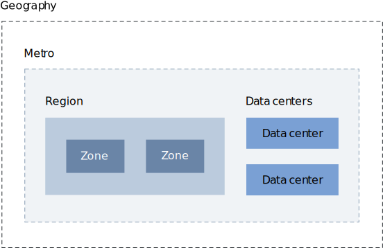

---

copyright:
  years: 2018, 2019
lastupdated: "2019-09-25"

keywords: HA, failover, DR, high availability, disaster recovery, locations, data centers, zero downtime, resources, workloads, failover, infrastructure resources

subcollection: overview

---

{:shortdesc: .shortdesc}
{:codeblock: .codeblock}
{:screen: .screen}
{:new_window: target="_blank"}
{:pre: .pre}
{:table: .aria-labeledby="caption"}
{:note: .note}

# How do I ensure zero downtime?
{: #zero-downtime}

Your global strategy is important. You can select a specific data center or location to deploy your data for your customers. All {{site.data.keyword.Bluemix_notm}} resources are hosted in data center locations around the world. The locations that you deploy your app can spread workloads across data centers, and you can ensure that a failover design is in place to keep your app up and running. For your infrastructure resources, you can select individual data centers to deploy resources.  
{:shortdesc}

High availability and disaster recovery aren't universal across all services, so the type of high availability and disaster recovery that's available depends on the service that you're using.  


## Disaster recovery
{: #disaster-recovery}

Disaster recovery is about surviving a catastrophic failure or loss of availability in a single location. To ensure that disaster recovery is in place, it's necessary to deploy several {{site.data.keyword.Bluemix_notm}} resources in multiple locations to avoid single points of failure. 

### Disaster recovery plan 
{: #dr-plan}

{{site.data.keyword.Bluemix_notm}} follows best practices for disaster recovery. All {{site.data.keyword.Bluemix_notm}} applications automatically recover and restart after any disaster event. Recovery is from electronic backups at a recovery center or alternative computing facilities that restore computing. Before any potential disaster, the disaster recovery plan includes the systems and hosting requirements for hardware, software, networking connectivity, and offsite backup capabilities.

The following list includes the requirements that {{site.data.keyword.IBM_notm}} adheres to for a disaster recovery plan:

- A design document explains how load balancing is used to keep a service highly available.
- Where multi-site failover occurs, the disaster recovery plan must explain who does what to cause the failover and ensure restart. 
- The disaster recovery plan must define how the solution works and include restore point objectives that clearly explain how much data might be lost in the outage, if any. The disaster recovery plan also includes a detailed recovery workflow for restoring services and data if a multi-availability zone failure. 
- It must confirm how the Maximum Tolerable Downtime is met and be stored on the Disaster Recovery Plan database.  
- The disaster recovery plan specifies the security controls for running in Disaster mode, if they are different from what's running in production. 

### Management of the disaster recovery plan 
{: #dr-plan-mgmt}

The requirements that {{site.data.keyword.Bluemix}} follows are: 

- The disaster recovery plan must be updated after any major infrastructure change, major application release, and after any test. 
- It must be approved annually. 


## Locations for resource deployment 
{: #ov_intro_reg}

You can create apps and service instances in different locations for the same usage details view for billing. You can deploy your apps to the location that is nearest to your customers to achieve low application latency. 

To address security issues, you can also select the location in which you want to keep application data. When you build apps in more than one location, if one location is unavailable, the apps that are in the other locations continue to run. For more information about the platform resources and the locations they're available in, see [Service availability](/docs/resources?topic=resources-services_region).

Global load balancing for the {{site.data.keyword.cloud_notm}} console ensures that if the nearest geographical location for you is unavailable, the console displays the information for the next closest location. This means, the {{site.data.keyword.Bluemix_notm}} console is highly available and continues to run even if the customer’s apps or service instances might be unavailable.

You can view all resources across all locations by default from the resource list view in the console. If you want to view and work with resources in a specific location, expand the **Location** menu, and select a location from the list. By expanding a specific geographical location, you can select to filter by individual data centers, regions, or zone.

<!-- diagram for availability zones
explanation for diagram
- 3 AZ (availability zones) to separate failure domains per MZR (multi-zone region)
- each AZ is a separate physical data center building
- These data centers have high bandwidth, low latency redundant links with dual POPs.
- Zones are to be built less than 2msex fiber distance from one another in a region --->

{: caption="Figure 1. Location options hierarchy" caption-side="bottom"}

For example, if you have resources that are deployed in the London 2 (eu-gb-2) zone, you can filter your resource list to display only those resources. A zone is located within a region and a region is organized by its metro location. To filter your list to the London 2 (eu-gb-2) zone, expand the **London** metro option, and then expand the **London (eu-gb)** region option. Within that region, you can select from the list of available zones. If you have a resource that is deployed in a specific data center, you can identify the data center by the specific metro location and alphanumeric code, for example, London 02 (lon02).

You might also have resources that are located globally. The **Global** option means that only one logical, globally accessible instance of the service, independent of any region or zone, is published to customer applications. These types of resources are accessible from a global endpoint.

## Data centers
{: #data_center}

When you deploy infrastructure resources, you have more options about where your data is located. You can select a location, or you can select from a list of the {{site.data.keyword.Bluemix_notm}} data centers. A *data center* is the physical location that hosts the power, cooling, compute, network, and storage resources used for services and apps. Data centers don't provide isolation from multi zones in a location. For more information, see [Global locations for your global business ](https://www.ibm.com/cloud/data-centers/){: new_window}.

{{site.data.keyword.Bluemix_notm}} offers data centers in many locations across the world. 


{: caption="Figure 2. Data center locations" caption-side="bottom"}


See the following table for the specific code for each data center. 

| Data Center | Code  |
|------------------|-------|
| Dallas 01        | dal01 |
| Dallas 05        | dal05 |
| Dallas 06        | dal06 |
| Dallas 07        | dal07 |
| Dallas 09        | dal09 |
| Dallas 10        | dal10 |
| Dallas 12        | dal12 |
| Dallas 13        | dal13 |
| Houston 01       | hou01 |
| Mexico 01        | mex01 |
| Montreal 01      | mon01 |
| San Jose 01      | sjc01 |
| San Jose 03      | sjc03 |
| San Jose 04      | sjc04 |
| Sao Paulo 01     | sao01 |
| Seattle 01       | sea01 |
| Toronto 01       | tor01 |
| Washington DC 01 | wdc01 |
| Washington DC 04 | wdc04 |
| Washington DC 06 | wdc06 |
| Washington DC 07 | wdc07 |
{: caption="Table 1. Data centers in North and South America" caption-side="top"}
{: #americas}
{: tab-title="Americas"}
{: tab-group="dcs"}
{: class="simple-tab-table"}
{: summary="Use the buttons before the table to change the context of the table. The column headers identify the data centers located in the specific geographical area."}

| Data Center | Code  |
|------------------|-------|
| Amsterdam 01     | ams01 |
| Amsterdam 03     | ams03 |
| Frankfurt 02     | fra02 |
| Frankfurt 04     | fra04 |
| Frankfurt 05     | fra05 |
| London 02        | lon02 |
| London 04        | lon04 |
| London 05        | lon05 |
| London 06        | lon06 |
| Milan 01         | mil01 |
| Oslo 01          | osl01 |
| Paris 01         | par01 |
{: caption="Table 1. Data centers in Europe" caption-side="top"}
{: #europe}
{: tab-title="Europe"}
{: tab-group="dcs"}
{: class="simple-tab-table"}
{: summary="Use the buttons before the table to change the context of the table. The column headers identify the data centers located in the specific geographical area."}

| Data Center | Code  |
|------------------|-------|
| Hong Kong 02     | hkg02 |
| Melbourne 01     | mel01 |
| Seoul 01         | seo01 |
| Singapore 01     | sng01 |
| Sydney 01        | syd01 |
| Sydney 04        | syd04 |
| Sydney 05        | syd05 |
| Tokyo 01         | tok02 | 
| Tokyo 04         | tok04 |
| Tokyo 05         | tok05 |
{: caption="Table 1. Data centers in Asia Pacific" caption-side="top"}
{: #asiapacific}
{: tab-title="Asia Pacific"}
{: tab-group="dcs"}
{: class="simple-tab-table"}
{: summary="Use the buttons before the table to change the context of the table. The column headers identify the data centers located in the specific geographical area."}

## Service Level Agreements (SLAs)
{: #SLAs} 

{{site.data.keyword.Bluemix_notm}} provides a 99.95% availability service level for multiple instances of a platform service within a public environment.

To submit a claim for downtime, contact [{{site.data.keyword.Bluemix_notm}} Support](https://cloud.ibm.com/unifiedsupport/supportcenter){: new_window} .

{{site.data.keyword.Bluemix_notm}} provides SLAs for {{site.data.keyword.Bluemix_notm}} services that might make you eligible for credits toward your account. SLAs are your only way to resolve {{site.data.keyword.Bluemix_notm}}'s failure to meet a specified service level. 

The complete Service Description for {{site.data.keyword.Bluemix_notm}} is available at [Cloud Services terms](http://www-03.ibm.com/software/sla/sladb.nsf/sla/bm){: new_window} .

### Availability downtime SLA 
{: #avail-downtime}

You're eligible for a credit toward your account if you experience availability less than the 99.95%. Availability downtime is the total minutes you're unable to connect to any of your service instances. Total downtime minutes start when you can prove a loss of availability with logs or any other records.

{{site.data.keyword.Bluemix_notm}} provides a 99.95% availability SLA: 

| Type	                                     | Description	      | Support Details|
|--------------------------------------------|--------------------|----------------|
| High availability for a public environment | Other Environments | Credit         |
| <99.95%                                    |<99.5%              |10%             |
| <99.90%                                    |<99.0%              |25%             |
{: caption="Table 2. Monthly availability service level" caption-side="top"}

Availability percentage is calculated as the total number of minutes that are in a contracted month, minus the total number of downtime minutes in that month divided by the total number of minutes in that month. 

For example, in a 31-day month, you have 44,640 total number of minutes. If you experience six hours of availability downtime, there's 360 downtime minutes. With only six hours of downtime, you have 99.19% availability. Since 99.19% is less than 99.90%, you're eligible for a 25% credit with a public environment.   

```
= (44,640 total minutes in month - 360 downtime minutes) / 44,640 total minutes in month
= (44,280 actual minutes available) / 44,640 total minutes in month
= 99.19% availability
```

SLAs don't include downtime or failures that are related to {{site.data.keyword.Bluemix_notm}} UI unavailability, or the time it takes to reload, configure, enable, or access content.

### Infrastructure hardware replacement and upgrade SLA
{: #hw-replaceupgrade-sla}

{{site.data.keyword.Bluemix_notm}} tries to minimize downtime when failed hardware is replaced and when scheduled upgrades are performed. 

{{site.data.keyword.Bluemix_notm}} provides credit for: 
- Hardware replacement based on the time to replace from the time {{site.data.keyword.Bluemix_notm}} verifies that a customer reported hardware failure.
- Planned hardware upgrades based on the total downtime of the service that receives the upgrade. 

Service level time periods exclude anytime that is required to reload the operating system or applications or the time performance might be degraded. You're eligible for a credit based on the monthly charge for the service that is affected by the hardware replacement or upgrade if {{site.data.keyword.Bluemix_notm}} fails to meet a specified service level time period.

| Service Level Time Period | Credit Percentage |
|---------------------------|----------------|
| ≤ 2 hours                 | None           |
| > 2 hours                 | 20%            |
| > 6 hours                 | 40%            |
| > 10 hours                | 60%            |
| > 14 hours                | 80%            |
| > 18 hours                | 80%            |
{: caption="Table 3. Credit based on the monthly charge for the service that is affected by the hardware replacement or upgrade" caption-side="top"}

### Claims
{: #claims}

Submit your claim within 60 days of the end of the contracted month that the service level was missed. Provide sufficient information to identify the affected service, error messages, and other information necessary to validate the claim. 

The credit is the highest applicable compensation based on the cumulative availability of the affected service during a contracted month and calculated by using the monthly charges for such affected service. Credits cannot exceed 25% of monthly charge.

### Exclusions
{: #exclusions}

No credits are given for failure to meet an SLA because of:
- Problems with Customer or community provided content, technology, designs, or instructions
- Beta, experimental, or no-charge Cloud services.
- Non-IBM build-packs
- Unsupported system configurations and platforms
- Customer infrastructure failures, including network, hardware, facility, or power
- Customer system administration actions, commands, or file transfers
- Customer errors or failures to provide needed information or access to resolve an outage
- Customer-caused security incidents or security testing
- Other causes beyond IBM's reasonable control
