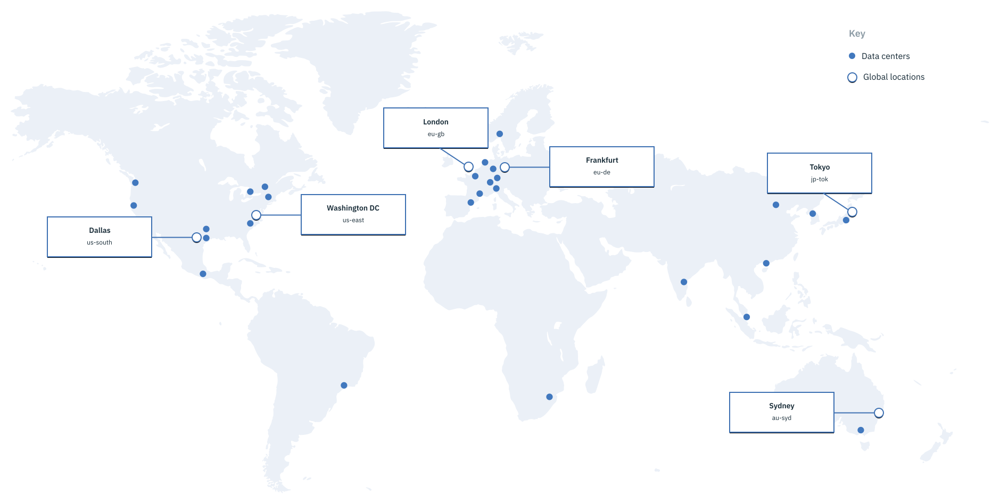

---

copyright:
  years: 2018, 2019
lastupdated: "2019-03-08"

metadata: HA,failover,DR 

---

{:shortdesc: .shortdesc}
{:codeblock: .codeblock}
{:screen: .screen}
{:new_window: target="_blank"}
{:pre: .pre}
{:table: .aria-labeledby="caption"}
{:note: .deprecated}


# How do I ensure zero downtime?
{: #zero-downtime}

Your global strategy is important. You can select a specific data center or location to deploy your data in the right part of the world for your customers. 
{:shortdesc}

{{site.data.keyword.Bluemix}} platform services are self-managed. Meaning, the locations in which you deploy your app can spread workloads across data centers. And you can ensure a failover design is in place, which means your app is always up and running for your customers. For your infrastructure resources, you can select individual data centers in which the resources are deployed. 

All {{site.data.keyword.Bluemix_notm}} resources are hosted in data center locations around the world. High availability and disaster recovery aren't universal across all services, so the type of high availability and disaster recovery that's available depends on the service that you're using.  

## Disaster recovery
{: #disaster-recovery}

Disaster recovery is about surviving a catastrophic failure or loss of availability in a single location. To ensure disaster recovery is in place, it's necessary to deploy several {{site.data.keyword.Bluemix_notm}} environments in multiple locations to avoid single points of failure. These environments can be a combination of Public, Dedicated, or Local platforms.  

### Disaster recovery plan 
{: #dr-plan}

{{site.data.keyword.Bluemix_notm}} follows requirements for planning for a disaster, and every application has a plan for you to recover or restart after a disaster event. Recovery is from electronic backups at a recovery center or alternate computing facilities that restore computing. Before any potential disaster, the disaster recovery plan includes the systems and hosting requirements for hardware, software, networking connectivity, and offsite backup capabilities.

The following list includes the requirements of the disaster recovery plan:

- For load balancing, a document exists to explain how the computing service stays available. 
- Where multi-site failover occurs, the disaster recovery plan must explain who does what to cause the failover and ensure restart. 
- The disaster recovery plan must define how the solution works and what the data loss is. 
- It must confirm how the Maximum Tolerable Downtime is met and be stored on the Disaster Recovery Plan database.  
- The disaster recovery plan specifies the security controls for running in Disaster mode, if they are different from what's running in production. 

### Management of the disaster recovery plan 
{: #dr-plan-mgmt}

The requirements that {{site.data.keyword.Bluemix}} follows are: 

- The disaster recovery plan must be updated after any major infrastructure change, major application release, and after any test. 
- It must be approved annually. 

## Locations for resource deployment 
{: #ov_intro_reg}

You can create apps and service instances in different locations with the same {{site.data.keyword.cloud_notm}} infrastructure for application management and the same usage details view for billing. You can deploy your apps to the location that is nearest to your customers to achieve low application latency. 

To address security issues, you can also select the location in which you want to keep application data. When you build apps in more than one location, if one location becomes unavailable, the apps that are in the other locations continue to run. Your resource allowance is the same for each location that you use. For more information about the platform resources and the locations they're available in, see [Service availability](/docs/resources?topic=resources-services_region).

Global load balancing for the {{site.data.keyword.cloud_notm}} console ensures that if the nearest geographical location for you is unavailable, the console displays the information for the next closest location. This way, you can always access the console without taking any action to access the resources you need.

You can view all resources across all locations by default from the resource list view in the console. If you want to view and work with resources in a specific location, expand the **LOCATION** menu, and select a location from the list. 

## Data centers
{: #data_center}

When you deploy infrastructure resources, you have more options about where your data is located. You can select a location, or you can select from a list of the {{site.data.keyword.Bluemix_notm}} data centers. A *data center* is the physical location that hosts the power, cooling, compute, network, and storage resources used for services and apps. Data centers don't provide isolation from local failures similar to multi-zones in a location. For more information, see [Global locations for your global business ](https://www.ibm.com/cloud/data-centers/){: new_window}.

{{site.data.keyword.Bluemix_notm}} offers data centers in many locations across the world. When you deploy infrastructure resources, you can select from a list of the data centers in {{site.data.keyword.Bluemix_notm}}. 




### North America
{: #na}

| Data Center | Code  |
|------------------|-------|
| Dallas 01        | dal01 |
| Dallas 05        | dal05 |
| Dallas 06        | dal06 |
| Dallas 07        | dal07 |
| Dallas 09        | dal09 |
| Dallas 10        | dal10 |
| Dallas 12        | dal12 |
| Dallas 13        | dal13 |
| Washington DC 01 | wdc01 |
| Washington DC 04 | wdc04 |
| Washington DC 06 | wdc06 |
| Washington DC 07 | wdc07 |
| San Jose 01      | sjc01 |
| San Jose 03      | sjc03 |
| San Jose 04      | sjc04 |
| Seattle 01       | sea01 |
| Houston 01       | hou01 |
| Montreal 01      | mon01 |
| Toronto 01       | tor01 |
| Mexico 01        | mex01 |
{: caption="Table 2. Data centers in North America" caption-side="top"}

### South America
{: #sa}

| Data Center | Code    |
|------------------|---------|
| Sao Paulo 01     | sao01   |
{: caption="Table 3. Data centers in South America" caption-side="top"}

### Europe
{: #eu}

| Data Center | Code  |
|------------------|-------|
| London 02        | lon02 |
| London 04        | lon04 |
| London 05        | lon05 |
| London 06        | lon06 |
| Frankfurt 02     | fra02 |
| Frankfurt 04     | fra04 |
| Frankfurt 05     | fra05 |
| Milan 01         | mil01 |
| Amsterdam 01     | ams01 |
| Amsterdam 03     | ams03 |
| Paris 01         | par01 |
| Oslo 01          | osl01 |
{: caption="Table 4. Data centers in Europe" caption-side="top"}

### Asia Pacific
{: #ap}

| Data Center | Code  |
|------------------|-------|
| Tokyo 01         | tok02 | 
| Tokyo 04         | tok04 |
| Tokyo 05         | tok05 |
| Seoul 01         | seo01 |
| Hong Kong 02     | hkg02 |
| Singapore 01     | sng01 |
| Sydney 01        | syd01 |
| Sydney 04        | syd04 |
| Sydney 05        | syd05 |
| Melbourne 01     | mel01 |
{: caption="Table 5. Data centers in Asia Pacific" caption-side="top"}


## Service Level Agreements (SLAs)
{: #SLAs} 

{{site.data.keyword.Bluemix_notm}} provides a 99.5% availability service level for multiple instances of a platform service within a single dedicated or local environment.

To submit a claim for downtime, contact [{{site.data.keyword.Bluemix_notm}} Support](https://console.cloud.ibm.com/unifiedsupport/supportcenter){: new_window} .

{{site.data.keyword.Bluemix_notm}} provides SLAs for {{site.data.keyword.Bluemix_notm}} services that might make you eligible for credits toward your account. SLAs are your only way to resolve {{site.data.keyword.Bluemix_notm}}'s failure to meet a specified service level. {{site.data.keyword.Bluemix_notm}} provides a 99.5% availability service level for multiple instances of a Platform Service within a single dedicated or local environment.

For more information about dedicated environments, see [IBM Cloud Dedicated](/docs/hybrid?topic=dedicated-dedicated), and for local environments, see [Bluemix Local](/docs/hybrid?topic=local-local). 

The complete Service Description for {{site.data.keyword.Bluemix_notm}} is available at [Cloud Services terms](http://www-03.ibm.com/software/sla/sladb.nsf/sla/bm){: new_window} .

### Availability downtime SLA 
{: #avail-downtime}

You're eligible for a credit toward your account if you experience downtime less than the 99.5% availability. Availability downtime is the total minutes you're unable to connect to any of your service instances. Total downtime minutes start when you submit a report for the outage event and end when at least one of the affected instances is available for use.

{{site.data.keyword.Bluemix_notm}} provides a 99.95% availability SLA for: 
- Cloud services in the public environment that are configured for high availability as described in the catalog details for each service. 
- Cloud services across several dedicated or local environments in geographically separated data centers. 

| Type	 | Description	 | Support Details|
|-------------------------------------------------------------------------------|--------------------|----------------|
| High Availability Public Environment or Multiple Dedicated/Local Environments | Other Environments | Credit         |
| <99.95%                                                                       |<99.5%              |10%             |
| <99.90%                                                                       |<99.0%              |25%             |
{: caption="Table 6. Monthly availability service level" caption-side="top"}

Availability percentage is calculated as the total number of minutes in a contracted month minus the total number of downtime minutes in that month divided by the total number of minutes in that month. 

For example, in a 31-day month, you have 44,640 total number of minutes. If you experience six hours of availability downtime, there's 360 downtime minutes. With only six hours of downtime, you have 99.19% availability. Since 99.19% is less than 99.90%, you're eligible for a 25% credit with a public or local environment.   

```
= (44,640 total minutes in month - 360 downtime minutes) / 44,640 total minutes in month
= (44,280 actual minutes available) / 44,640 total minutes in month
= 99.19% availability
```

SLAs don't include downtime or failures that are related to the specified exclusions, {{site.data.keyword.Bluemix_notm}} UI unavailability, time to reload, configure, enable, or access content.

The availability downtime SLA doesn't include {{site.data.keyword.Bluemix_notm}} infrastructure services. 
{: note}

### Infrastructure services SLAs
{: #iaas-slas}

Infrastructure services are bare metal and virtual servers, networking, storage, and security services. To find a complete list of infrastructure services, search the {{site.data.keyword.Bluemix_notm}} catalog with the tag `iaas`. 

Downtime is the total minutes a customer-identified infrastructure service is unavailable because of service disruption based on Public network, Private network, and Redundant Infrastructure power and HVAC outages. The total downtime minutes calculation begins when the validated outage affecting the service is identified until the time the service is available. 

Downtime doesn't include time for scheduled or announced maintenance. For each 30 continuous minute period of downtime, you receive a credit in the amount of 5% of the monthly charges for the identified services that are directly impacted by the outage. You're not eligible for a credit if the downtime is less than 30 continuous minutes. Downtime for different outage types might not be combined to meet this calculation. 

### Infrastructure hardware replacement and upgrade SLA
{: #hw-replaceupgrade-sla}

{{site.data.keyword.Bluemix_notm}} tries to minimize downtime when replacing failed hardware or when performing a scheduled hardware upgrade. 

{{site.data.keyword.Bluemix_notm}} provides credit for: 
- Hardware replacement based on the time to replace from the time {{site.data.keyword.Bluemix_notm}} verifies that a customer reported hardware failure.
- Planned hardware upgrades based on the total downtime of the service receiving the upgrade. 

Service level time periods exclude any time that is required to reload the operating system or applications or the time performance might be degraded. You're eligible for a credit based on the monthly charge for the service that is affected by the hardware replacement or upgrade if {{site.data.keyword.Bluemix_notm}} fails to meet a specified service level time period.

| Service Level Time Period  | Credit Percentage |
|---------------------------|----------------|
| ≤ 2 hours                 | None           |
| > 2 hours                 | 20%            |
| > 6 hours                 | 40%            |
| > 10 hours                | 60%            |
| > 14 hours                | 80%            |
| > 18 hours                | 80%            |
{: caption="Table 7. Credit based on the monthly charge for the service that is affected by the hardware replacement or upgrade" caption-side="top"}

### Claims
{: #claims}

Submit your claim within 60 days of the end of the contracted month that the service level was missed. Provide sufficient information to identify the affected service, error messages, and other information necessary to validate the claim. 

The credit will be the highest applicable compensation based on the cumulative availability of the affected service during a contracted month and calculated using the monthly charges for such affected service. Credits cannot exceed 25% of monthly charge.

To submit a claim for downtime, contact [{{site.data.keyword.Bluemix_notm}} Support](https://console.cloud.ibm.com/unifiedsupport/supportcenter){: new_window} .

### Exclusions
{: #exclusions}

No credits are given for failure to meet an SLA because of:
- Problems with Customer or community provided content, technology, designs, or instructions
- Beta, experimental, or no-charge Cloud services.
- Non-IBM build-packs
- Unsupported system configurations and platforms
- Customer infrastructure failures, including network, hardware, facility, or power
- Customer system administration actions, commands, or file transfers
- Customer errors or failures to provide needed information or access to resolve an outage
- Customer-caused security incidents or security testing
- Other causes beyond IBM's reasonable control
